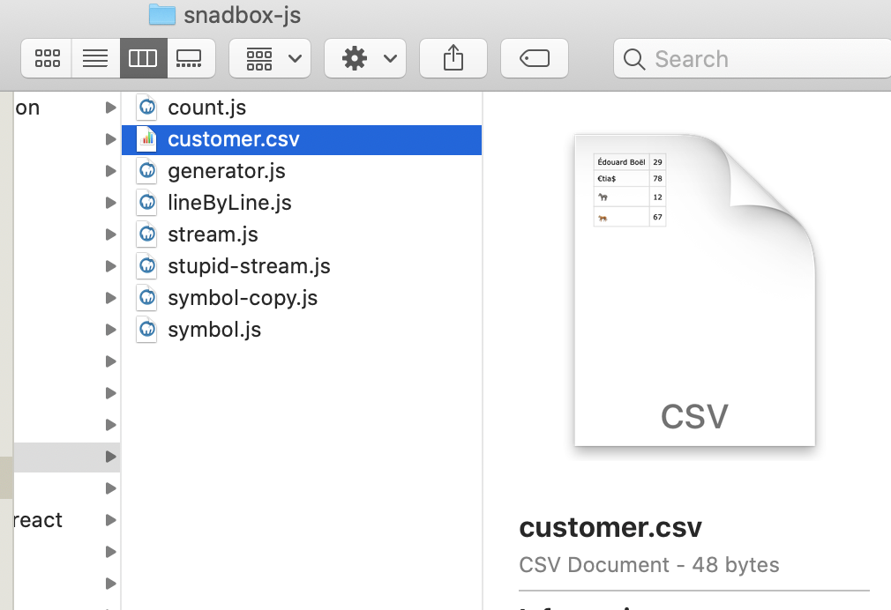

# Annexe pour les `streams`

source : `Fun Fun Function`

`yield` produire - céder - délivrer

## stupid `stream`

```js
const stupidNumberStream = {
  each: (callback) => {
    setTimeout(() => {
      callback(1);
    }, 1000);
    setTimeout(() => {
      callback(2);
    }, 2000);
    setTimeout(() => {
      callback(3);
    }, 3000);
  },
};

stupidNumberStream.each(console.log);
```

Les `streams` sont un mélange (un croisement) entre les `promise` (une donnée viendra peut-être) et les tableaux (une collection de données ici et maintenant).

C'est donc un ensemble de données (de tonneaux sur la rivière), qui viendront peut-être.

## Lire un fichier ligne par ligne

### ma méthode

```js
const fs = require("fs");
const { StringDecoder } = require("string_decoder");

const decoder = new StringDecoder("utf8");

const readStream = fs.createReadStream("./customer.csv", {
  highWaterMark: 1,
});

let line = "";

readStream.on("data", (buf) => {
  if (buf.includes(0x0a)) {
    console.log(`nouvelle ligne : ${line}`);
    line = "";
  } else {
    line += decoder.write(buf);
  }
});
```

```bash
node lineByLine.js

nouvelle ligne : Édouard Boël,29
nouvelle ligne : €tia$, 78
nouvelle ligne : 🦓, 12
nouvelle ligne : 🐅, 67
```

#### `buf.includes(0x0a)` pour tester une valeur du `buffer`.

### `highWaterMark`

Si l'encodage est précisé, `highWaterMark` correspond au nombres de caractères et non plus au nombre de bytes.

```js
const fs = require("fs");

const readStreamBuf = fs.createReadStream("./customer.csv", {
  highWaterMark: 1,
});
const readStreamStr = fs.createReadStream("./customer.csv", {
  encoding: "utf8",
  highWaterMark: 1,
});

let countBuf = 0;
let countStr = 0;

readStreamBuf.on("data", (buf) => {
  countBuf++;
});
readStreamStr.on("data", (str) => {
  countStr++;
});

readStreamBuf.on("end", () => {
  console.log(countBuf);
});
readStreamStr.on("end", () => {
  console.log(countStr);
});
```

```bash
48
38
```

Notre fichier contient 48 Bytes et 38 caractères.



## `readline`

Le module natif `readline ` permet de lire des données ligne par ligne :

```js
const fs = require("fs");
const readline = require("readline");

const rl = readline.createInterface({
  input: fs.createReadStream("./customer.csv"),
  crlfDelay: Infinity,
});

rl.on("line", (line) => console.log(`l : ${line}`));
```
