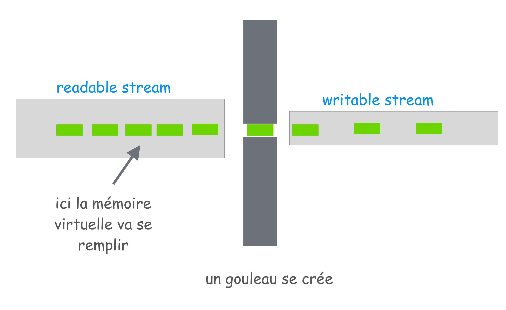

# 02 `drain` or not `drain`

Si on ce contente de brancher un `readable stream` sur un `writable stream`, on a un effet d'étranglement car l'écriture est plsu lente que la lecture : `backpressure`.

En fait la mémoire virtuel se rempli des morceaux qui font la fil :



## Code comportant un problème de `backpressure`

```js
const server = require("http").createServer();
const fs = require("fs");

const PORT = 8000;

server.on("request", (req, res) => {
  const fileStream = fs.createReadStream("./big-file.txt");

  fileStream.on("data", (data) => res.write(data));
  fileStream.on("end", () => res.end());
});

server.listen(PORT, console.log(`server listenning on ${PORT}`));
```

Résultat :


`1.67G` en mémoire vive pour seulement deux requêtes (via `curl`).

## Correction du problème grâce à `drain`

Le `readable stream` peut être dans deux mode `flowing` et `paused`.

L'appelle à la méthode `.pause` met en mode `paused`.

L'appelle à la méthode `.resume` met en mode `flowing`.

l'événement `drain` est déclenché lorsqu'il est approprié de reprendre le stream, cela se déroule après qu'un `stream.write(chunk)` retourne `false`.

La méthode `.write` retourne `false` si elle n'a plus la possibilité d'écrire un `chunk`, puis dès que c'est de nouveau possible, l'événement `drain` est lancé.

```js
const server = require("http").createServer();
const fs = require("fs");

// un indicateur d'écriture
let flag = true;

server.on("request", (req, res) => {
  const readStream = fs.createReadStream("./big-file.txt");
  readStream.on("data", (data) => {
    flag = res.write(data);

    // si il n'y a plus de place on met le stream en lecture en pause
    if (!flag) {
      readStream.pause();
    }
  });

  // dès que de la place est retrouvée, on relance le stream en lecture
  res.on("drain", () => {
    readStream.resume();
  });

  readStream.on("end", () => {
    res.end();
  });
});

const PORT = process.env.NODE_PORT || 8000;

server.listen(PORT, console.log(`server is running on ${PORT}`));
```


La mémoire n'est occupée qu'à maximum `59.7M`, ce qui est 27 fois plus performant.
