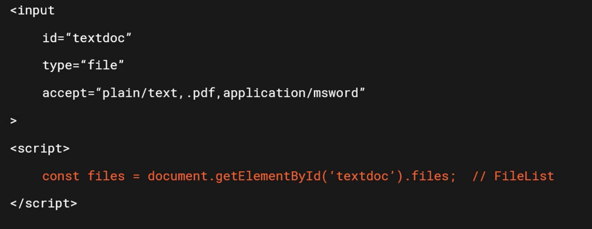

# Upload single file



`accept` permet de filtrer les types de fichiers.

## Simple formulaire

```html
<div>
  <form method="POST" action="/api/single-file" enctype="multipart/form-data">
    <input id="inputFile" name="myfile" type="file" accept="image/*" style="display: none">
    <p><button type="button" id="uploadFile">Choose File</button></p>
    <p id="filename"></p>
    <br>
    <button type="submit">Upload file</button>
  </form>
</div>
<script>
  const inputFile = document.getElementById('inputFile')
  const btnUploadFile = document.getElementById('uploadFile')
  const filenameBox = document.getElementById('filename')
  btnUploadFile.addEventListener('click', function () {
    inputFile.click()
  })
  inputFile.addEventListener('change', function (e) {
    // console.log(e)
    filenameBox.innerText = e.target.files[0].name
  })
</script>
```

Pour des raisons de `CSS`, on masque le `input type="file"` et on le remplace par un bouton plus facile à *styler* avec les `CSS`.

## Envoie en `XHR`

On peut ne pas souhaiter le rafraî

chissement du navigateur à chaque envoie de formulaire, pour cela on peut utiliser `AJAX`.

```html
<div>
  <form
        method="POST"
        action="/api/single-file"
        enctype="multipart/form-data"
        >
    <p>
      <label for="inputFile"
             ><input
                     id="inputFile"
                     name="myfile"
                     type="file"
                     accept="image/*"
                     style="display: none"
                     onchange="document.querySelector('#filename').innerText = this.files[0].name"
                     />
        Choose File</label
        >
      <span id="filename"></span>
    </p>

    <br />
    <button type="button" id="xhrSubmit">Submit with XHR</button>
  </form>
</div>
<script>
  const form = document.querySelector('form')
  const submitXhr = document.querySelector('#xhrSubmit')

  const xhr = new XMLHttpRequest()
  
  submitXhr.addEventListener('click', function () {
    xhr.open('POST', '/api/single-file', false) // doit être appelé avant chaque nouvel envoie
    xhr.send(new FormData(form))
  })
</script>
```

### `xhr.open(<METHOD>, <URL>, <IS_ASYNC>)`

Ici `xhr` est appelé de manière `synchrone`.

## `URL.createObjectURL`

Permet de créer une `URL` (`string`) vers un objet `File` ou `Blob`.

Il faut libérer la mémoire avec `URL.revokeObjectURL`.


