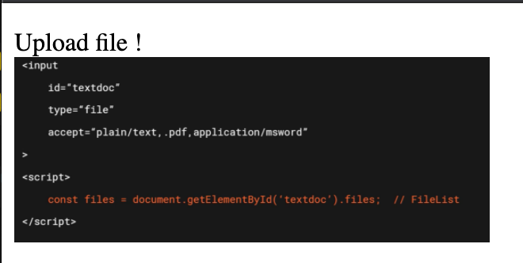

# AA Fichier en mémoire ?

## Chargement avec minuteur

Le code charge un fichier, le transforme en `Object URL` et le place dans une image après `6 s`.

`HTML`

```html
<p>
  <label for="myfile1">
    Upload file !<br>
    <input id="myfile1" type="file" name="file1">
  </label>
</p>
```


`Javascipt`

```js
const inputFile1 = document.getElementById("myfile1")

inputFile1.onchange = (e) => {
    const img = document.createElement('img')

    const f = e.target.files[0]
    // const f = new File([e.target.files[0]], 'newCopyOfMyFile')

    setTimeout(() => {
        img.src = URL.createObjectURL(f)
        img.width = 300

        img.onload = () => URL.revokeObjectURL(img.src)

        inputFile1.parentNode.replaceChild(img, inputFile1)
    }, 6000)
}
```

Voila ce qu'on obtient après `6 s` :



Maintenant je vais me servir des `6 s` de délais pour supprimer le fichier sur le disque dur.

Si l'image est uploadée en mémoire, elle devrait pouvoir s'afficher :


Et dans la console on a le message suivant :


### `ERR_FILE_NOT_FOUND`

On peut en conclure qu'il n'y avait pas de copie de l'image en mémoire.

Même si je clone l'image comme ceci :

```js
 const f = new File([e.target.files[0]], 'newCopyOfMyFile')
```

cela ne change rien.