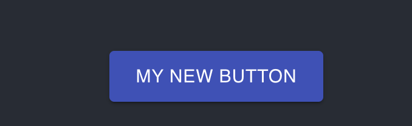
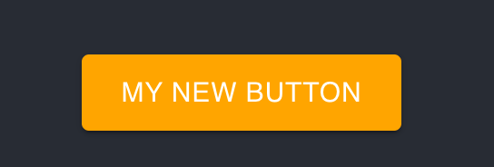
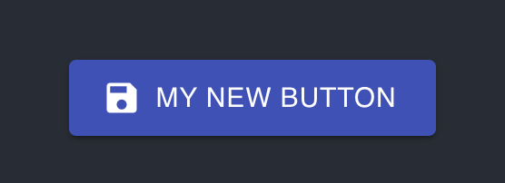
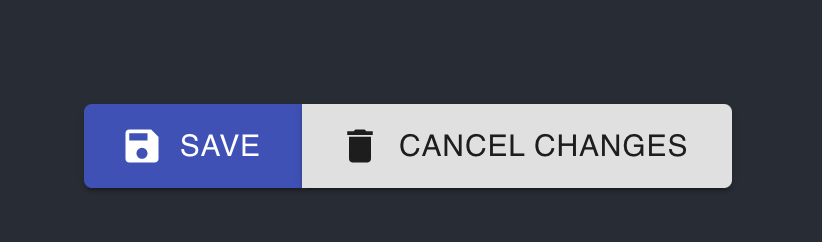

# 00 Crash Course Material UI

### Traversy Media : https://www.youtube.com/watch?v=vyJU9efvUtQ&t=5s


## Setup

```bash
npx create-react-app .

npm i @material-ui/core
```


## Importer un `Button`

```jsx
import logo from './logo.svg'
import './App.css'
import { Button } from '@material-ui/core'

function App() {
    return (
        <div className="App">
            <header className="App-header">
                <Button size="large">My new button</Button>
                
            </header>
        </div>
    )
}

export default App
```

### Option de `Button`



```jsx
<Button 
  variant="contained" 
  color="primary" // secondary 
  size="large" // small
  href="/titi/toto"
  disabled>
  My new button
</Button>
```

On peut *overrider* les styles avec `style={{ maProp: valeur }}` :

```jsx
<Button 
  variant="contained"
  style={{backgroundColor: 'orange'}} 
  color="primary" 
  size="large"
  href="/titi/toto"
  >
  My new button
</Button>
```




## Ajouter des icônes

```bash
npm i @material-ui/icons
```

```jsx
import SaveIcon from '@material-ui/icons/Save'

<Button 
variant="contained"
startIcon={<SaveIcon />}
// endIcon={<SaveIcon />}
color="primary" 
size="large"
>
  My new button
</Button>
```




## `Button Group`

```jsx
import { Button, ButtonGroup } from '@material-ui/core'
import SaveIcon from '@material-ui/icons/Save'
import DeleteIcon from '@material-ui/icons/Delete'

<ButtonGroup>
  <Button 
    variant="contained"
    startIcon={<SaveIcon />}
    color="primary" 
    size="large"
    >
    Save
  </Button>
  <Button 
    variant="contained"
    startIcon={<DeleteIcon />}
    size="large"
    >
    Cancel changes
  </Button>
</ButtonGroup>
```

