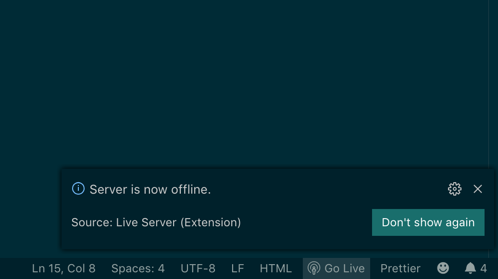

# 01 Les bases

`React` est une librairie qui avec l'ajout d'éléments (`react router`, `redux`) peut devenir un `framework`.

## Utiliser un serveur

### 1 live server

Installer l'extension VSCode live server


Click droit et **Open with Live Server** ou **Stop**

Sinon avec cette icône :



`Go Live`

On click dessus pour le lancer ou pour l'éteindre

### 2 Un serveur python

Lancer cette commande dans le dossier pour y démarrer un serveur HTTP :

```bash
kms: react-bootcamp $ python3 -m http.server 6767
Serving HTTP on 0.0.0.0 port 6767 (http://0.0.0.0:6767/) ...
```

Avec python 2 :

```bash
python -m SimpleHTTPServer 8980
```

## Un premier composant : Classe

Regardont d'abord les dépendances dans le fichier `index.html` :

```html
<!DOCTYPE html>
<html lang="en">
<head>
  <meta charset="UTF-8">
  <meta name="viewport" content="width=device-width, initial-scale=1.0">
  <meta http-equiv="X-UA-Compatible" content="ie=edge">
  <title>First Component</title>
</head>
<body>
  <div id="root"></div>
  <script src="https://unpkg.com/react/umd/react.development.js"></script>
  <script src="https://unpkg.com/react-dom/umd/react-dom.development.js"></script>

  <script src="https://unpkg.com/babel-standalone"></script>
  <script src="Hello.js" type="text/jsx"></script>
  <script src="index.js" type="text/jsx"></script>
</script>
</body>
</html>
```

### `<div id="root"></div>`

C'est ici que `React` fera son rendu.

### Les librairies de bases

```html
<script src="https://unpkg.com/react/umd/react.development.js"></script>
<script src="https://unpkg.com/react-dom/umd/react-dom.development.js"></script>

<script src="https://unpkg.com/babel-standalone"></script>
```

**React** et **React-Dom**, puis le transpilateur **Babel** (qui permet d'écrire le `jsx`)

### Mon code à proprement parlé

```html
<script src="Hello.js" type="text/jsx"></script>
<script src="index.js" type="text/jsx"></script>
```

On remarque le type `text/jsx`

### Voici le composant App :

```jsx
class App extends React.Component {
  render() {
    return (
      <div>
        <Hello />
      </div>
    );
  }
}

ReactDOM.render(<App />, document.getElementById("root"));
```

Une classe `App` qui hérite de `React.Component`.

Une méthode `render` qui s'occupe du rendu du composant dans la vue.

Elle retourne du **jsx**

Le **jsx** doit toujours avoir un et un seul élément racine ici `<div>`

Ensuite on injecte tout ça dans le **DOM** : `ReactDOM.render(MonComposant, PointDeMontage)`

### Voici le composant Hello

```jsx
class Hello extends React.Component {
  render() {
    return (
      <div>
        <h1> Hello Kitty </h1>
      </div>
    );
  }
}
```

Il faut des parenthèses après le `return` pour envoyer plusieurs lignes `(exprssion_inside)`

En **jsx**, il faut un élément parent.

## Les composants fonctionnels

On peut aussi utiliser des fonctions pour fabriquer des composants, on profite alors de la closure des fonctions :

https://overreacted.io/fr/how-are-function-components-different-from-classes/

### exemple de composant fonctionnel 

```jsx
// dans le composant parent App.js
class App extends React.Component {
  render() {
    return (
      <div>
        <Article
          title={"three wolf"}
          content={"one upon the time ..."}
          author={"hukar"}
        />
      </div>
    );
  }
}

ReactDOM.render(<App />, document.querySelector("#root"));
```

On voit des propriété **jsx** auquel on attribut des valeurs `prop={value}`

```jsx
// dans le composant enfant Article.js
function Article({ title, content, author }) {
  return (
    <article>
      <header>{title}</header>
      <div className="content">{content}</div>
      <footer>{author}</footer>
    </article>
  );
}
```

Attention à la majuscule de `Article`

On récupère par destructuration (décomposition ?) les valeurs des props

```jsx
// écriture alternative
function Article(props) {
  return (
    <article>
      <header>{props.title}</header>
      <div className="content">{props.content}</div>
      <footer>{props.author}</footer>
    </article>
  );
}
```


 