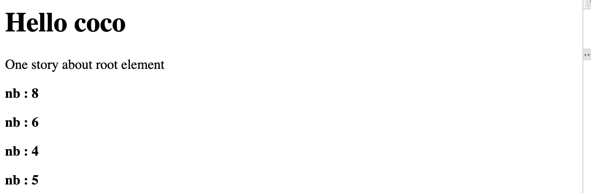

# 02-5 Les boucles en JSX

## Boucle en JSX

### répéter n-fois un élément

#### 1. On utilise `Array(n)`

Pour rappel `Array(n)` est équivalent à `new Array(n)`

```jsx
const t = Array(6);
const tbis = new Array(12); // idem
```

Par contre Array(n) ne crée pas les index


Du coup `map` qui fonctionne avec les index ne donne pas de résultat :

```js
t.map(x => "hello"); // [ , , , , ,  ]

tbis.map (x => "hello"); // [ 'hello', 'hello', 'hello', 'hello', 'hello', 'hello' ]
```

#### Solution utiliser `fill().map()`

On peut construire un tableau d'élément seulement avec `fill` :

```jsx
<p>One story about root element</p>
      {Array(4).fill(
        <p>
          <b>toto</b>
        </p>
      )}
```

Mais si on veut un nombre aléatoire :

```jsx
function Hello({ name }) {
  const nbRandom = () => {
    return Math.ceil(Math.random() * 8);
  };
  return (
    <div>
      <h1>Hello {name}</h1>
      <p>One story about root element</p>
      {Array(4).fill(
        <p>
          <b>nb : {nbRandom()}</b>
        </p>
      )};
}
```

on obtient :


Car fill utilise un contenu statique.

On va donc plutôt utiliser `map` :

```jsx
{Array(4)
        .fill()
        .map((v, i) => (
          <p key={i}>
            <b>nb : {nbRandom()}</b>
          </p>
        ))}
```

On en profite pour ajouter une clé d'index `key={i}`.

### Avec le spread operator `...`

Une syntaxe élégante qui fonctionne aussi :

```jsx
<p>One story about root element</p>
{[...Array(4)].map((v, i) => (
  <p key={i}>
    <b>nb avec spread : {nbRandom()}</b>
  </p>
))}
```


> ### ! Différence entre une expression et une déclaration
>
> Fondamentalement une **expression** peut être placée là ou on attend une valeur :
>
> ```js
> myvar
> 1 + 2
> f()
> a = g() {}
> "something"
> ```
>
> Une **déclaration**, elle , fait quelque chose
>
> ```js
> if() { ... }
> for() { ... }
> ```
>
> Partout où javascript attend une déclaration, on peut mettre à la place une expression, on parle d'expression déclaration.
>
> L'inverse n'est pas vrai.
>
> ```js
> testExpression(coucou = function() {return "coucou"}); // Ok
> 
> testExpression(let coucou = function() {return "coucou"}); // Syntax Error
> ```

## Afficher directement le contenu HTML d'un tableau

On peut directement afficher un tableau dans le JSX, il sera transformer en HTML :

```jsx
export default class Collection extends Component {
  
    myCollection() {
        const values = ["renard", "lapin", "chameau", "chat", "souris"];

        return values.map((v, i) => <li key={i}>{v}</li>);
    }

    render() {
        return <ul>{this.myCollection()}</ul>;
    }
}
```

## Afficher un tableau à deux dimensions avec une table HTML

```jsx
export default class ArrayTesting extends Component {
    constructor(props) {
        super(props);
        this.rows = 6;
        this.cols = 8;
        this.state = {
            grid: [...Array(this.rows)].map(() => Array(this.cols).fill(0))
        };
    }

    // tableau à une dimension => colonnes
    generateRow(t_1d) {
        return t_1d.map((v, i) => <td key={i}>{v}</td>);
    }

    // tableau à deux dimensions => lignes
    generateRows(T_2d) {
        return T_2d.map((t_1d, i) => <tr key={i}>{this.generateRow(t_1d)}</tr>);
    }

    render() {
        return (
            <div>
                <h1>react Dynamic Table</h1>
                <table>
                    <tbody>{this.generateRows(this.state.grid)}</tbody>
                </table>
            </div>
        );
    }
}
```

`[...Array(n)]` à le même résultat que `Array(n).fill()`