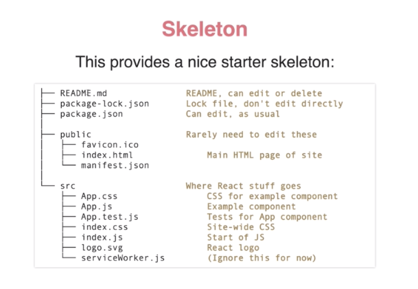
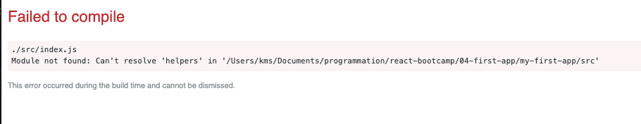
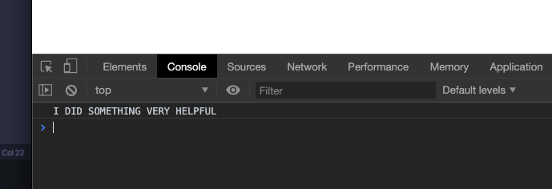

#  Create React App

C'est l'outil créé par l'équipe de **React** pour générer automatiquement et transpiler les projets **React**.

C'est un outil officiel, il est géré par **Facebook**.

## Installer `CRA` (Create-react-App)

Deux façon de faire 

### 1. `npx`

Avec `npx` pas besoin d'installer `CRA` :

```bash
npx create-react-app my-app
```

`npx` va lancer `CRA` sans avoir besoin de l'installer

### 2. `npm`

Sinon il faut d'abord installer globalement (pour tout les projets de l'utilisateur) `CRA`

```bash
npm install -g create-react-app
create-react-app my-app
```

## Squelette d'une application



## CRA est construit sur Webpack

À quoi sert webpack ?

- modules export/import
- package et minifie
- hot reload : recharge la page à chaque modification sauvegardée.

## Modules

### import / export

#### `export default`

On va créer deux fichiers `index.js` et `helpers.js`

```js
// helpers.js

function helpful() {
  console.log("I DID SOMETHING VERY HELPFUL");
}

export default helpful;
```

On expliquera plus tard le `default`

```js
// index.js

import helpful from "helpers";
//import helpful from "./helpers";

helpful();
```




`from "helpers"` va chercher **un module** dans les `node_modules`

Pour importer **le fichier** `helpers.js` il faut écrire `from "./helpers"` sans le `.js`



On peut choisir le nom de la variable référençant l'import comme on vaut :

```js
// index.js

import hel from "./helpers";

hel();
```

Cela va fonctionner.

#### `export { ... }`

Un fichier peut contenir plusieurs fonction

```js
// helpers.js

function helpful() {
  console.log("I DID SOMETHING VERY HELPFUL");
}

function sort() {
  console.log("ALL SORTED");
}

function sing() {
  console.log("LA LA LA");
}

// export default helpful;
export { helpful, sort };
```

On dit explicitement quelles fonctions on exporte, ici les deux première par exemple.

```js
// index.js

import { helpful, sort } from "./helpers";

helpful();
sort();
```

On utilise les accolades pour importer les fonctions que l'on veut. Ici le nom doit être exactement le même (il doit *"matcher"*).

Si j'avais exporté les trois :

```js
export { helpful, sort, sing };
```

Je pourrais configurer mon import de différentes façons :

```js
import { helpful } from "./helpers"
// ou
import { helpful, sort } from "./helpers"
// ou
import { helpful, sort, sing } from "./helpers"
// ou
import { sort, sing } from "./helpers"
// etc 
```

## Mélange des deux manières

```js
// helpers.js

export { sort, sing };
export default helpful;
```

Maintenant dans index on peut utiliser les deux manières d'import :

```js
// index.js

import help, { sing, sort } from "./helpers";

help();
sort();
sing();
```

#### Pour `export { ..., ... }` les noms de variables doivent matcher

#### Pour `exprot default ...` , on peut choisir le nom que l'on veut.

> ### ! Rappel Javascript
>
> #### `Math.ceil`
>
> Le plus petit entier supérieur ou égal
>
> #### `Math.floor`
>
> Le plus grand entier inférieur ou égal
>
> #### `Math.random`
>
> Renvoie un nombre aléatoire entre `[0, 1[` 0 inclus, 1 exclus
>
> Pour un appel aléatoire on utilise plutôt `floor` car la probabilité de tomber sur zéro avec `ceil` est trop faible.
>
> #### `Math.floor(Math.random()  * max + 1)`

## Exercice utilisation du `spread` opérateur

Pour la fonction `remove` 

```js
function remove(items, item) {
    const idx = items.indexOf(item);

    if (idx < 0) return items;

    return [...items.slice(0,idx), ...items.slice(idx + 1)];
}

const t = ["titi", "tata","toto","dede","didi","dodo"];

remove(t, "toto"); //? 	[ 'titi', 'tata', 'dede', 'didi', 'dodo' ] 
t; //? 									[ 'titi', 'tata', 'toto', 'dede', 'didi', 'dodo' ] 
```

## Convention d'écriture

- Un composant = un fichier du même nom :

`Car component` => `Car.js`       ! à la première lettre en capital

- Un composant hérite de `Component ` :

```js
import React, { Component } from "react";

class Car extends Component
{ ... }

export default Car;
```

Dans un autre fichier :

```js
import Car from "./Car";
```

- L'élément englobant est `App`

## CSS et Assets

La convention est d'avoir un fichier **css** par composant :

`Car.css` pour un composant `Car`

On l'importe en haut de son composant :

```jsx
import logo from './logo-car.svg';
import './Car.css';

...


```

Par convention aussi on encadre l'élément avec la classe Car

```jsx
<article className="Car">
	<header className="Car-banner">{ this.props.banner }</header>
  <p className="Car-description">{ this.props.description }</p> 
</article>
```

`Car.css`

```css
.Car {
  color: red;
}

div {
  background-color: gray;
}
```

#### ! le css n'est pas scopé uniquement sur le composant, mais est général à la vue.

On le retrouve dans le `<head>` , il s'applique donc à toute la page web.

## Les images

```jsx
import didi from "./dog_in_the_wood.jpeg";


```

