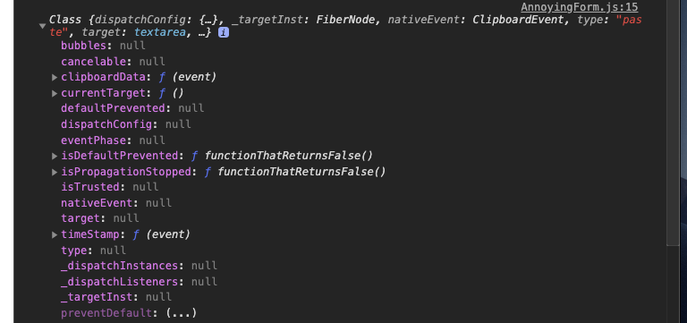
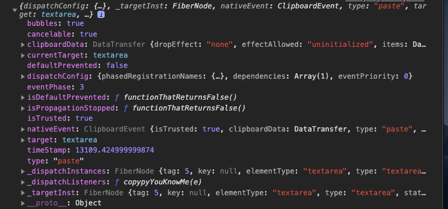
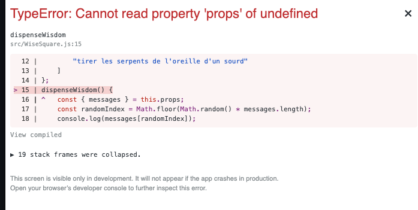
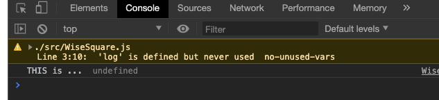
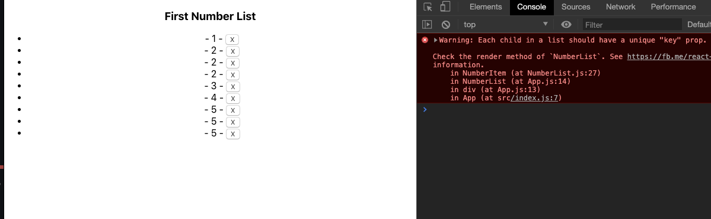
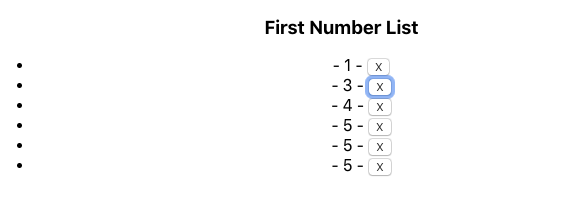

# 10 React Event

## Visionner l'objet `event`

**React**, par souci de performance, réutilise son objet `event`, une fois utilisé, il replace `null` dans toutes ses valeurs :



On voit les valeurs dans la ligne résumée, mais une fois l'objet ouvert, trops tard, toutes les valeurs sont passée à `null`

Pour afficher les valeurs, il faut faire une copie profonde de l'objet `event` avant que celui-ci ne soit réécris par **React**

```jsx
this.handleClick(e) {
        const myEvt = { ...e };
        
        console.log(myEvt);
        // console.log(e);
    }
```

On éffectue une copie profonde avec le spread opérateur `{ ...e }`



On voit maintenant la valeur de toutes les propriétés de l'objet `event` de React (l'objet natif javascript est lui contenue dans la propriété nativeEvent).

## Lier sa méthode : `this`

```jsx
import React, { Component } from "react";
import "./WiseSquare.css";

export default class WiseSquare extends Component {
    static defaultProps = {
        messages: [
            "battre le fer de la main gauche",
            "mager les doigts de pied par la racine",
            "partir parterre et creusé son terrier",
            "rouler dans la boue son quartier de pomme pour demain",
            "prêter sa roue de secours à la mousse du verre à bière",
            "tirer les serpents de l'oreille d'un sourd"
        ]
    };
    dispenseWisdom() {
        const { messages } = this.props;
        const randomIndex = Math.floor(Math.random() * messages.length);
        console.log(messages[randomIndex]);
    }
    render() {
        return (
            <div className="WiseSquare" onMouseEnter={this.dispenseWisdom}>
                <span role="img" aria-label="demon">
                    😈
                </span>
            </div>
        );
    }
}
```

Le composant va s'afficher, mais dès que l'événement sera levé, on aura une belle erreur :



Voyons le contenu de ce fameux this

```jsx
 dispenseWisdom() {
   	console.log("THIS is ..." this); 	
   //const { messages } = this.props;
   //const randomIndex = Math.floor(Math.random() * messages.length);
   //console.log(messages[randomIndex]);
 }
```



Du coup `this.prop`s revient à écrire `undefined.props`

### Méthode de résolution :

#### 1. en ligne

```jsx
<div
  className="WiseSquare"
  onMouseEnter={this.dispenseWisdom.bind(this)}
  >
```

| Pros            | Cons                                                         |
| --------------- | :----------------------------------------------------------- |
| Très explicite. | rend le code du template plus compliqué                      |
|                 | `bind` crée une nouvelle fonction à chaque fois : probléme de performance |

#### 2. Arrow function inline

```jsx
<div
  className="WiseSquare"
  onMouseEnter={() => this.dispenseWisdom()}
  >
```

| Pros                                             | Cons                                                         |
| ------------------------------------------------ | ------------------------------------------------------------ |
| Pas d'utilistation de `bind` , c'est plus simple | Intention moins claire                                       |
|                                                  | refaire pour chaque appel de `this.dispenseWisdom`           |
|                                                  | Une nouvelle fonction est créée à chaque rendu (performance) |

#### 3. Dans le constructeur

```jsx
constructor(props) {
  super(props);
  this.dispenseWisdom = this.dispenseWisdom.bind(this);
}
```

| Pros                                     | Cons                                              |
| ---------------------------------------- | ------------------------------------------------- |
| On `bind` que une seule fois par méthode | C'est laid, une grande ligne dans le constructeur |
| C'est plus performant.                   |                                                   |

#### 4. Public class field syntax (experimental)

```jsx
dispenseWisdom = () => {
 	const { messages } = this.props;
  const randomIndex = Math.floor(Math.random() * messages.length);

  this.setState(prevState => ({
    	wisdoms: [...prevState.wisdoms, messages[randomIndex]]
  }));
};
```

## Lier (Binding) avec des arguments

```jsx
render() {
    return (
      <div className="ColorBg" style={{ backgroundColor: this.state.color }}>
        {this.props.colors.map((c, i) => (
          <button
            style={{ backgroundColor: c }}
            key={i}
            onClick={this.changeColor.bind(this, c)}
          >
            Hey click me !!
          </button>
        ))}
      </div>
    );
  }
```

#### `this.changeColor.bind(this, c)`

`bind` prend en première argument la valeur de `this` à l'intérieur de la fonction et une suite d'argument pour la fonction créée.

#### `bind(thisValue, arg1, arg2, ... )`

On peut aussi utiliser une `Arrow Function` :

```jsx
<button
  style={{ backgroundColor: c }}
  key={i}
  onClick={() => this.changeColor(c)}
  >
```

Les deux solutions sont identiques et vont créée de nouvelles fonctions à chaque appelle de `render`.

## Pattern passer des fonctions du parent aux enfants

### 1. Premier pattern

Dans le parent :

```jsx
class NumberList extends Component {
  constructor(props) {
    super(props);

    this.state = {
      nums: [1, 2, 3, 4, 5]
    };
  }

  remove(num) {
    this.setState(prevState => {
      // filter créée et retourne un nouveau tableau => pure function
      return { nums: prevState.nums.filter(v => v !== num) };
    });
  }

  render() {
    const nums = this.state.nums.map((n, i) => (
      <NumberItem value={n} removeItem={() => this.remove(n)} key={i} />
    ));

    console.log(nums);
    return (
      <div>
        <h3>First Number List</h3>
        <ul>{nums}</ul>
      </div>
    );
  }
}
```

`removeItem={() => this.remove(n)}` on passe la fonction dans une propriété de l'enfant.

Dans l'enfant :

```jsx
function NumberItem(props) {
  return (
    <li>
      - {props.value} - <button onClick={props.removeItem}>X</button>
    </li>
  );
}
```

`onClick` on exécute la fonction.

**Inconvénient** : la fonction est copiée (binder) dans chaque item et à chaque rendu.

### 2. Amélioration du pattern

Dans le parent :

```jsx
constructor(props) {
  super(props);

  this.state = {
    nums: [1, 2, 3, 4, 5]
  };

  this.remove = this.remove.bind(this);
}

// ...

render() {
  const nums = this.state.nums.map((n, i) => (
    <NumberItem value={n} removeItem={this.remove} key={i} />
  ));

  return (
    <div>
      <h3>First Number List</h3>
      <ul>{nums}</ul>
    </div>
  );
}
```

Ici on ne passe qu'une fois la référence à une fonction du parent, binder dans le constructeur.

Dans l'enfant :

```jsx
function NumberItem(props) {
  function removeItem() {
    props.removeItem(props.value);
  }

  return (
    <li>
      - {props.value} - <button onClick={removeItem}>X</button>
    </li>
  );
}
```

Pour pouvois passer facilement l'attribut, on créée une indirection dans laquelle on appelle la fonction parente `props.removeItem(props.value)`.

`props.removeItem` contient bien une référence vers la fonction du parent **binder** sur le parent (dans son constructeur).

#### On passe la référence déjà *bindée*

### Data Flows

1. le composant parent implémente (définie) une fonction
2. La fonction est passé comme une `prop` au composant enfant
3. le composant enfant invoque la fonction `prop`
4. Le composant parent est appelé, généralement il met à jour le `state`
5. Le composant parent et ses enfants sont re-rendus

### Où lier sa fonction *binding*

- le plus haut est le mieux, ne pas *binder* dans le composant enfant
- Si on a besoin d'un paramètre, on le passe dans les `props` de l'enfant
- On évite les `Arrow Function` si possible
- On lie (*bind*) dans le constructeur si possible

## Convention de nommage

Nom de l'`action` dans le parent (add, remote, update, ...)

`handleAction` dans le composant enfant

Dans le parent :

```jsx
update(newValue) {
  //...
}

render() {
  return <Child update={this.update} n/>;
}
```

Dans le composant enfant :

```jsx
handleUpdate(evt) {
  this.props.update(newValue);
}

render() {
  return <button onClick={this.handleUpdate}>hello coco</button>
}
```

#### `action` : parent

#### `handleAction` : child

## Key

Lorsqu'on travail avec des tableaux (des collections), react demande en warning de spécifier un attribut `key` pour pouvoir différencier les éléments rendu.

Ici l'attribut `key` n'est pas spécifié et il y a des valeurs en doublon :

```jsx
render() {
  const nums = this.state.nums.map((n, i) => (
    <NumberItem value={n} removeItem={this.remove} />
  ));

  return <ul>{nums}</ul>;
}
```




Si je `remove` la valeur `2` :



Tous les `2` sont retirés

Maintenant j'ajoute l'attribut `key`

```jsx
render() {
    const nums = this.state.nums.map((n, i) => (
      <NumberItem value={n} removeItem={this.remove} key={n} />
    ));

    return <ul>{nums}</ul>;
  }
```

`n` n'est pas unique, cela génère de nouveau un warning et le comportement est "*chaotique*".

plusieurs éléments supprimés mais pas tous, des éléments qui refuse de se supprimer ??

### La bonne méthode

`key` doit obtenir une valeur unique pour chaque élément de la collection : un index de l'objet qui soit fournie et unique.

L'index de la collection n'est pas un bon candidat si la collection est ammenée à être modifiée, cela générera des bugs (des comportements inattendus ou des problèmes de performances).

#### la bonne méthode c'est un `id` unique apporté par l'item : `item.id`

Il existe des générateurs `UUID` via `NPM`