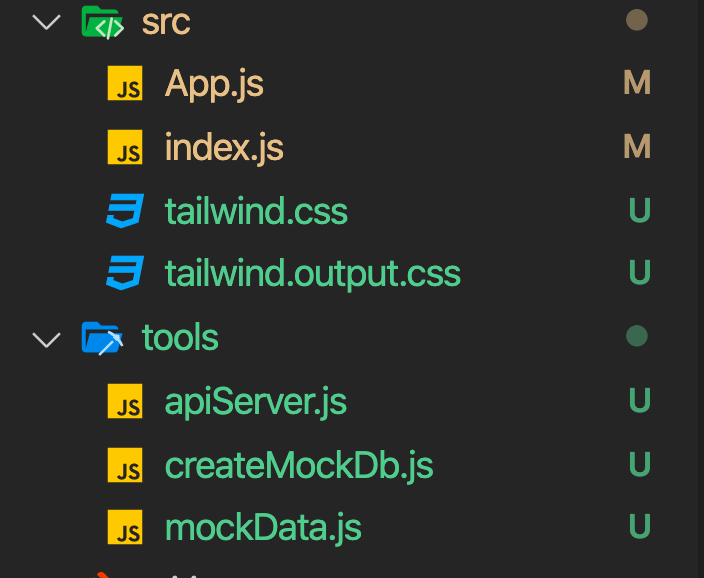
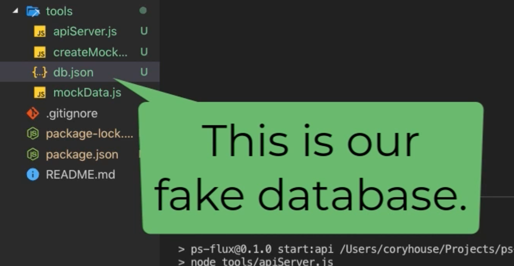
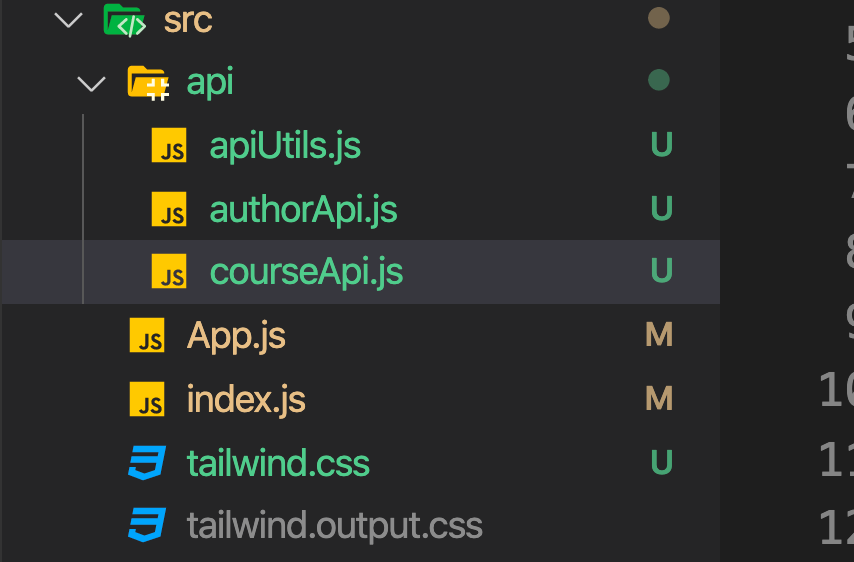

# 01 Mock API with `JSON Server`

## Avantages

- Indépendance vis à vis des délais de l'API réel.
- Disponible en cas de panne de L'API réel pour continuer le développement.
- Très rapide, ne dépend pas du réseau.
- On peut avec un `setTimeout` tester des conditions de lenteur du réseau.
- Facilite les tests.
- Avec une variable d'environnement, on peut facilement pointer vers la vraie API plus tard.

## Set up

Installation des `packages` nécessaires :

```bash
npm i -D cross-env npm-run-all json-server
```

### `cross-env`

Permet de définir des variables d'environnement.

usage :

```json
{
  "scripts": {
    "parentScript": "cross-env GREET=\"Joe\" npm run childScript",
    "childScript": "cross-env-shell \"echo Hello $GREET\""
  }
}
```

`cross-env-shell`

Est à utiliser lorsqu'il y a des caractère `shell` spéciaux dans la ligne.

### `npm-run-all`

Permet de faire tourner plusieurs scripts en même temps.

avant : `npm run clean && npm run build:css && npm run build:js && npm run build:html`

après : `npm-run-all clean build:*`

Pour faire tourner les scripts en parallèle :

`-p` `--parallel` :

`npm-run-all --parallel lint build` similaire à `npm run lint & npm run build`.

`run-p` est un alias de `npm-run-all -p`.

### Copie dans un dossier `tools` des fichiers nécessaire



### Modification de `packages.json`

```json
"scripts": {
    "build:tailwind": "tailwindcss build src/tailwind.css -O src/tailwind.output.css",
    "prestart": "npm run build:tailwind",
    "prebuild": "npm run build:tailwind",
    "prestart:api": "node tools/createMockDb.js",
    "start:api": "npde tools/apiServer.js",
    "start": "react-scripts start",
    "build": "react-scripts build",
    "test": "react-scripts test",
    "eject": "react-scripts eject"
},
```

Si la `database` est corrompue, faire `ctrl + c` pour reconstruire la `database`.

```bash
npm run start:api
```

Il faut changer le dossier `dist` par `public` dans `apiServer.js` :

```js
// Can pass a limited number of options to this to override (some) defaults. See https://github.com/typicode/json-server#api
const middlewares = jsonServer.defaults({
  // Display json-server's built in homepage when json-server starts.
  static: "node_modules/json-server/public",
  // au lieu de static: "node_modules/json-server/dist",
});
```

Le fichier généré `tools/db.json` simule une base de données, `json-server` va modifier ce fichier automatiquement.



À chaque fois que l'on `start` l'application, `db.json` est régénéré.

### Lancer l'`API` à chaque fois qu'on lance l'application

On doit de nouveau modifier `package.json` :

```json
"scripts": {
    "build:tailwind": "tailwindcss build src/tailwind.css -O src/tailwind.output.css",
    "prestart:tailwind": "npm run build:tailwind",
    "prebuild": "npm run build:tailwind",
    "prestart:api": "node tools/createMockDb.js",
    "prestart": "run-s prestart:*",
    "start": "run-p start:*",
    "start:api": "node tools/apiServer.js",
    "start:dev": "react-scripts start",
    "build": "react-scripts build",
    "test": "react-scripts test",
    "eject": "react-scripts eject"
},
```

On utilise pour le `prestart` `run-s` qui est un alias de `npm-run-all --sequential`.

L'écriture `*` permet de simplifier `run-s prestart:tailwind prestart:api` en `run-s prestart:*`.

### API javascript

Création des fonctions communiquant avec l'`API` dans le dossier `api` :



`apiUtils.js`

```js
export async function handleResponse(response) {
  if (response.ok) return response.json();
  if (response.status === 400) {
    // So, a server-side validation error occurred.
    // Server side validation returns a string error message, so parse as text instead of json.
    const error = await response.text();
    throw new Error(error);
  }
  throw new Error("Network response was not ok.");
}

// In a real app, would likely call an error logging service.
export function handleError(error) {
  // eslint-disable-next-line no-console
  console.error("API call failed. " + error);
  throw error;
}
```

`courseApi.js`

```js
import { handleResponse, handleError } from "./apiUtils";
const baseUrl = process.env.REACT_APP_API_URL + "/courses/";

export function getCourses() {
  return fetch(baseUrl).then(handleResponse).catch(handleError);
}

export function getCourseBySlug(slug) {
  return fetch(baseUrl + "?slug=" + slug)
    .then((response) => {
      if (!response.ok) throw new Error("Network response was not ok.");
      return response.json().then((courses) => {
        if (courses.length !== 1) throw new Error("Course not found: " + slug);
        return courses[0]; // should only find one course for a given slug, so return it.
      });
    })
    .catch(handleError);
}

export function saveCourse(course) {
  return fetch(baseUrl + (course.id || ""), {
    method: course.id ? "PUT" : "POST", // POST for create, PUT to update when id already exists.
    headers: { "content-type": "application/json" },
    body: JSON.stringify({
      ...course,
      // Parse authorId to a number (in case it was sent as a string).
      authorId: parseInt(course.authorId, 10),
    }),
  })
    .then(handleResponse)
    .catch(handleError);
}

export function deleteCourse(courseId) {
  return fetch(baseUrl + courseId, { method: "DELETE" })
    .then(handleResponse)
    .catch(handleError);
}
```

Utilisation de la méthode native des navigateurs `fetch`.


#### `const baseUrl = process.env.REACT_APP_API_URL + "/courses/";`

On va définir la variable d'environnement grace à cross-env dans `package.json` :

```json
"start:dev": "cross-env REACT_APP_API_URL=http://localhost:3001 react-scripts start",
```

#### Une seule instance peut tourner


Si plusieurs instances essaye de tourner en même temps une erreur `EADDRINUSE` sera levée car l'adresse localhost:3001 sera utilisée deux fois.

Il suffit de tuer un des deux processus.
