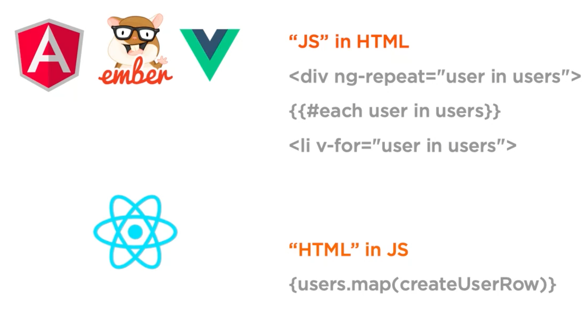
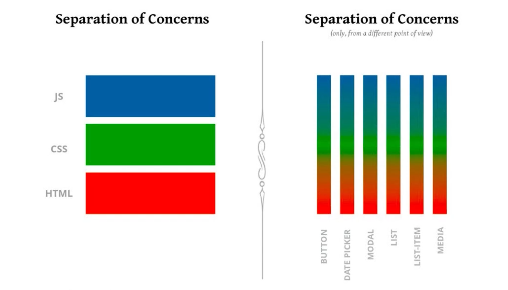
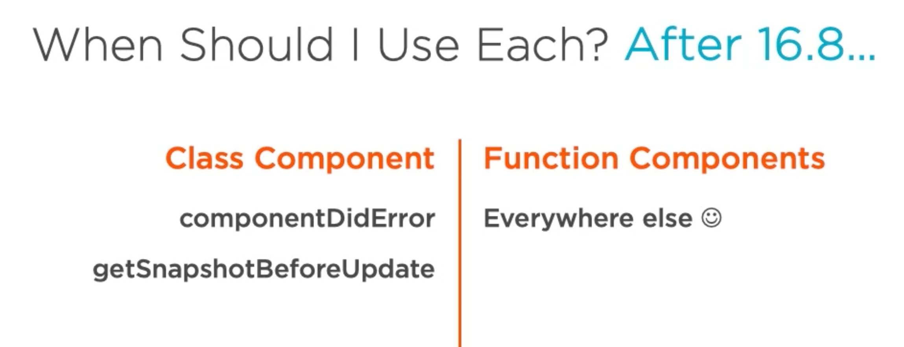

# 02 Les concepts de `React`

## `React` vs MVC

`React` peut jouer les trois rôles.

`Vue` avec son système de composant.

`Model` avec `Flux` par exemple.

`Controller` avec ce qu'on appelle `controller view` qui est un composant ne gérant que la logique en haut de composant _dumb_.


## JSX

`htmlFor` à la place de `for`.

compile en javascript (`Babel`).

optionnel.

```jsx
import React from "react";

function About() {
  return <h1>About</h1>;
}
```

compile en

```js
import React from "react";

function About() {
  return React.createElement("h1", null, "About");
}
```

### Inline Style

```jsx
function About() {
    return (
    <h1 style={{
          color: 'white',
          backgroundColor: '#fff',
          height: 20
    }})>
        About
    </h1>;
}
```


L'unité `px` est déduite, sinon il faut préciser l'unité.

Utilisation de la `camelCase`.

## Virtual `DOM`

`React` gère au mieux les changements du `DOM`, mais aussi les `event handler`.

`React` possède les `Synthetic events` ce qui lui permet de placer le véritable `event handler` à une position stratégique en terme de performance.

Comme `React` possède une représentation abstraite du `DOM`, cela lui permet des rendus côté serveur ou encore des application `native` pour les appareils mobiles (`React Native`).

## Séparation des préoccupations

Pour les autres frameworks, le `javascript` est injecté dans le `HTML`.

Il est alors nécessaire d'utilisé un `Domain Specific Language` pour travailler avec.

Avec `React`, c'est le `HTML` qui est injecté dans le `javascript`.

Au lieu d'améliorer le `HTML`, `React` permet à `javascript` d'utiliser les `markup`.

On peut donc utiliser toute la puissance du `javascript` pour composer son `JSX`.





En `React`, le composant est la préoccupation (`concern`) et on sépare en composants.

## 4 possibilités pour créer un composant

- createClass
- ES class
- Function
- Arrow function

### `createClass` Component

```jsx
var HelloWorld = React.createClass({
  render: function () {
    return <h1>Hello World</h1>;
  },
});
```

C'est une façon ancienne qui n'est plus utilisée.

### JS Class Component

Maintenant `javascript` possède des `class` dans sa syntaxe.

```jsx
class HelloWorld extends React.Component {
  constructor(props) {
    super(props);
  }

  render() {
    return <h1>Hello World</h1>;
  }
}
```

### Function Component

```jsx
function HelloWorld(props) {
  return <h1>Hello World</h1>;
}
```

### Arrow Function

```jsx
const HelloWorld = (props) => <h1>hello World</h1>;
```

## Avantages des composants fonctionnel

- Simple à comprendre.
- Évite les pièges du mot clé `this` en javascript.
- Moins de code transpilé en sortie.
- Moins de bruit dans l'écriture (pas de `return` ou de `{`).
- Facilite la complétion du code.
- Facile à tester.
- Meilleur performance.
- Les classes seront peut être supprimées dans le futur.


