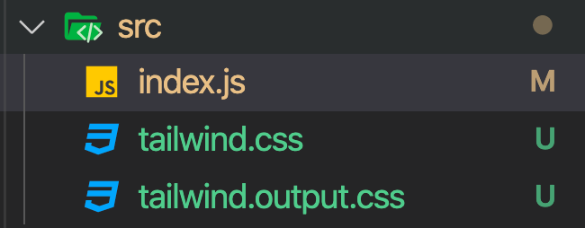
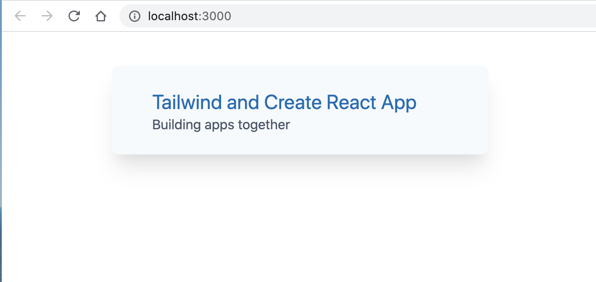

# BB Installation de `Tailwincss`

# 1re méthode

inspirée de :

https://daveceddia.com/tailwind-create-react-app/

## Basic

### Créer un projet

```bash
npx create-react-app basic-tailwind
```

### Ajouter `Tailwindcss`

```bash
npm i tailwindcss
```

Apparemment `postcss`, `autoprefixer` et `purgecss` sont inclus.

### Ajouter `tailwind` au `build`

Dans `package.json` :

On ajoute trois script `build:tailwind` `prestart` et `prebuild`.

```json
"scripts": {
    "build:tailwind": "tailwindcss build src/tailwind.css -O src/tailwind.output.css",
    "prestart": "npm run build:tailwind",
    "prebuild": "npm run build:tailwind",
    "start": "react-scripts start",
    "build": "react-scripts build",
    "test": "react-scripts test",
    "eject": "react-scripts eject"
  },
```

> #### `tailwindcss build src/tailwind.css -O src/tailwind.output.css`
>
> C'est le moyen de compiler la feuille de style utilisable.

Le nom `build:tailwind` n'a rien de spécial et aurait très bien pu être `tructrucbuild` par exemple.

Par contre dans `npm` les scripts commençant par `prequelquechose` sont spéciaux, il s'exécute avant le scriptqui s'appelle `quelquechose`.

Quand on exécute `npm run start`, automatiquement le script `prestart` s'exécute avant.

Le préfixe `post` fonctionne pareille mais exécute le script après.

Ce `setup` va seulement `build` les `css` une fois au démarrage, il ne `watch` pas les changements.

Si on modifie le fichier `src/tailwind.css` on doit redémarrer `React`.

### Création de `src/tailwind.css`

```css
@tailwind base;
@tailwind components;
@tailwind utilities;
```

### Importer la feuille de style générée `tailwind.output.css`

On va l'importer en haut de `index.js` :

```js
import React from "react";
import ReactDOM from "react-dom";
import "./tailwind.output.css";

const App = () => (
  <div className="max-w-md mx-auto flex p-6 bg-gray-100 mt-10 rounded-lg shadow-xl">
    <div className="ml-6 pt-1">
      <h1 className="text-2xl text-blue-700 leading-tight">
        Tailwind and Create React App
      </h1>
      <p className="text-base text-gray-700 leading-normal">
        Building apps together
      </p>
    </div>
  </div>
);

ReactDOM.render(<App />, document.getElementById("root"));
```



Il y ajuste le fichier `tailwind.css` à créer et un fichier `tailwind.output.css` qui est générée.

Résultat :



On peut ajouter `src/tailwindoutput.css` au `.gitignore` pour éviter de le _commiter_.

```bash
# css tailwind
/src/tailwind.output.css
```

## Production `build`

à faire ...

# 2eme méthode

inspirée de :

https://www.smashingmagazine.com/2020/02/tailwindcss-react-project/

## Créer son projet React

```bash
npx create-react-app react-tailwindcss && cd react-tailwindcss
```

## Installer `Tailwindcss`

```bash
npm i tailwindcss -D
```

## Initialiser `Tailwindcss`

```bash
npx tailwind init tailwind.js --full
```

cela génère un fichier `tailwind.js` où se trouve toute la configuration du projet.

`--full` signifie que l'on veut toutes les propriétés configurable dans le fichier de configuration.

## dépendance de `Tailwind`

```bash
npm i postcss-cli autoprefixer -D
```

## Créer le fichier de configuration de `postcss`

```bash
touch postcss.config.js
```

```js
const tailwindcss = require("tailwindcss");

module.exports = {
  plugins: [tailwindcss("./tailwind.js"), require("autoprefixer")],
};
```

ou en une ligne :

```bash
cat << EOF >> postcss.config.js
> const tailwindcss = require("tailwindcss");
>
> module.exports = {
>     plugins: [tailwindcss("./tailwind.js"), require("autoprefixer")]
> };
> EOF
```

`EOF` est un délimiteur et peut avoir n'importe quel nom.

Créer le dossier `assets` avec `main.css` et `tailwind.css`.

`tailwind.css`

```css
@tailwind base;
@tailwind components;
@tailwind utilities;
```

## Modifier les scripts dans le fichier `package.json`

```json
"scripts": {
    "start": "npm run watch:css && react-scripts start",
    "build": "npm run build:css && react-scripts build",
    "test": "react-scripts test",
    "eject": "react-scripts eject",
    "watch:css": "postcss src/assets/tailwind.css -o src/assets/main.css",
    "build:css": "postcss src/assets/tailwind.css -o src/assets/main.css"
},
```

## Importer le `css` dans `index.js`

```js
import React from "react";
import ReactDOM from "react-dom";
import "./assets/main.css";
import App from "./App";

ReactDOM.render(<App />, document.getElementById("root"));
```
