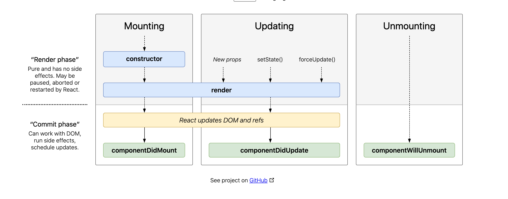

# 04 cycle de vie

## Le montage : Mounting

1. `constructor`
2. `render`
3. `componentDidMount`

## La mise à jour : Updating

4. if newProps or newState => `render` X times
5. `componentDidUpdate`

## Le démontage : Unmounting

6. `componentWillUnmount`

