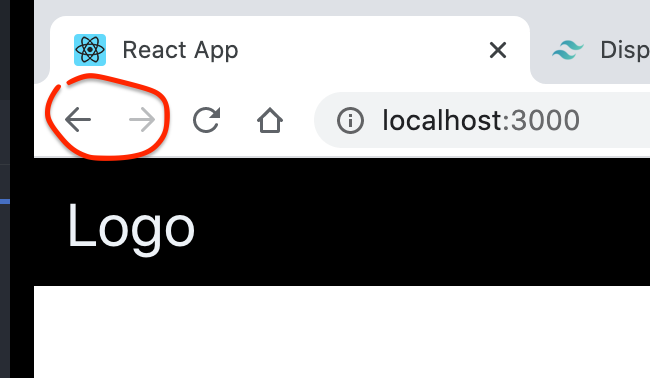

# 01 `React-router` introduction

`React-router` a deux version une pour le **web** et l'autre pour le **mobile**.

Pour le web on utilise `react-router-dom`.

## Installation

```bash
npm i react-router-dom
```

Dans `App.js` :

```js
import { BrowserRouter as Router, Route, Link } from "react-router-dom";
```

## `Router` et `Route`

`App.js`

```js
import React from "react";
import "./App.css";
import { BrowserRouter as Router, Route, Link } from "react-router-dom";

const Home = () => <h1>Hello Check</h1>;

function App() {
  return (
    <Router>
      <Route path="/" component={Home} />
    </Router>
  );
}

export default App;
```

## `exact`

Par défaut `"/"` va matcher avec toutes les routes contenant `/`.

Si on veut la route `"/"` exactement, on utilise la propriété `exact`.

`App.js`

```js
const Home = () => (
  <h1>
    Hello Check <a href="http://localhost:3000/about">About</a>
  </h1>
);
const About = () => (
  <h1>
    About <a href="http://localhost:3000">home</a>
  </h1>
);

function App() {
  return (
    <Router>
      <Route exact path="/" component={Home} />
      <Route path="/about" component={About} />
    </Router>
  );
}
```

## `Link`

On n'utilise pas `<a>` car il provoque un rafraîchissement de la page.

À la place on utilise `<Link>`.

`<Link>` permet aussi d'utiliser les flèches du navigateur :



`App.js`

```js
function App() {
  return (
    <Router>
      <h1>Header</h1>
      <div>
        <Link to="/">Home page</Link> - <Link to="/about">About page</Link>
      </div>
      <Route exact path="/" component={Home} />
      <Route path="/about" component={About} />
    </Router>
  );
}
```
