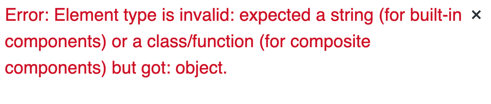

# 02 `navlink`, `render`

## `NavLink`

`NavLink` s'utilise comme `Link` et en plus ajoute la classe active si l'attribut `to` du `NavLink` correspond à l'`URL` courante.

```jsx
<NavLink to="/about">about</NavLink>
```

On obtient dans le `html` généré :

```html
<a href="/host" aria-current="page" class="active">host</a>
```

## `render`

L'utilisation de l'attribut `component` de `<Route>` ne fonctionne pas si le composant passé possède des attributs :

```jsx
<div className="App">
  <Router>
    <NavBar />
    <Route exact path="/" component={<Page title="Home" />} />
  </Router>
</div>
```



On doit alors utiliser l'attribut `render` qui accepte une `callback`.

## Nested route

On peut imbriquer les routes dans un composant enfant.

Par exemple une page `help` qui possède plusieurs sous éléments :

`Help.js`

```jsx
<div className="mt-4 bg-red-200">
  <h1>Welcome to Help Page</h1>

  <Route path="/help/customer" component={Customer} />
  <Route path="/help/host" component={Host} />
  <footer className="bg-black text-gray-400 p-10">
    <NavLink to="/help/customer">Help for Customer</NavLink> |
    <NavLink to="/help/host">Help for Host</NavLink>
  </footer>
</div>
```

Dans l'élément parent on a :

`App.js`

```jsx
<Route path="/help" component={Help} />
```

Si on garde l'attribut `exact` cela ne fonctionne pas car alors le composant `<Help />` ne serait plus rendu.
