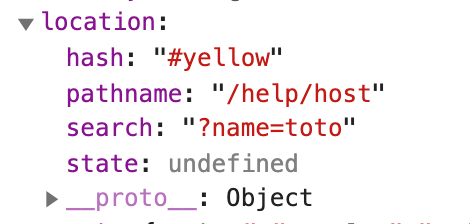
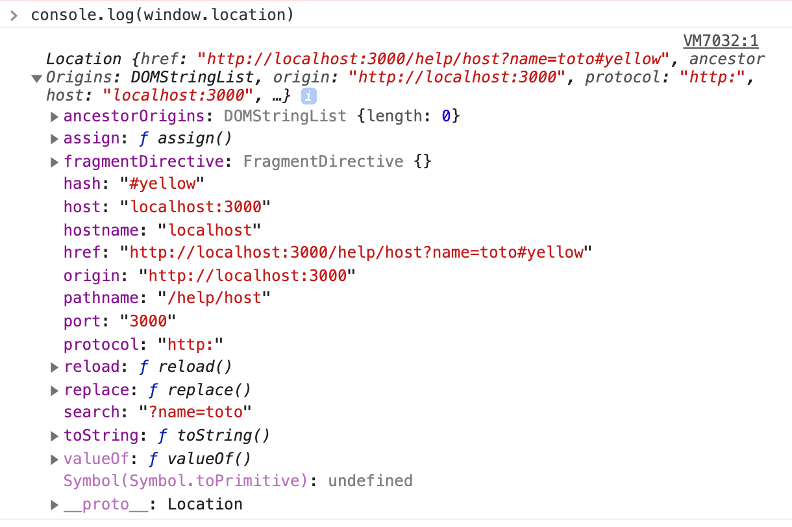

# 03 `Router` props

Pour que le `Router` passe ses `props` à un composant, celui-ci doit être appelé par une `<Route>`.

```jsx
<Router>
  <Route path="/" component={NavBar} />
</Router>
```

IL a alors accès à des _utilitaires_ dans ses `props`.

`Navbar.js`

```jsx
function NavBar(props) {
  console.log(props);
  // ...
}
```

`console`

```js
{history: {…}, location: {…}, match: {…}, staticContext: undefined}
history:
action: "POP"
block: ƒ block(prompt)
createHref: ƒ createHref(location)
go: ƒ go(n)
goBack: ƒ goBack()
goForward: ƒ goForward()
length: 50
listen: ƒ listen(listener)
location: {pathname: "/", search: "", hash: "", state: undefined, key: "pgjmgu"}
push: ƒ push(path, state)
replace: ƒ replace(path, state)
__proto__: Object
location:
hash: ""
key: "pgjmgu"
pathname: "/"
search: ""
state: undefined
__proto__: Object
match:
isExact: true
params: {}
path: "/"
url: "/"
__proto__: Object
staticContext: undefined
__proto__: Object
```

## `location`

On va utiliser cette url :

```
http://localhost:3000/help/host?name=toto#yellow
```



On pourrait aussi avoir ces infos avec `window.location` :



## `history`

C'est une structure de données de type `stack` `fifo` (firt in first out).

En français on appelle cela une pile.
