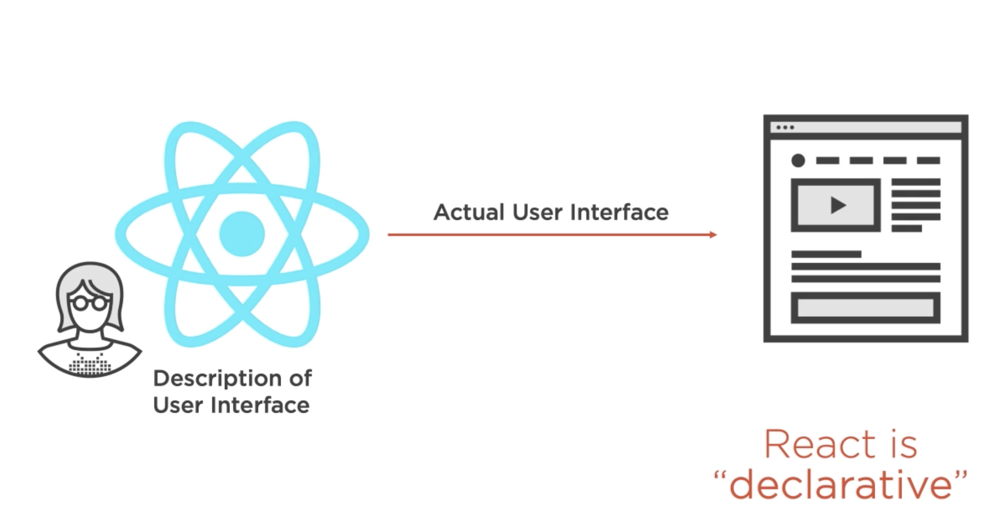
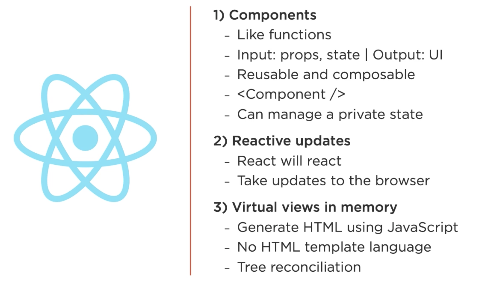
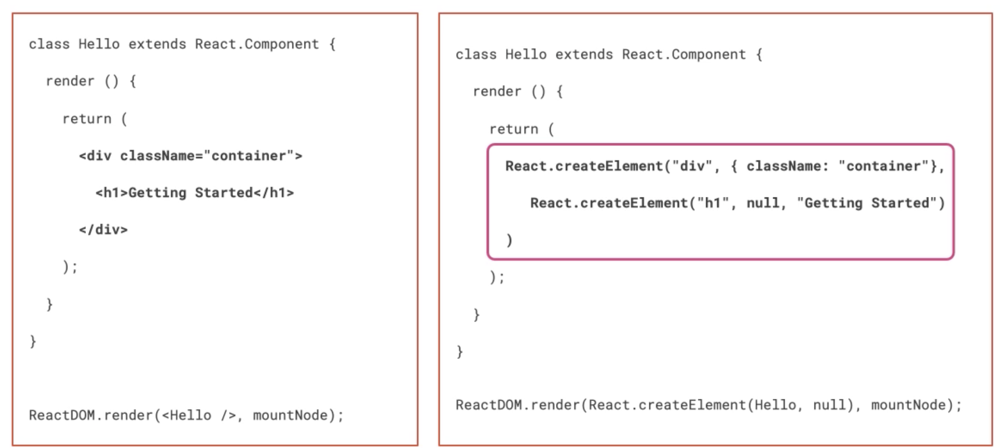
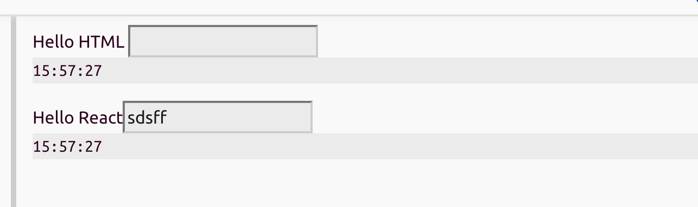
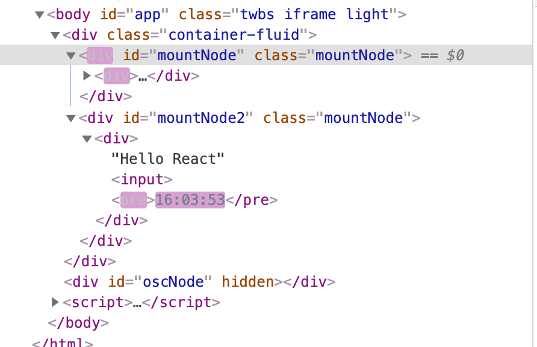

# 01 Les basiques



## Avantages

**React** simplifie le `DOM`.

**React** est du pure **Javascript** : L'`API` de **React** est assez petite, le reste c'est du pure **Javascript**.

C'est une **librairie**, pas un **framework** : plus souple, plus petit qu'un **framework**.

**React Native** permet de faire du mobile avec les mêmes compétences.

## React Fundamental

3 concept

1. Composant
2. Mise à jour reactive
3. virtual DOM



## `Props` et `State`

Les `props` sont immuable.

Seul le `state` peut être changé dans une application React.

## JSX

**JSX** est un compromis entre le **HTML** et de pure fonction javascript.

**JSX** est compilé en pure fonction javascript qui à leur tour vont manipuler le `DOM`.



## Exemple

```jsx
const Count = () => {
  const [count, setCount] =  useState(0);
  return <button onClick={() => setCount(count + 1)}>{ 🦋 count }</button>
};

ReactDOM.render(<Count />, mountNode);
```

#### ! ne pas passer directement `setCount` à `onClick` car il serait exécuté au lieu d'être passé au gestionnaire de click.

`ReactDOM.render` est le point d'entrée d'une application **React**.

Le premier argument est un élément **JSX**, le deuxième est le point de montage dans le `DOM` réel.

`mountNode = document.getElementById("mountNode")`

On peut réécrire le **JSX** de cette façon :

```js
return React.createElement(
  "button",
  {
    onClick: () => {
      setCount(count + 1);
    },
  },
  "\uD83E\uDD8B ",
  count
);
```

Le nom d'un composant **doit** commencer par une lettre capitale pour ce différencier du `html` classique.

### Amélioration du style

```jsx
const Count = () => {
  const [count, setCount] = useState(5);
  const handleClick = () => setCount(count * 2);

  return <button onClick={handleClick}>🦋 {count}</button>;
};
```

Utilisation des parenthèse en `JSX` pour indenter de manière lisible.

Création de `handlClick` pour sortir la logique de la fonction du `JSX`.

## Afficher deux composants

Utilisation d'un tableau de composant :

```jsx
function Count() {
  const [count, setCount] = useState(5);
  const handleClick = () => setCount(count * 2);

  return <button onClick={handleClick}>🦋 {count}</button>;
}

function Display() {
  return <div> .... </div>;
}

ReactDOM.render([<Count />, <Display />], mountNode);
```

On peut aussi utiliser une `<div>` pour entourer les deux composants :

```jsx
ReactDOM.render(
  <div>
    <Count />
    <Display />
  </div>,
  mountNode
);
```

Ou pour ne pas ajouter une `<div>` au `DOM` réel on peut utiliser `React.Fragment` :

```jsx
ReactDOM.render(
  <React.Fragment>
    <Count />
    <Display />
  </React.Fragment>,
  mountNode
);
```

`<React.Fragment>` possède un raccourci en `JSX` : `<>`

```jsx
ReactDOM.render(
  <>
    <Count />
    <Display />
  </>,
  mountNode
);
```

## Remonter le `state` d'un niveau

Pour que deux composants puissent communiquer, le `state` doit se trouver dans le parent de ces deux composants.

```jsx
function App() {
  const [count, setCount] = useState(5);
  const incrementCount = () => setCount(count + 1);

  return [
    <h1>My App</h1>,
    <Count incrementCount={incrementCount} />,
    <Display message={count} />,
  ];
}
```

### One-Way flow of data

On passe les données par l'objet clé-valeur `props` en utilisant la syntaxe des attributs `HTML`.

```jsx
function Display(props) {
  return <div> {props.message} </div>;
}
```

On peut simplifier la syntaxe :

```jsx
function Display({ message }) {
  return <div> {message} </div>;
}
```

### Séparation des responsabilités

```jsx
function Button({ onClickFunction }) {
  return <button onClick={onClickFunction}>🦋 + 1</button>;
}

function Display({ message }) {
  return <div> {message} </div>;
}

function App() {
  const [count, setCount] = useState(5);
  const incrementCount = () => setCount(count + 1);

  return (
    <div>
      <h1>My App</h1>
      <Button onClickFunction={incrementCount} />
      <Display message={count} />
    </div>
  );
}

ReactDOM.render(<App />, mountNode);
```

Le composant `App` détient la logique des données tandis que `Display` et `Button` n'ont pas à savoir ce qui se cache derrière `message` et `onClickFunction`, mais juste afficher et invoquer au click.

Chaque composant à sa responsabilité bien séparée des autres.

Une question est couramment posée dans **React** :

#### Quel composant a la responsabilité du `state` ?

Le plus haut possible dans la hiérarchie des composants et le plus près possible des composants utilisants les valeurs du `state`.

## Manipulation du `DOM` vs React

```jsx
const render = () => {
  document.getElementById("mountNode").innerHTML = `
    <div>
      Hello HTML
      <input />
      <pre>${new Date().toLocaleTimeString()}</pre>
    </div
  `;

  ReactDOM.render(
    React.createElement(
      "div",
      null,
      "Hello React",
      React.createElement("input", null),
      React.createElement("pre", null, new Date().toLocaleTimeString())
    ),
    document.getElementById("mountNode2")
  );
};

setInterval(render, 1000);
```



On voit que le même `HTML` rendu via **React** est plus long à écrire qu'avec les manipulations de `DOM` classique.

Mais là où la magie opère c'est que le premier `input` est inutilisable, car il se régénère toutes les secondes.

Par contre le deuxième `input` gérer par **React** est tout à fait utilisable car **React** ne modifie les noeuds du `DOM` que si leur valeur a changé.



On voit dans le premier cas que toutes la chaine du `DOM` est à chaque `tick` modifier tandis que dans le deuxième cas c'est juste la balise `pre`.

**React** permet de réfléchir a son interface de manière **déclarative** (quoi) et non **impérative** (comment).

cela permet de se concentrer sur la logique métier de son interface sans se perdre en comment mettre à jour le `DOM`.

Le `Virtual DOM` peut être écrit en `JSX`, ce qui rend la syntaxe de **React** très agréable.
