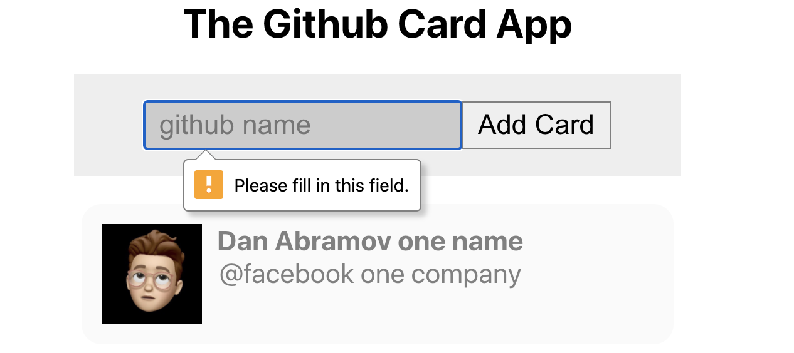
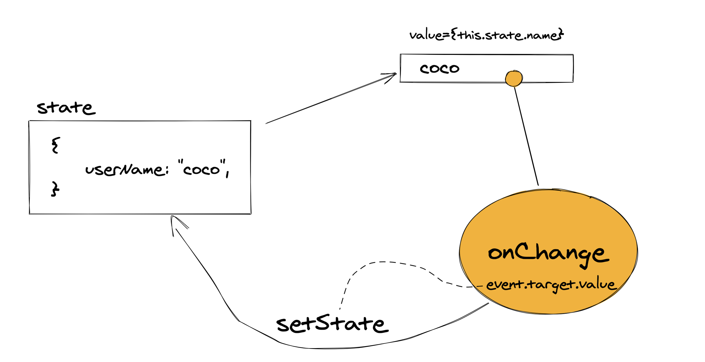

# 06 form

## Champs de formulaire

L'attribut required est compris par les navigateurs modernes, c'est une bonne raison de mettre le gestionnaire de formulaire plutôt sur la balise `<form>` que sur le bouton `<button>`, car l'événement `submit ` sera bloqué sur le formulaire.

En deux mot choisir l'événement `submit` du `<form>` plutôt que l'événement `click` du `<button>`.

```jsx
const handleSubmit = (event) => {
  event.preventDefault();
  console.log("form submitted");
};

return (
  <form style={formStyle} onSubmit={handleSubmit}>
    <input style={inputStyle} type="text" placeholder="github name" required />
    <button style={buttonStyle}>Add Card</button>
  </form>
);
```



C'est le navigateur qui traite le `warning` grâce à l'attribut `required` mis sur la balise `<input>`.

L'objet `event` passer à la fonction `handler` est un `wrapper React` de l'objet `event` de javascript.

`wrapper` ± conteneur de l'objet natif javascript.

### `event.preventDefault()` pour éviter le rafraîchissement du navigateur.

## `ref` : accès par le `DOM`

On utilise l'`API` `React.createRef` :

```jsx
class Form extends Component {
  userNameInput = React.createRef(); // On utilise l'API de React

  handleSubmit = (event) => {
    event.preventDefault();
    console.log("form submitted");
    console.log(this.userNameInput);
  };

  render() {
    return (
      <form style={formStyle} onSubmit={this.handleSubmit}>
        <input
          style={inputStyle}
          type="text"
          placeholder="github name"
          ref={this.userNameInput} // ici on passe le champ à l'attribut
          required
        />
        <button style={buttonStyle}>Add Card</button>
      </form>
    );
  }
}
```

D'abord on crée un champ `userNameInput = React.createRef();` puis dans notre `JSX` :

`ref={this.userNameInput}`

On récupère la valeur de l'input avec `this.userNameInput.current.value`.

## Controlled Component

```jsx
class Form extends Component {
  state = {
    userName: "",
  };

  handleSubmit = (event) => {
    event.preventDefault();
    console.log("form submitted");
    console.log(this.state);
  };

  render() {
    return (
      <form style={formStyle} onSubmit={this.handleSubmit}>
        <input
          style={inputStyle}
          type="text"
          placeholder="github name"
          onChange={(event) => this.setState({ userName: event.target.value })}
          value={this.state.userName}
          required
        />
        <button style={buttonStyle}>Add Card</button>
      </form>
    );
  }
}
```

Un composant controlé par **React** a son `state` relié avec la valeur du formulaire.

`value` est relié au `state` et un **event listener** `onChange` est placé sur l'élément pour transmettre les changements



## Modifier le `state` d'un parent : passer la référence d'une méthode

Pour que `Form ` transmette à `App` les données reçu, `App` passe par les `props` une référence à une méthode modifiant son `state`.

Pour gérer les appelles `AJAX` on utilise `Axios` :

```bash
npm i axios
```

Dans `Form`

```jsx
import axios from "axios";
```

```jsx
const response = await axios.get(url);
```

### `App.js`

```jsx
import React, { Component } from "react";
import "./App.css";
import CardsList from "./CardsList";
import Form from "./Form";

const testData = [...];

class App extends Component {
    state = {
        profiles: [],
    };

    addProfile = (user) => {
        this.setState((oldState) => ({
            profiles: [...oldState.profiles, user],
        }));
    };

    render() {
        return (
            <div className="App">
                <h1>The Github Card App</h1>
                <Form onSubmit={this.addProfile} />
                <CardsList profiles={this.state.profiles} />
            </div>
        );
    }
}

export default App;
```

Si le nouveau `state` est obtenu à partir de l'ancien, `setState` prend une fonction comme argument :

#### `oldState => newState`

Ici `newState` est calculé en concatenant l'ancien tableau et le nouvel élément en utilisant le `spead operator : ...` :

#### `[...oldState.profiles, user]`

On passe la référence à `addProfile` à travers la propriété `onSubmit` de notre élément `<Form>`.

#### ! `onSubmit` est une prpopriété du composant React `<Form>`, pas un écouteur d'événement associé à la balise (l'élément `DOM`) `<form>`.

### `Form.js`

```jsx
class Form extends Component {
  state = {
    userName: "",
  };

  handleSubmit = async (event) => {
    event.preventDefault();
    const response = await axios.get(
      `https://api.github.com/users/${this.state.userName}`
    );

    let { avatar_url, name, login, company } = response.data;

    name = name || login;
    company = company || "no company";

    this.props.onSubmit({ name, avatar_url, company });
    // clear the text of the input
    this.setState({ userName: "" });
  };

  render() {
    return (
      <form style={formStyle} onSubmit={this.handleSubmit}>
        <input
          style={inputStyle}
          type="text"
          placeholder="github name"
          onChange={(event) => this.setState({ userName: event.target.value })}
          value={this.state.userName}
          required
        />
        <button style={buttonStyle}>Add Card</button>
      </form>
    );
  }
}
```

La propriété `userName` est **contrôlée** par le composant React :

- l'attribut `value` de l'`input` est branché sur le `state` du composant.
- un écouteur `onChange` est branché sur l'`input` et modifie le `state` à chaque changement.
- l'événement `onSubmit` est contrôlé grace à un `event.preventDefault()`.
- L'opérateur `||` est utilisé pour donner une valeur par défaut à certain champs.
