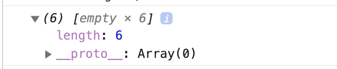
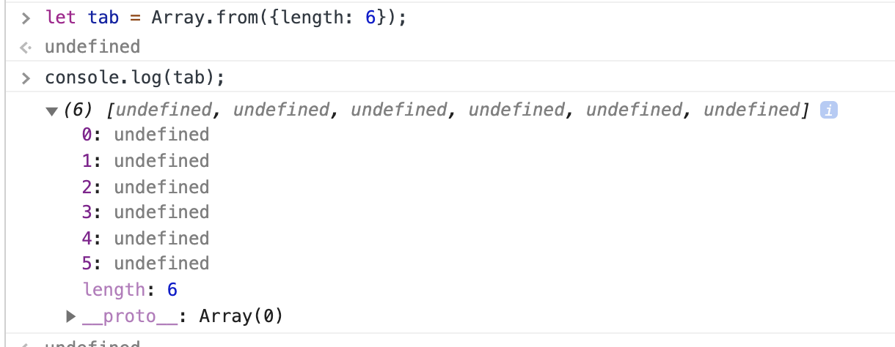

# 08 les tableaux d'éléments

On peut se servir des fonctions sur les tableaux pour générer des éléments.

## Rappel javascript

### `Array.from`

On peut générer une séquence de valeurs avec cette syntaxe :

```js
const c = Array.from({ length: 4 }, (_, i) => 1 + i);
c; //? [ 1, 2, 3, 4 ]
```

On peut aussi utiliser le `spread operator ...` :

```js
[...Array(4)].map((_, i) => 1 + i); //? [ 1, 2, 3, 4 ]
```

### Mauvaise syntaxe

```js
const a = new Array(6);
a.map((_, i) => i + 1); //? [ , , , , ,  ]
```

Explication : `new Array(6)` ne crée aucun élément, du coup `map` ne trouve rien à `mapper`.



En comparaison `Array.from` crée des index et associe `undefined` à chacun.



## Fonction `range`

```js
const range = (start, end) =>
  Array.from({ length: end - start + 1 }, (_, i) => start + i);

range(5, 9); //? [ 5, 6, 7, 8, 9 ]
```

## `React` et les tableaux de composant

```jsx
<div className="left">
    {utils.range(1, stars).map((starId) => (
        <div key={starId} className="star"></div>
    ))}
</div>
<div className="right">
    {utils.range(1, 9).map((buttonId) => (
        <button key={buttonId} className="number">
            {buttonId}
        </button>
    ))}
</div>
```

En utilisant la syntaxe fonctionnelle `.map` des tableaux on peut générer des boucles de création de composants.
