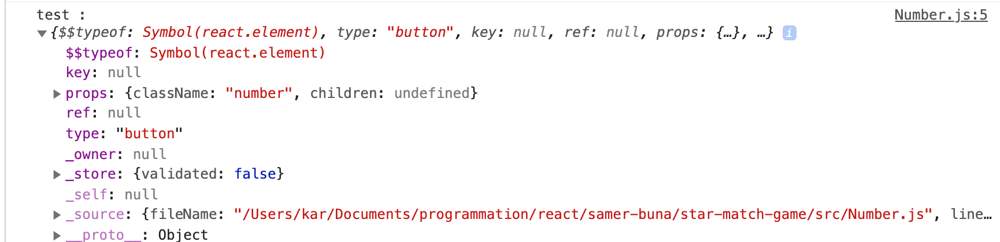
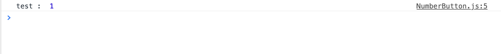

# 09 design de conception en React

## Règle pour savoir quand on utilise `useState`

Lorsque dans le code on identifie une valeur de l'interface qui est susceptible de changer, alors on la met dans le `state`.

```jsx
const [stars, setStars] = useState(utils.random(1, 9));
```

## Règle pour découper son interface en `component`

Si des élément partagent des données similaires ou un comportement similaire, ce sont de bon candidat pour créer un composant autonome.

## Attention de ne pas écraser des objets natif javascript

Par exemple on peut écrire un composant `<Number />`

```jsx
import React from "react";

const Number = ({ number }) => <button className="number">{number}</button>;

export default Number;
```

Mais alors la classe `Number` javascript sera _overridée_ et un code tel que :

```js
console.log("test : ", Number("1"));
```



ne fonctionnera plus comme attendu.

#### ! Toujours nommer ses composant avec deux mots.

```jsx
import React from "react";

const NumberButton = ({ number }) => (
  <button className="number">{number}</button>
);

export default NumberButton;
```

Quelque part dans le code :

```js
console.log("test : ", Number("1"));
```



## Ordre logique en React

On commence par implémenter la logique de l'interface (UI Logic).

Puis on implémente la logique des données (data logic).

Pour ce faire on peut utiliser dans le `state` des valeurs "_croquis_" (mock values).

```jsx
const [stars, setStars] = useState(utils.random(1, 9));
const [availableNums, setAvailableNums] = useState([1, 2, 3, 4, 5]);
const [candidateNums, setCandidateNums] = useState([2, 3]);
```

On ne met dans le `state` que les données non calculable, les données calculables étant déduite de celle dans le `state`.

## Implémentation de la logique

La logique est implémentée dans le composant parent :

```js
const candidatesAreWrong = utils.sum(candidateNums) > stars;

const numberStatus = (number) => {
  if (!availableNums.includes(number)) {
    return "used";
  }

  if (candidateNums.includes(number)) {
    return candidatesAreWrong ? "wrong" : "candidate";
  }

  return "available";
};
```

### `.includes` détermine si une valeur est dans un tableaux et renvoie `true` ou `false`.

```
arr.includes(elementToFind);
arr.includes(elementToFind, startIndex);
```

le composant enfant reste simple :

```jsx
<div className="right">
  {utils.range(1, 9).map((number) => (
    <NumberButton key={number} status={numberStatus(number)} number={number} />
  ))}
</div>
```

```jsx
const NumberButton = ({ number, status }) => (
  <button
    className="number"
    style={{ backgroundColor: colors[status] }}
    onClick={() => console.log(number)}
  >
    {number}
  </button>
);
```

#### ! on essaye de garder la logique le plus haut possible

## Organisation d'un composant

1. Les appelle au `state` .
2. Les valeurs calculées.
3. Les méthodes.
4. le rendu `jsx`.

## Réunir deux variables en une

Il est toujours intéressant de réunir deux variables ayant une information lié en une seule :

```js
// avant
const gameIsDone = availableNums.length === 0;
const gameIsLost = secondLeft === 0;
```

```js
// après
const gameStatus =
  availableNums.length === 0 ? "won" : secondLeft === 0 ? "lost" : "active";
```
