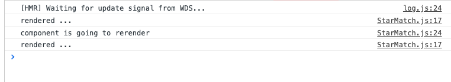

# 11 `useEffect`

`useEffect` est exécutée à chaque fois qu'il y a un rendu.

```jsx
useEffect(() => {
  console.log("rendered !!");
});
```

`useEffect` retourne une `callback` qui sera exécutée avant que le composant soit re-rendu :

```jsx
useEffect(() => {
  console.log("rendered ...");
  if (secondLeft > 0) {
    setTimeout(() => {
      setSecondLeft(secondLeft - 1);
    }, 1000);
  }

  return () => console.log("component is going to rerender");
});
```



Le composant est d'abord rendu,

puis avant d'être re-rendu, la `callback` de `useEffect` est exécutée,

puis le composant est re-rendu.

## Toujours nettoyer ses effets

```jsx
useEffect(() => {
  if (secondLeft > 0) {
    const timerId = setTimeout(() => {
      setSecondLeft(secondLeft - 1);
    }, 1000);
    console.log("timerId", timerId);
    return () => clearTimeout(timerId);
  }
});
```

Ici on nettoie le `timer`.
