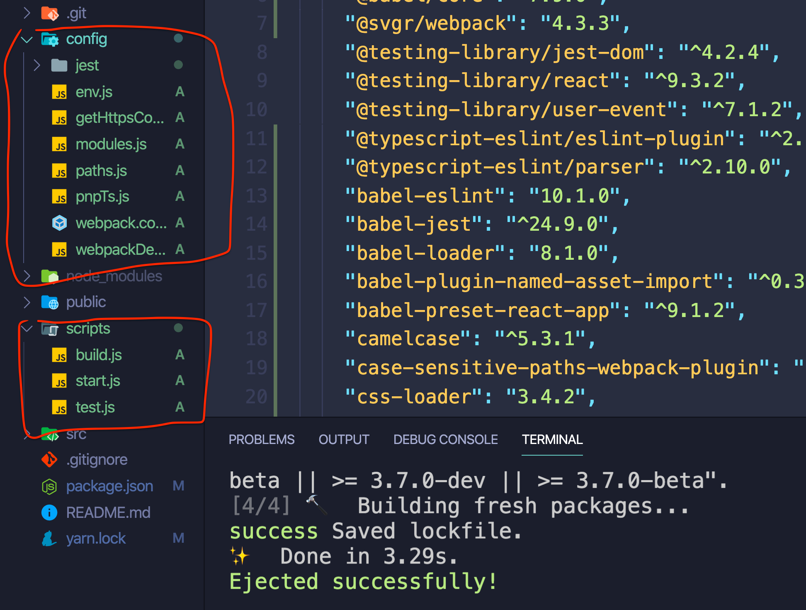

# 14 Créer son environnement de dev `from scratch`

## create-react-app

On peut simplifier la création de l'environnement en utilisant `create-react-app`.

```bash
npx create-react-app my-project
```

`npx` exécute le package le plus récent et le conserve dans le cache.

### `npm run eject`

Permet d'avoir un plein contrôle sur la configuration.



## Faire soi-même son environnement

```bash
mkdir from-scratch
cd from-scratch
npm init
```

### installation des dépendances :

#### React lui-même

```bash
code -r . # pour ouvrir dans visual studio code -r pour re-use window
npm i react react-dom
```

#### Webpack

C'est un `module bundler` :

```bash
npm i webpack webpack-cli
```

Pour l'instant les navigateur de reconnaissent pas les modules pour javascript, **Webpack** permet de développer avec plusieurs fichiers et d'en envoyer un seul au navigateur.

#### Babel

C'est le package qui compile `jsx` dans l'API normal de React (`React.createElement`).

```bash
npm i babel-loader @babel/core @babel/node @babel/preset-env @babel/preset-react
```

`@babel/preset-env` permet de convertir le javascript moderne (peut recevoir plus d'infos sur les navigateurs ciblés).

#### Nodemon

Pour relancer `npm start` automatiquement à chaque sauvegarde.

```bash
npm i -D nodemon # -D dev dependencie
```

```json
"devDependencies": {
    "nodemon": "^2.0.4"
  }
```

#### ESLint

```bash
npm i -D eslint babel-eslint eslint-plugin-react
```

#### Express

```bash
npm i -D express
```
