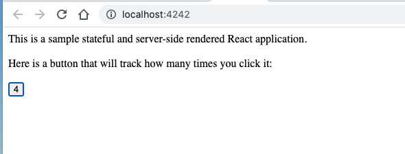
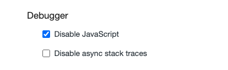

# Configurer ses outils

source :

https://jscomplete.com/learn/1rd-reactful

## `eslint`

Il faut créer un fichier `.eslintrc.js`

```js
module.exports = {
  parser: "babel-eslint",
  env: {
    browser: true,
    commonjs: true,
    es6: true,
    node: true,
    jest: true,
  },
  parserOptions: {
    ecmaVersion: 2020,
    ecmaFeatures: {
      impliedStrict: true,
      jsx: true,
    },
    sourceType: "module",
  },
  plugins: ["react", "react-hooks"],
  extends: [
    "eslint:recommended",
    "plugin:react/recommended",
    "plugin:react-hooks/recommended",
  ],
  settings: {
    react: {
      version: "detect",
    },
  },
  rules: {
    // You can do your customizations here...
    // For example, if you don't want to use the prop-types package,
    // you can turn off that recommended rule with: 'react/prop-types': ['off']
  },
};
```

## Jest

Framework conseillé pour les tests.

## Structure de fichier initialle

Structure conseillée pour travailler facilement avec **Webpack**.

```
from-scratch/
  dist/
    main.js
  src/
    index.js
    components/
      App.js
    server/
      server.js
```

```bash
mkdir dist src
mkdir src/components src/server
```

## Configurer `Babel`

On crée à la racine le fichier `babel.config.js`.

```js
module.exports = {
  presets: ["@babel/preset-env", "@babel/preset-react"],
};
```

## Configurer `Webpack`

On crée à la racine le fichier `webpack.config.js`.

```js
module.exports = {
  module: {
    rules: [
      {
        test: /\.js$/,
        exclude: /node_modules/,
        use: {
          loader: "babel-loader",
        },
      },
    ],
  },
};
```

**traduction** : pour tous les fichiers finissant par `.js` et ne situant pas dans `/node_modules` utilise `babel-loader`.

`babel-loader` va rechercher dans les fichiers le `jsx` pour le transformer en du javascript correcte en utilisant l'API de React.

## Créer ses script

On va les créer dans `package.json`.

```json
"scripts": {
    "test": "jest",
    "dev-server": "nodemon --exec babel-node src/server/server.js --ignore dist"
}
```

`dist` contenu que le résultat généré, on ne le `watch` pas : `--ignore dist`.

```json
"dev-bundle": "webpack -wd"
```

`-w` `watch` mode de **Webpack**

`-d` pour le développement un bundle non-minifié et non-uglyfié.

Pour la production on peut lancer **Webpack** avec l'option `-p`.

#### `index.js`

```jsx
import React from "react";
import ReactDOM from "react-dom";

import App from "./components/App";

ReactDOM.hydrate(<App />, document.getElementById("mountNode"));
```

`hydrate` est dans un contexte de rendu côté serveur (server side rendering).

#### `App.js`

```jsx
import React, { useState } from "react";

export default function App() {
  const [count, setCount] = useState(0);
  return (
    <div>
      This is a sample stateful and server-side rendered React application.
      <br />
      <br />
      Here is a button that will track how many times you click it:
      <br />
      <br />
      <button onClick={() => setCount(count + 1)}>{count}</button>
    </div>
  );
}
```

#### `server.js`

```jsx
import express from "express";
import React from "react";
import ReactDOMServer from "react-dom/server";
import App from "../components/App";

const server = express();
server.use(express.static("dist"));

server.get("/", (req, res) => {
  const initialMarkup = ReactDOMServer.renderToString(<App />);

  res.send(`
    <html>
      <head>
        <title>Sample React App</title>
      </head>
      <body>
        <div id="mountNode">${initialMarkup}</div>
        <script src="/main.js"></script>
      </body>
    </html>
  `);
});

server.listen(4242, () => console.log("Server is running..."));
```

## Lancer le serveur

On va lancer deux commandes : une pour le serveur et l'autre pour créer le `bundle`.

```bash
npm run dev-server # express
npm run dev-bundle # webpack
```


**Webpack** va créer le fichier `main.js` dans le dossier `dist`.



On a bien notre application **React** qui tourne sur `localhost:4242`.

Si dans les dev-tools de **Chrome** on désactive **Javascript**, on conserve le squelette de l'application.

Notre application est `server side rendering`.


