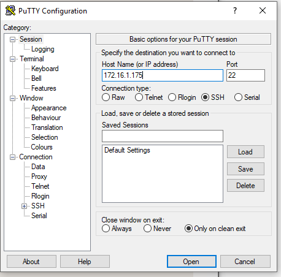

# Raspberry SSH

## Secure SHell

Connecter son Raspberry à distance.

récupérer l'adresse IP :

`ifconfig`

### Sur mac

```bash
ssh pi@175.2.4.125
```

mdp: raspberry


### Sur Windows

Utilisation de Putty pour se connecter en SSH

Il faut juste introduire l'IP pour se connecter.



Sur le **Raspberry Pi** avec **Raspian lite** :

Taper `raspi-config`  cela ouvre la fenêtre de configuration

Aller sur `interfacing options` et choisir `ssh` `enable`

alternative (à tester) :

```bash
sudo systemctl enable ssh
sudo systemctl start ssh
```

Pour connaître l'IP du Raspberry `ifconfig` ou `hostname -I`

