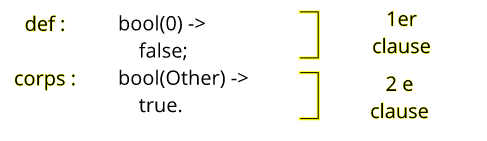

# 04 Les fonctions

## Anatomie d'un fonction

### Signature

La signature est de la forme :

```
nom_de_fonction/arité
```

```erlang
add/2
add/3
translate/2
alert/0
```

### Clause

Une fonction se compose d'une ou plusieurs clause(s).

### Définition

La définition de la fonction est constituée du nom, de parenthèse et des paramètres

### Corps

Le corps de la fonction se compose d'une ou plusieurs instruction(s).




## Utilisation du Pattern Matching pour chercher des valeurs identiques

```erlang
-module(twin).

-export([detect/2]).

detect(Name, Name) ->
    io:format("~p and ~p are twin ~n", [Name, Name]);
detect(Name, OtherName) ->
    io:format("~p and ~p aren't twin ~n", [Name, OtherName]).
```

```
27> twin:detect("olaf","ilaf").
"olaf" and "ilaf" aren't twin 
ok

28> twin:detect("tom","tom").  
"tom" and "tom" are twin 
ok
```

En fait c'est une comparaison de motif qui s'effectue entre `Name, Name` et `"olaf", "ilaf"`  , on recherche s'il y a correspondance.

Comme il ne peut y avoir qu'une seule liaison de la variable `Name` , Erlang va chercher une correspondance pour le deuxième paramètre `Name`.

## Imbrication de fonctions

```erlang
31> lists:reverse(lists:flatten([4,5,[1,2,3,[4,9],7],8])).
[8,7,9,4,3,2,1,5,4]
```

#### ! list`s` est au pluriel -> `lists:`

### `lists:reverse/1`

### `lists:flatten/1`

## Appel de fonction dynamique

On peut coder un appel de fo,nction avec des variables qui ne seront connue qu'à l'exécution : runtime.

```erlang
-module(reflexif).
%% on doit exporter selfy pour qu'elle soit disponnible au runtime
-export([mirror/3, selfy/1]).

mirror(Module, Function, Parameter) ->
    Module:Function(Parameter).  %% L'appel est sous forme de variable pour l'instant inconnues

selfy(Parameter) ->
    Parameter.
```

```erlang
reflexif:mirror(reflexif, selfy, me_myself_and_i).
me_myself_and_i
```

`selfy` est appelée dynamiquement dans le shell en passant sont nom à `reflexif:mirror`

## Compilation et appel dynamique

```erlang
-module(existence).

-export([start/0]).

start() ->
    dont_existe().
```

```erlang
 c(existence).
existence.erl:6: function dont_existe/0 undefined
error
```

Ici le code ne compile pas.

Par contre, si j'appel un fonction d'un hypothètique module cela va fonctionner :

```erlang
-module(existence).

-export([start/0]).

start() ->
    abracadabra_module:dont_existe().
```

```erlang
6> c(existence).
{ok,existence}

7> existence:start().
** exception error: undefined function abracadabra_module:dont_existe/0
```

Erlang permet d'appeler une fonction d'un module qu'il ne connait pas à la compilation.

## `apply` et `spawn` 

```erlang
-module(dyna).

-export([process/0, compute/0]).

process() ->
    spawn(?MODULE, dont_exist, []).

compute() ->
    apply(?MODULE, unknow_function, []).
```

```
8> c(dyna).
{ok,dyna}
```

Malgré la présence de fonction non définie dans le module, celui-ci compile.

Spawn et apply appelant réellement la fonction dans leur propre code, ce cas est traité comme comme un appel d'un module externe (voire plus haut).

## Fonctions anonymes

```erlang
fun(Param, ...) -> expr1, expr2, expr3, ... end
```

Les fonctions anonymes peuvent être liées à une variable.

```erlang
-module(fa).

-export([compute/2]).

compute(MyFunc, X) ->
    MyFunc(X).
```

```erlang
16> fa:compute(fun(X) -> X + 2 end, 6).
8
```

