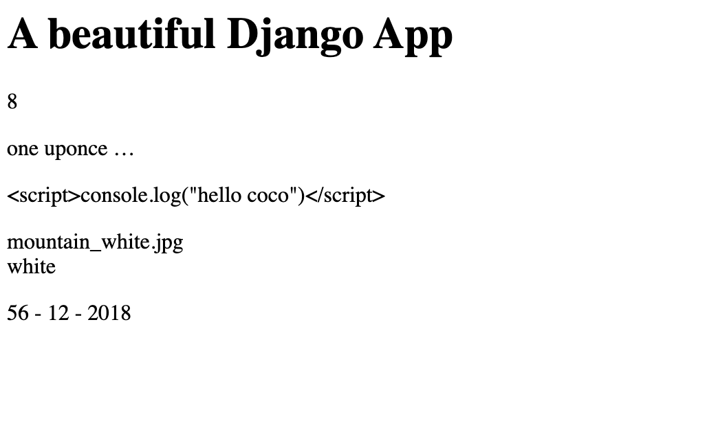

# template

## DTL Django Template Language

Les templates sont configurés dans `settings.py`

```python
TEMPLATES = [
    {
        'BACKEND': 'django.template.backends.django.DjangoTemplates',
        'DIRS': [],
        'APP_DIRS': True,
        'OPTIONS': {
            'context_processors': [
                'django.template.context_processors.debug',
                'django.template.context_processors.request',
                'django.contrib.auth.context_processors.auth',
                'django.contrib.messages.context_processors.messages',
            ],
        },
    },
]
```

On peut définir un dossier de `templates` avec `'DIRS'`

`'APP_DIRS'` à `true` signifie que `Django` va chercher dans les dossiers d'`app` pour trouver les templates

Ici on utilise `DjangoTemplates`, mais on pourrait dséfinir `jinga` comme moteur de templates

On crée dans l'`App` un dossier `templates ` et dedans un dossier au nom de l'`app`

Dedans on crée un fichier `index.html`


Ensuite on défini un `render` dans `views.py`

```python
from django.shortcuts import render
from django.template import loader # ici on va importer un loader
from django.http import HttpResponse

# Create your views here.

def picture_detail(request, category, year=0, month=0, day=0):
    # body = f"category={category}, year={year}, month={month}, day={day}"
    template = loader.get_template('apptwo/index.html') # le template de apptwo/templates/apptwo/index.html
    return HttpResponse(template.render({}, request))
```

`render(contexte, requête)` le premier argument est un dictionnaire représentant le contexte

### Le contexte

Pour passer des varibles au `templates` on utilise le contexte :

`views.py`

```python
import datetime

def picture_detail(request, category, year=0, month=0, day=0):
    template = loader.get_template('apptwo/index.html')

    month = datetime.datetime.now().month
    year = datetime.datetime.now().year

    context = {
        'title': 'A beautiful Django App',
        'content': """Django est un cadre de développement web open source en Python. Il a pour but de rendre le développement web 2.0 simple et rapide. Pour cette raison, le projet a pour slogan « Le framework pour les perfectionnistes avec des deadlines. ». Développé en 2003 pour le journal local de Lawrence (Kansas), Django a été publié sous licence BSD à partir de juillet 2005.

                    Depuis juin 2008, la Django Software Foundation s'occupe du développement et de la promotion du cadre. En plus de cette promotion régulière, des conférences entre développeurs et utilisateurs de Django sont organisées deux fois par an depuis 2008. Nommées DjangoCon, une se déroule en Europe et l'autre aux États-Unis.

                    Plusieurs sites grand public sont désormais fondés sur Django, dont Pinterest3 et Instagram4 au moins en 2011 ou encore Mozilla5.""",
        'date': f"{day} - {month} - {year}"
    }
    return HttpResponse(template.render(context, request))
```

Maintenant dans notre template :

```django
<!DOCTYPE html>
<html lang="en">
<head>
    <meta charset="UTF-8">
    <title>App Two Template Machine</title>
</head>
    <body>
        <h1>{{ title }}</h1>
    <div>
        <p>
            {{ content }}
        </p>
    </div>
    <footer>
        {{ date }}
    </footer>
</body>
</html>
```

On utilise `{{ nom_variable }}` dans le `template`

#### Commentaire de ligne

```django
{# ceci est un commentaire en ligne #}
```

Il ne s'affichera bien sûre pas dans le code `html`

#### Commentaire en block

```django

<p>
	hello coco
</p>

```

#### Accès à un élément de dictionnaire

```django
{{ picture.filename }}
```

#### Accès à un élément de tableau

```django
{{ picture.categories.2 }}
```

## Les `tags`

Ils permettent de contrôler la logique dans le template :

```django
 ... 

 ... 

 ... 
```

### `if`

Un exemple complet :

```django

    <p>
    jour valide
    </p>

    <p>
    jour invalide
    </p>

	<p>On exagère</p>

```

### `for`

```django

	<li>{{ cat }}</li>

	<li>y'a rien</li>

```

`` gère le cas où le tableau est vide

### `cycle`

`cycle` permet d'itérer sur un nombre de valeurs définies au départ à chaque appelle du tag `` :

```django
<ul>
    <li class="">un</li>
    <li class="">deux</li>
    <li class="">trois</li>
    <li class="">un</li>
    <li class="">deux</li>
    <li class="">trois</li>
    <li class="">un</li>
    <li class="">deux</li>
    <li class="">trois</li>
</ul>
```


On peut directement modifier la couleur :

```django
<ul>
    <li style="background-color:;color: white;">
    Lorem ipsum dolor.
    </li>
    <li style="background-color:;color: white;">
    Lorem ipsum dolor.
    </li>
    <li style="background-color:;color: white;">
    Lorem ipsum dolor.
    </li>
    <li style="background-color:;color: white;">
    Lorem ipsum dolor.
    </li>
    <li style="background-color:{{ bgcolor }};color: white;">
    Lorem ipsum dolor.
    </li>
    <li style="background-color:;color: white;">
    Lorem ipsum dolor.
    </li>
</ul>
```

En appelant juste `{{ bgcolor }}`, on garde la même valeur deux fois.


## Les `filters`

Ils modifient une variable :

```django
{{ name|length }}

{{ name|default:'empty' }} # avec paramètre

{{ name|lower|truncatewords:5 }}
```

### Ne pas échappé le `html` `|safe`

Le `html` est sécurisé pour l'affichage (échappé).

```django
# dans le fichier views.py dans le context :
'description': '<script>console.log("hello coco")</script>',

# Dans le fichier du template :

{{ description }}
```



On voit que les balise sont échappées.

Maintenant, si on veut que le `html` soit bien interprété comme tel :

```django
# dans le template
{{ description|safe }}
```


On voit que le script est bien interprété.

### Retirer les `tags` `|striptags`

```django
{{ description|striptags }}
```


On voit que les balises `<script>` ont disparu

### Mettre la première lettre en majuscule `|title`

```django
{{ my_title|title }}
```

### Afficher un tableau `join`

```django
{{ picture.categories|join:' - ' }}
```

## Héritage de template

On crée d'abord un squelette :

`base.html`

```django
<!DOCTYPE html>
<html lang="en">
<head>
    <meta charset="UTF-8">
    <title>hello Django Template</title>
</head>
<body>
<div id="content">
    
        Content by default
    
</div>

</body>
</html>
```

On défini des block ainsi qu'un contenu par défaut avec ` ... `

Puis une vue qui va hériter du squelette de base :

`index.html`

```django




    Content Picture



    Pictures

```

on hérite du modèle de base avec ``

**remarque** : on n'est pas obligé de respecter l'ordre des `block` (`content` avant `title`)

```django

    New content<br>
    {{ block.super }}

```

On peut spécifier par commodité le nom de fin d'un block ``

On peut accéder au contenu du block de base `{{ block.super }}`

## Les fichiers statiques

Le nom du dossier des fichiers statiques est défini dans `settings.py` :

```python
# Static files (CSS, JavaScript, Images)
# https://docs.djangoproject.com/en/3.0/howto/static-files/

STATIC_URL = '/static/'
```

ensuite on crée l'arborescence nécéssaire :


Puis dans le template :

```django
<!DOCTYPE html>

```

```django
<link rel="stylesheet" href="">
```

nouveaux tag :

`` pour charger le dossier static

`` pour récupérer un fichier

```django

        
        <p>
            
        </p>
        
    
```

`` permet de définir une variable

`|add:` permet de concatènera deux chaînes de caractères

`` fini le bloc de portée de la variable

### Pour un dossier `static` commun à toute l'application (pas seulement une `app`)

dans le fichier `sections.py` :

```python
STATICFILES_DIRS = [
    os.path.join(BASE_DIR, 'static'),
]
```

`BASE_DIR` est défini tout en haut de `settings.Py`, c'est l'adresse du dossier racine sur l'ordinateur :

```python
import os

# Build paths inside the project like this: os.path.join(BASE_DIR, ...)
BASE_DIR = os.path.dirname(os.path.dirname(os.path.abspath(__file__)))
```

On crée un dossier `static` à la racine du projet :


Puis dans le `template` :

```django
<link rel="stylesheet" href="">
```

On ne fait plus référence à l'`app`
