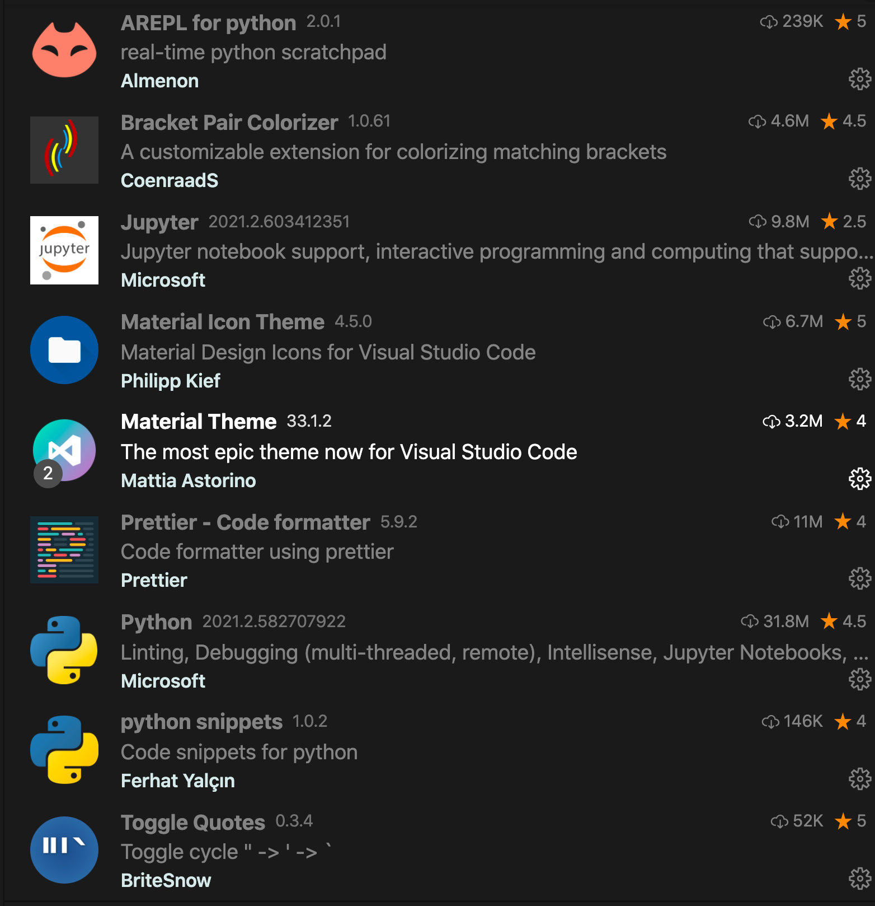
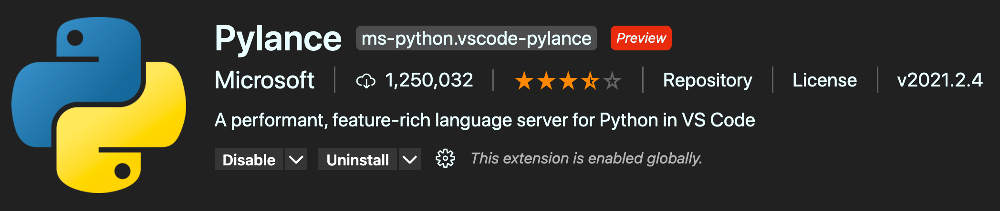

# 01 VSCode set-up

## utilisation d'un virtual environment

Création :

```bash
python3 -m venv venv
```

Activation :

```bash
source ./venv/bin/activate
```

ou

```bash
. venv/bin/activate
```

```bash
(venv) 🧨 hukar:chap-03$
```

### La version de python est celle du `venv`

```bash
(venv) 🧨 hukar:chap-03$ which python
/Users/hukar/Documents/programmation/fastapi-talkpython/chap-03/venv/bin/python
```

## Upgrade de `pip`

```bash
(venv) 🧨 hukar:chap-03$ pip list
Package    Version
---------- -------
pip        20.2.3
setuptools 49.2.1
WARNING: You are using pip version 20.2.3; however, version 21.0.1 is available.
You should consider upgrading via the '/Users/hukar/Documents/programmation/fastapi-talkpython/chap-03/venv/bin/python3 -m pip install --upgrade pip' command.
```
```bash
(venv) 🧨 hukar:chap-03$ python3 -m pip install --upgrade pip
Collecting pip
  Downloading pip-21.0.1-py3-none-any.whl (1.5 MB)
     |████████████████████████████████| 1.5 MB 5.2 MB/s 
Installing collected packages: pip
  Attempting uninstall: pip
    Found existing installation: pip 20.2.3
    Uninstalling pip-20.2.3:
      Successfully uninstalled pip-20.2.3
Successfully installed pip-21.0.1
```
```bash
(venv) 🧨 hukar:chap-03$ pip list
Package    Version
---------- -------
pip        21.0.1
setuptools 49.2.1
```


## Extension



J'ai l'impression que `Jupyter` c'est installé tout seul (?) certainement une dépendance de l'extension officiel `Python`. 

> => Oui c'est le cas 😸

## Pylance

Pour avoir un check des types de l'auto-import et une meilleur coloration syntaxique



