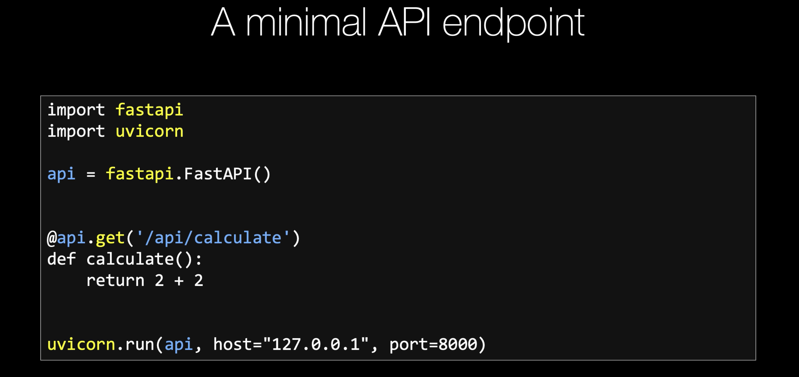
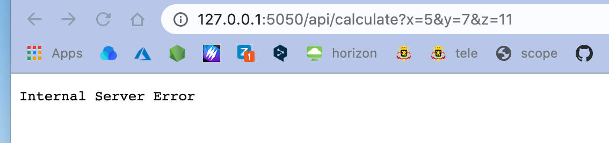
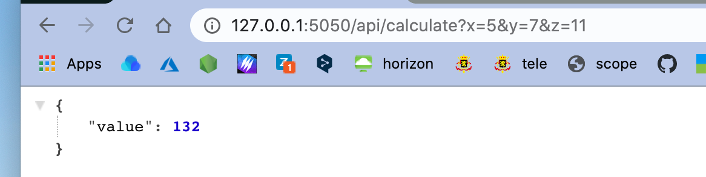
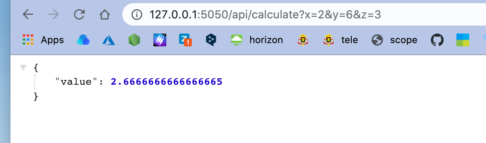
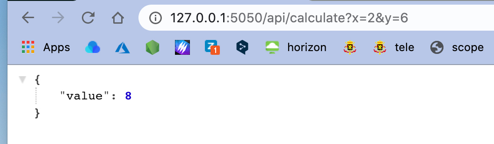
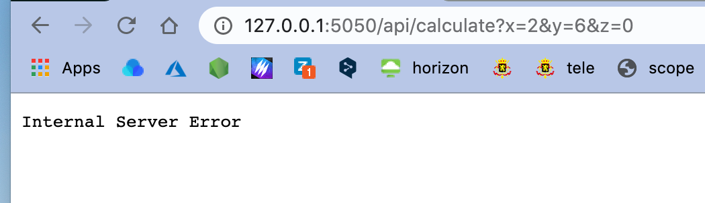
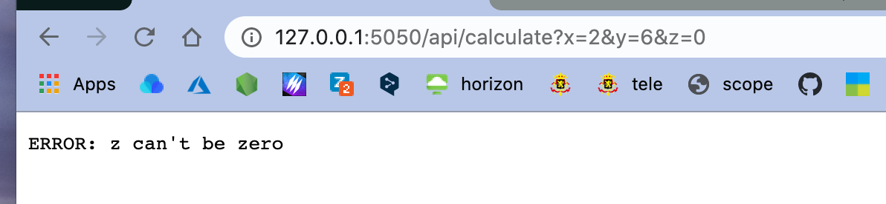
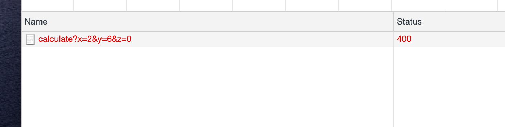
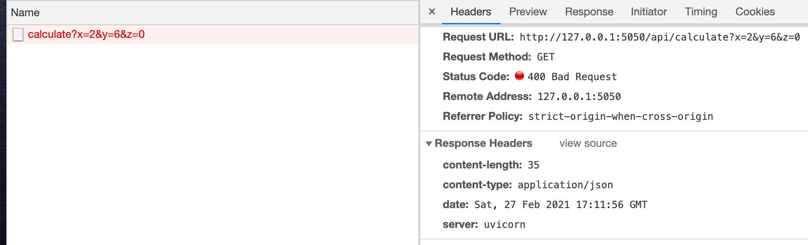

# 02 First `API`

`requirements.txt`

```
fastapi
uvicorn
```

```bash
pip install -r requirements.txt 
```


`main.py`

```python
import fastapi
import uvicorn

api = fastapi.FastAPI()

@api.get('/api/calculate')
def calculate():
  return 2 + 2

# uvicorn.run(api)
uvicorn.run(api, host="127.0.0.1", port=5050)
```




## Query Parameters

On peut passer des paramètres à notre fonction par les `Query Parameters` :

```python
@api.get('/api/calculate')
def calculate(x, y, z):
    value = (x + y) * z

    return {
        'value': value
    }
```

Mais les paramètres sont toujours de type `string`.



C'est parceque l'opérateur `*` provoqie une erreur avec un `string`.

```
File "/Users/hukar/Documents/programmation/fastapi-talkpython/chap-03/main.py", line 11, in calculate
    value = (x + y) * z
TypeError: can't multiply sequence by non-int of type 'str'
```

On va convertir les paramètres en `int` (grace à `typing`):

```python
@api.get('/api/calculate')
def calculate(x: int, y: int, z: int):
    value = (x + y) * z

    return {
        'value': value
    }
```




## Paramètre optionnel

```python
from typing import Optional
# ...

@api.get('/api/calculate')
def calculate(x: int, y: int, z: Optional[int] = None):
    value = (x + y)

    if z is not None:
        value /= z

    return {
        'value': value
    }
```

On initialise `z` à `None` et on teste avec `if is not None` avant de diviser.








## `fastapi.Response`

Si on veut modifier le `status code` on va alors utiliser `fastapi.Response` :

```python
@api.get('/api/calculate')
def calculate(x: int, y: int, z: Optional[int] = None):
    value = (x + y)

    if z == 0:
        return fastapi.Response(content='ERROR: z can\'t be zero', status_code=400)

    if z is not None:
        value /= z

    return {
        'x': x,
        'y': y,
        'z': z,
        'value': value
    }
```





On peut spécifier le type `MIME` avec `media_type` :

```python
if z == 0:
        return fastapi.Response(
          content="{'error': 'ERROR: z can\'t be zero'}",
          media_type='application/json',
          status_code=400)
```



### `fastapi.responses.JSONResponse`

Cette méthode est un raccourci d'écriture pour envoyer du `JSON`.

Le `Content-Type` est automatiquement mit à `application/json`.

```python
if z == 0:
        return fastapi.responses.JSONResponse(
            content={"error": "auto-json says no zero for z value"},
            status_code=400)
```

## Remarque

De manière automatique, `fastapi`, lorsqu'on retourne un dictionnaire, renvoie du `json` avec le `Content-Type` valant `application/json`.


## Renvoyé du `HTML`

On va utiliser `fastapi.responses.HTMLRespone` :

```python
@api.get('/')
def index():
    body = "<!DOCTYPE html>"\
        "<html lang=\"en\">"\
        "<head>"\
        "<title>Api Calculate</title>"\
        "</head>"\
        "<body>"\
        "<a href=\"/api/calculate?x=4&y=11\">/api/calculate?x=4&y=11</a>"\
        "</body>"\
        "</html>"

    return fastapi.responses.HTMLResponse(content=body)
```


## Code complet

`main.py`

```python
from typing import Optional

import fastapi
import uvicorn

api = fastapi.FastAPI()

@api.get('/')
def index():
    body = "<!DOCTYPE html>"\
        "<html lang=\"en\">"\
        "<head>"\
        "<title>Api Calculate</title>"\
        "</head>"\
        "<body>"\
        "<a href=\"/api/calculate?x=4&y=11\">/api/calculate?x=4&y=11</a>"\
        "</body>"\
        "</html>"

    return fastapi.responses.HTMLResponse(content=body)

@api.get('/api/calculate')
def calculate(x: int, y: int, z: Optional[int] = None):
    value = (x + y)

    if z == 0:
        return fastapi.responses.JSONResponse(
            content={"error": "auto-json says no zero for z value"},
            status_code=400)
        # return fastapi.Response(content="{'error': 'ERROR: z can\'t be zero'}", media_type='application/json', status_code=400)

    if z is not None:
        value /= z

    return {
        'x': x,
        'y': y,
        'z': z,
        'value': value
    }

uvicorn.run(api, port=5050, host='127.0.0.1')
```

