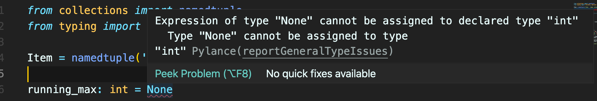
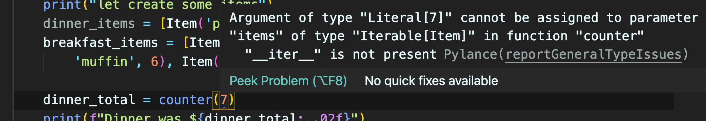

# 03 Type hints

## Code sans `Type hints`

```python
from collections import namedtuple

Item = namedtuple('Item', 'name, value')

running_max = None

def counter(items):
    global running_max
    total = 0

    for i in items:
        total += i.value

    if not running_max or total > running_max:
        running_max = total

    return total


def main():
    print("let create some items")
    dinner_items = [Item('pizza', 20), Item('beer', 9), Item('spaghetti', 16)]
    breakfast_items = [Item('bacon', 6), Item('pancake', 8), Item(
        'muffin', 6), Item('cheese', 11), Item('tea', 7)]

    dinner_total = counter(dinner_items)
    print(f"Dinner was ${dinner_total:,.02f}")

    breakfast_total = counter(breakfast_items)
    print(f"Breakfast was ${breakfast_total:,.02f}")

    print(f"Today your most expensive meal costs ${running_max}")


if __name__ == '__main__':
    main()
```

Cela fonctionne, mais l'`intellisense` de l'éditeur de code ne nous aide pas beaucoup.


## `Optional`

```python
running_max: Optional[int] = None
```

`None` n'étant pas un `int` on doit utiliser `Optional` :



Il faut importer `Optional` depuis le package `typing` :

```python
from typing import Optional
```


## `Iterable`

```python
def counter(items: Iterable[Item]) -> int:
```



Cela permet d'avoir une erreur dans l'`intellisense` si on ne donne pas le bon type en entrée.

Il faut aussi un import :

```python
from typing import Iterable
```


## `fastapi` et `type hints`

`fastapi` tire partie des indication de `type hints` pour faire des conversions automatiques, comme quand on reçoit des `query parameters`.


## Code Complet

```python
from collections import namedtuple
from typing import Iterable, Optional

Item = namedtuple('Item', 'name, value')

running_max: Optional[int] = None

def counter(items: Iterable[Item]) -> int:
    global running_max
    total = 0

    for i in items:
        total += i.value

    if not running_max or total > running_max:
        running_max = total

    return total

def main():
    print("let create some items")
    dinner_items = [Item('pizza', 20), Item('beer', 9), Item('spaghetti', 16)]
    breakfast_items = [Item('bacon', 6), Item('pancake', 8), Item(
        'muffin', 6), Item('cheese', 11), Item('tea', 7)]

    dinner_total = counter(dinner_items)
    print(f"Dinner was ${dinner_total:,.02f}")

    breakfast_total = counter(breakfast_items)
    print(f"Breakfast was ${breakfast_total:,.02f}")

    print(f"Today your most expensive meal costs ${running_max}")


if __name__ == '__main__':
    main()
```

