# 00.5 Rendre séduisant son `terminal`

tiré de la video :

https://www.youtube.com/watch?v=D2PSsnqgBiw&ab_channel=QuentinWattTutorials

Et du `gist` :

https://gist.github.com/kevin-smets/8568070

## `iterm2`

On installe `iterm2` en le téléchargeant sur son site ou via `homebrew` :

```bash
brew install --cask iterm2
```

On met à jour `git` via `homebrew`

```bash
brew install git
```


## `oh-my-zsh`

On installe le framework pour `zsh` : `oh-my-zsh`

```bash
sh -c "$(curl -fsSL https://raw.github.com/ohmyzsh/ohmyzsh/master/tools/install.sh)"
```


### Fichier de configuration : `~/.zshrc`

On doit modifier le thème par défaut :

```bash
# ZSH_THEME="robbyrussell"
ZSH_THEME="agnoster"
```


### Modifier les couleurs

Utiliser le réglage de couleur de `quentin watt`

https://github.com/QuentinWatt/dark-flat-iterm-colors

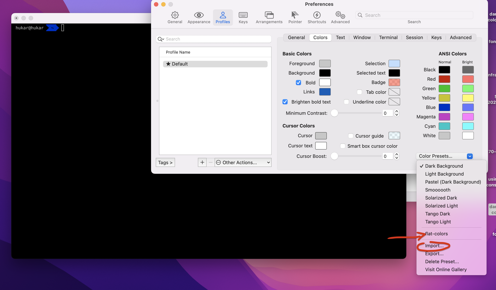

Il suffit ensuite d'importer et de choisir dans `Iterm2` le fichier `flat-colors.itermcolors`.

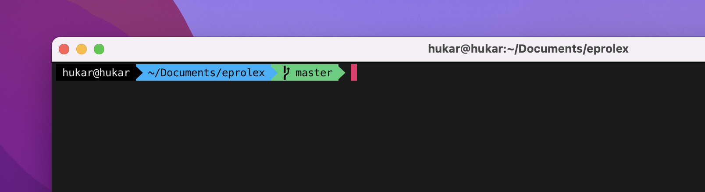

Plus de thèmes :

https://github.com/kevin-smets/iTerm2-Color-Schemes


## `Power Level 10K`

C'est un thème pour `zsh`.

### Installer le thème

```bash
git clone --depth=1 https://github.com/romkatv/powerlevel10k.git ~/powerlevel10k
echo 'source ~/powerlevel10k/powerlevel10k.zsh-theme' >>~/.zshrc
```

changer le thème dans `~/.zshrc`

```bash
ZSH_THEME="powerlevel10k/powerlevel10k"
```


### Configuration du thème

En rouvrant `iterm` on arrive sur l'écran de configuration du thème :

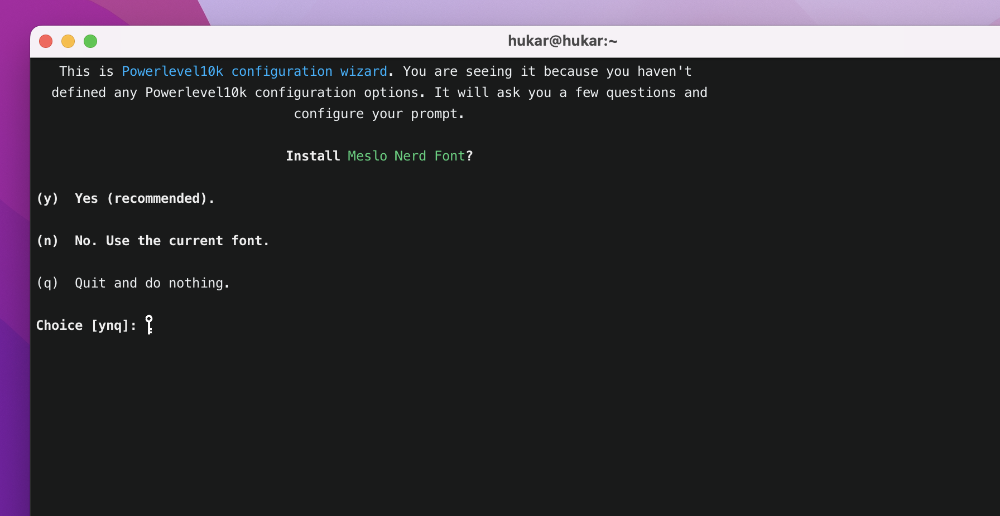

C'est à cette étape que les `fonts` sont installées automatiquement.

`MesloGS NF` est installé dans toutes ses déclinaisons et configurer dans `iterm` automatiquement.

Après il faut fermer et rouvrir `iterm`.

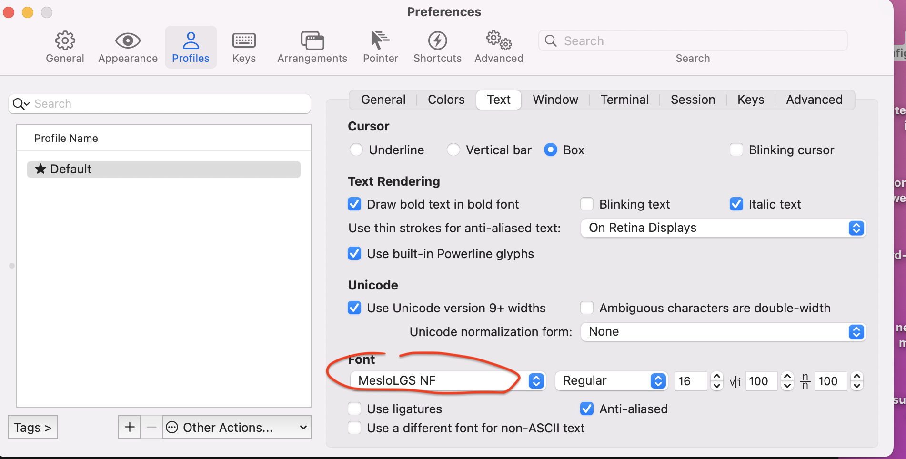

Ensuite on devra vérifier l'affichage des icônes :

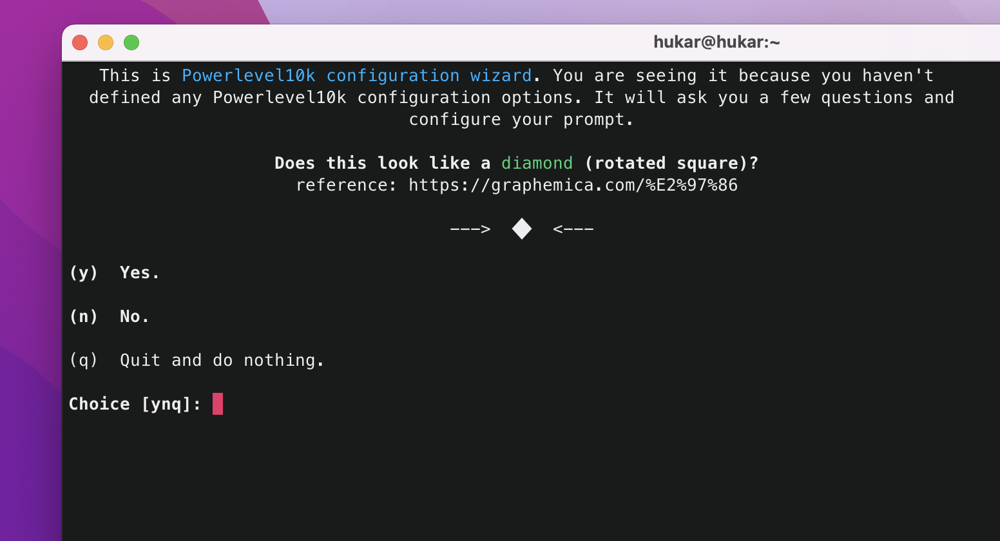

Puis plusieurs réglages de styles :

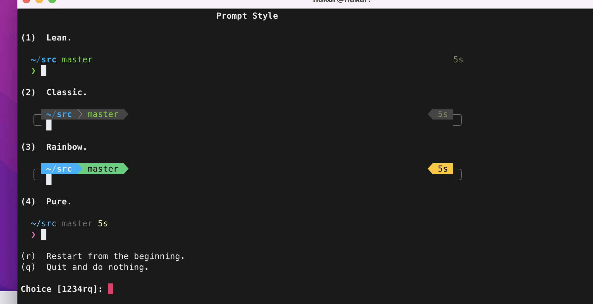

Pour reconfigurer il suffit de lancer la commande

```bash
p10k configure
```


## `Plugin`

### `Syntaxe Highlighting`

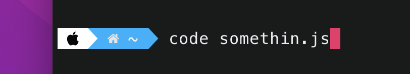

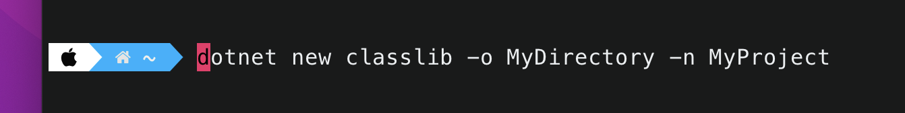

Pour le moment il n'y a pas de syntaxe highlighting.

```bash
brew install zsh-syntax-highlighting

source /usr/local/share/zsh-syntax-highlighting/zsh-syntax-highlighting.zsh
```

Après c'est pas la fête du slip !!

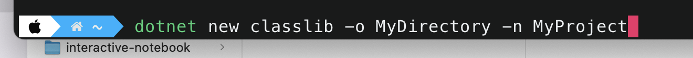


## Problème d'affichage dans `Vscode` et dans le `Terminal` de base

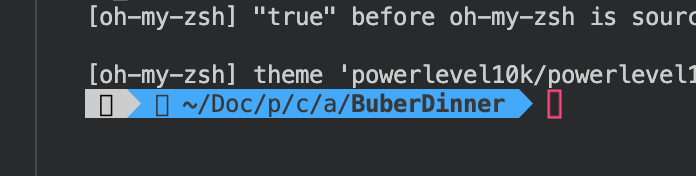

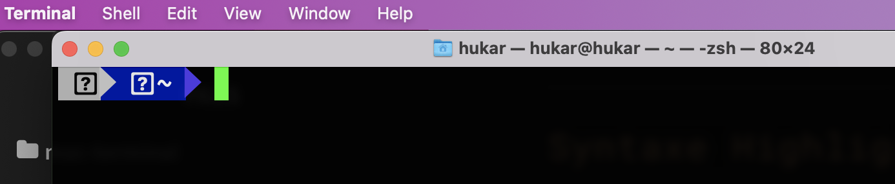

Il faut changer la `font` dans les `settings` :

`settings.json` dans `Vscode`

```json
"terminal.integrated.fontSize": 10,
"terminal.integrated.fontFamily": "MesloLGS NF",
```


et dans `Terminal.app`

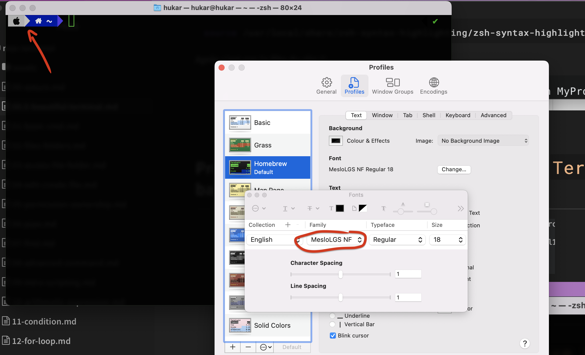