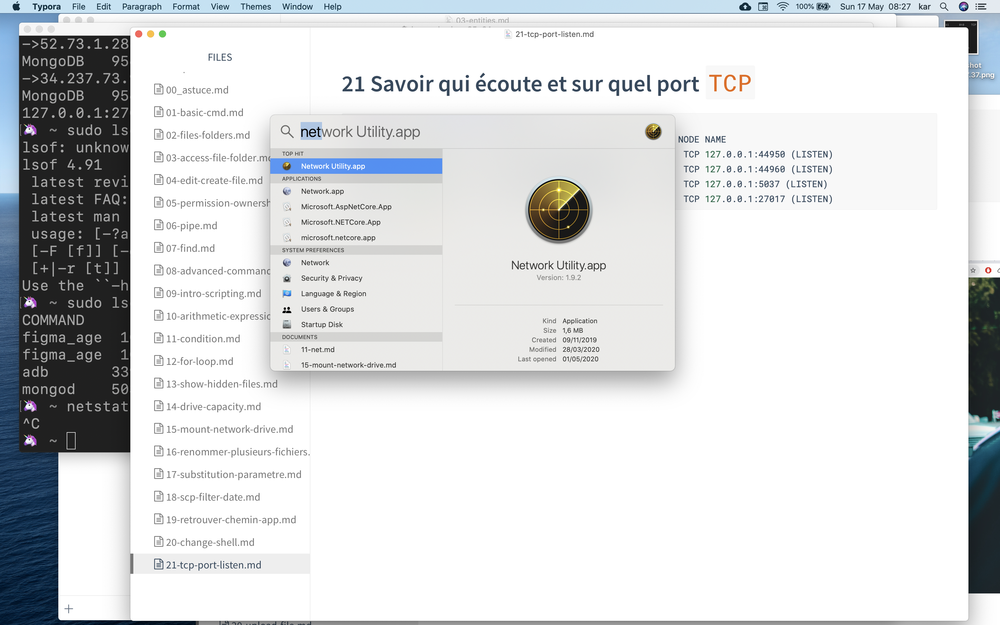
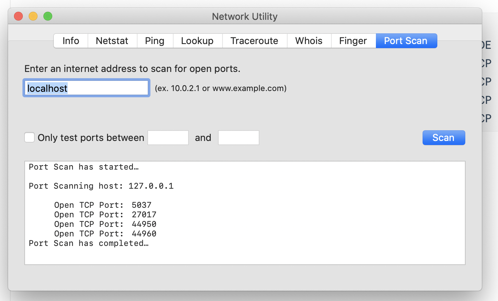

# 21 Savoir qui écoute et sur quel port `TCP`

## avec LiSt Open Files `lsof`

```bash
🦄 ~ sudo lsof -i4TCP -sTCP:LISTEN -n -P
COMMAND     PID USER   FD   TYPE             DEVICE SIZE/OFF NODE NAME
figma_age  1080  kar    3u  IPv4 0xe6b20b0a9a4d77a1      0t0  TCP 127.0.0.1:44950 (LISTEN)
figma_age  1080  kar   39u  IPv4 0xe6b20b0a9d84c7a1      0t0  TCP 127.0.0.1:44960 (LISTEN)
adb       33939  kar    7u  IPv4 0xe6b20b0a8cc8d7a1      0t0  TCP 127.0.0.1:5037 (LISTEN)
mongod    50386  kar   10u  IPv4 0xe6b20b0a9bd8ba01      0t0  TCP 127.0.0.1:27017 (LISTEN)
```

Pour IPV4 et 6 `-iTCP`

## Avec `network Utility`





On obtient pas le nom du processus, seulement les ports occupés.
