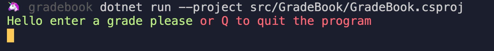
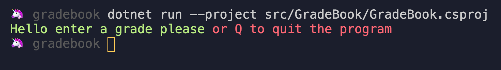
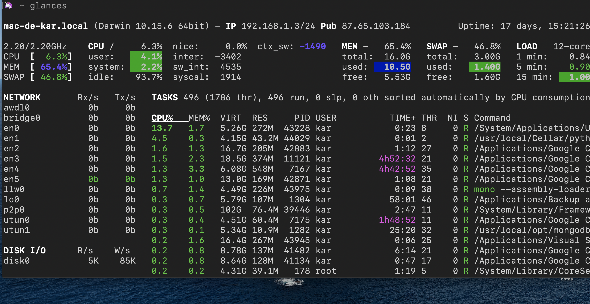
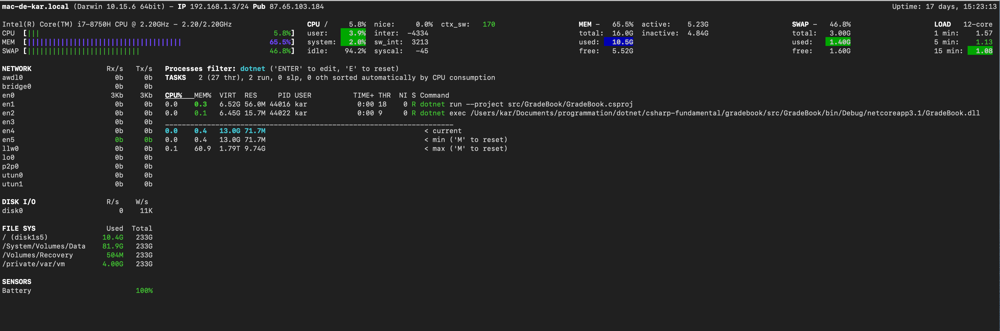

# 22 Rechercher un processus

## `ps`

```bash
ps -ax | grep -v grep | grep process_name
```

Il y a aussi `ps aux`.

Le premier numéro est le numéro de processus :

```bash
🦄 ~ ps -ax |grep dotnet
43975 ??         0:07.50 mono --assembly-loader=strict /Users/kar/.vscode/extensions/ms-dotnettools.csharp-1.22.1/.omnisharp/1.35.3/omnisharp/OmniSharp.exe -s /Users/kar/Documents/programmation/dotnet/csharp-fundamental/gradebook/gradebook.sln --hostPID 43952 DotNet:enablePackageRestore=false --encoding utf-8 --loglevel information --plugin /Users/kar/.vscode/extensions/ms-dotnettools.csharp-1.22.1/.razor/OmniSharpPlugin/Microsoft.AspNetCore.Razor.OmniSharpPlugin.dll FileOptions:SystemExcludeSearchPatterns:0=**/.svn FileOptions:SystemExcludeSearchPatterns:1=**/.hg FileOptions:SystemExcludeSearchPatterns:2=**/CVS FileOptions:SystemExcludeSearchPatterns:3=**/.DS_Store formattingOptions:useTabs=false formattingOptions:tabSize=4 formattingOptions:indentationSize=4
44005 ttys000    0:00.00 grep dotnet
43995 ttys001    0:00.75 dotnet run --project src/GradeBook/GradeBook.csproj
44003 ttys001    0:00.08 dotnet exec /Users/kar/Documents/programmation/dotnet/csharp-fundamental/gradebook/src/GradeBook/bin/Debug/netcoreapp3.1/GradeBook.dll
```

Si je veux arrêter mon programme :

```bash
kill 44003
```





Dans `VSCode` le programme s'est arrêter d'un coup.

## `glances`

C'est un utilitaire :



On tape `enter` pour entrer un pattern à rechercher :



Prévoir un grand écran.
