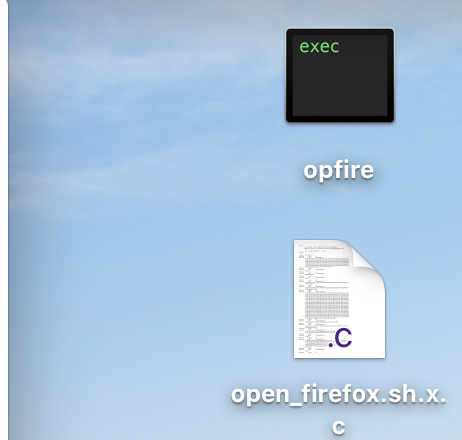

# 23 Compiler un script bash

On peut parfois vouloir compiler un script en exécutable binaire.

## Pour cela on utilise :`shc`

https://github.com/neurobin/shc

```
brew install shc
```

## Compiler un script

fichier script : `open_firefox.sh`

```bash
#! /bin/bash
/Applications/Firefox.app/Contents/MacOS/firefox -url about:profiles
```

Ouvre firefox à une page bien précise.

Dans le terminal

```bash
shc -f open_firefox.sh -o opfire
```



On obtient un fichier `c` puis un exécutable.

il suffit de double cliquer sur l'`exec` pour le lancer.
