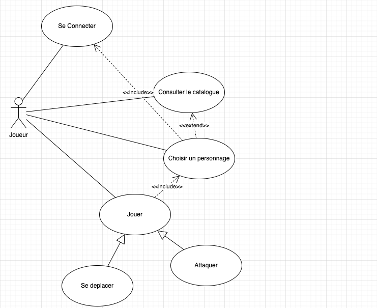
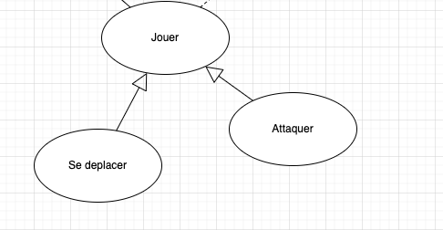
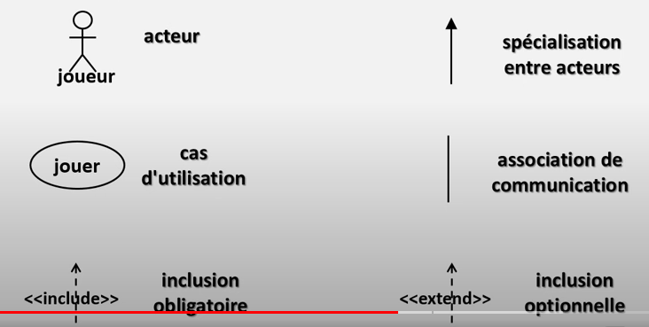

# 02 Diagramme de `Cas d'utilisation`

Schématise l'expression des besoins.

- Schéma regroupant les activités d'un acteur
- Tableau détaillant les actions liées à une activité

Ce schéma permet de concevoir l'interface graphique.

## Contraintes

`<<include>>` signifie que la possibilité d'une action inclus qu'une autre a été réussie, c'est une obligation.

`<<extends>>` signifie que c'est une possibilité d'action antérieure mais pas une obligation.

Ces liens de contrainte ne sont pas obligatoires.

## Association

Ces liens sont eux obligatoires entre l'acteur et les actions.

## Sous cas d'utilisation : héritage

On décrit ici `Se déplacer` et `Attaquer` comme des sous-cas de `Jouer`.

## Cas d'utilisation indépendants

On peut avoir des cas d'utilisation n'ayant aucune dépendances les un envers les autre :

Ici `Dialoguer` (via un Chat par exemple) et `Consulter l'aide` n'ont aucune dépendance avec `Jouer`.

`Dialoguer` lui a l'obligation d'avoir `Se connecter` avant.

`Consulter l'aide` ne nécessite pas de s'être `Connecter` avant.

## Syntaxe

La `Spécialisation entre acteur` permet d'hériter entre utilisateur de cas d'utilisation.

Les `contraintes` sont optionnelles dans la représentation.

## Le tableau des opérations d'un cas d'utilisation

| Cas d'utilisation     | Se connecter                                                 |
| --------------------- | ------------------------------------------------------------ |
| Acteur                | Joueur                                                       |
| Événement déclencheur | néant                                                        |
| Intérêts              | Accéder au serveur afin d'être authentifié et accéder au jeu |
| Pré-conditions        | Serveur actif                                                |
| Post-conditions       | Connexion établie                                            |
| Scénario nominal      | 1. l'utilisateur saisit l'adresse IP du serveur 2. l'utilisateur demande une connexion au serveur 3.le serveur répond |
| Extensions            | non                                                          |
| Contraintes           | 2a. L'adresse IP n'est pas remplie : aller en 1 3a. Le serveur retourne un message d'erreur : aller en 1 3b. Le serveur ne répond pas : aller en 1 |

Les `Contraintes` sont des scénario alternatifs reprenant la numérotation des scénarios nominaux.