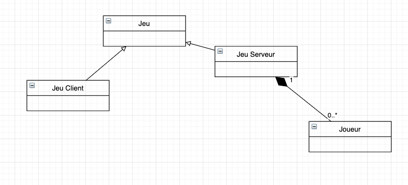
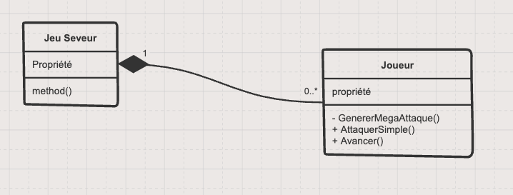
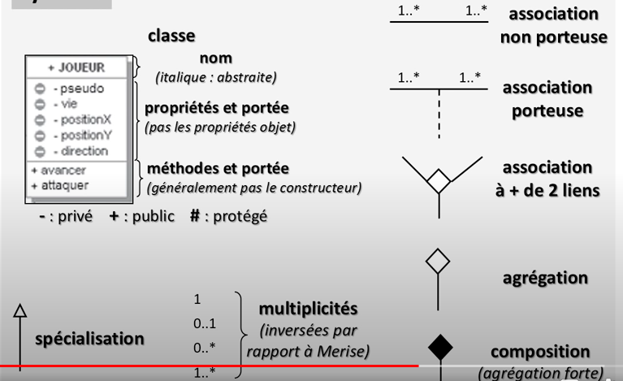
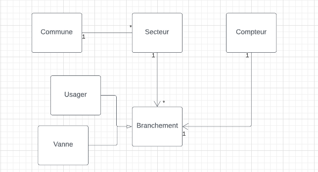
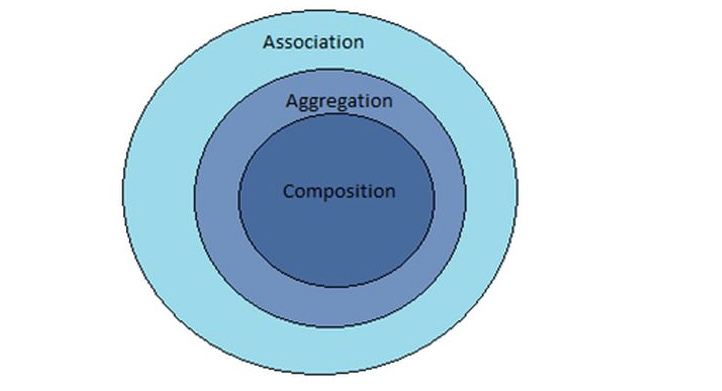

# 03 Diagramme de classe

Représente les classes métier de l'application.

C'est ce diagramme de classe qui va être directement relié à notre `BDD`.



Le losange noir signifie `composition`.

Avec la composition, la durée de vie des classes est liée du côté ou se trouve la composition :

En clair si le `Jeu Serveur` meurt, le `Joueur` meurt aussi.

la flèche blanche correspond à une relation d'héritage.

On parle de multiplicité et plus de cardinalité, les valeurs sont inversée par rapport à `Merise`.


## Les méthodes dans le diagramme de classe



Les méthodes peuvent être privées `-`, protégées `#` et publiques `+`.


## Syntaxe



On ne met pas les propriétés objet (issue d'autres classes).

`1..*` peut aussi s'écrire `*`

La composition `🔷` est un lien très fort : Un dossier contenant des fiches, si le dossier est détruit les fiches le sont aussi.

L'agrégation `🔶` est un lien faible : par exemple les ingrédients composant une recette.

Si la recette est détruite, cela n'implique pas que les ingrédients le soit.



Les flèches simple ne sont pas obligatoire mais montre les sens de navigation possible (propriété de navigation).


## Composition en `c#`

Pour lier la durée de vie de deux entités il suffit d'en créer une dans l'autre :

```cs
class Car
{
    public Motor Motor { get; set; } = new();
}
class Motor {}
```

Ainsi la référence de `Motor` est lié au scope de `Car` et si  `Car` est détruite alors `Motor` est aussi détruit.


## Association et Aggregation en `c#`

Il n'y a pas l'air d'avoir de différence entre les deux.

Il y a peut-être une différence sémantique comme quoi le lien d'`Aggregation` est plus fort que le lien d'`Association`.

