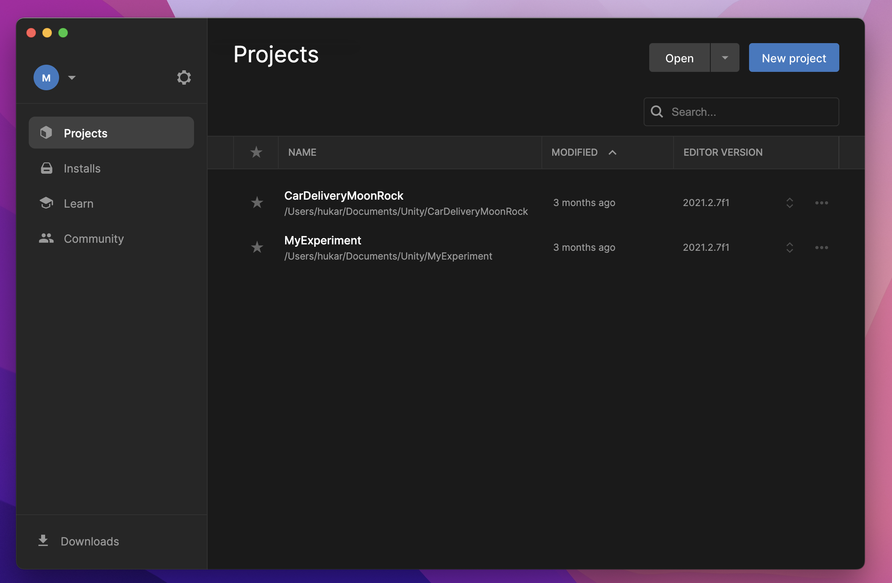
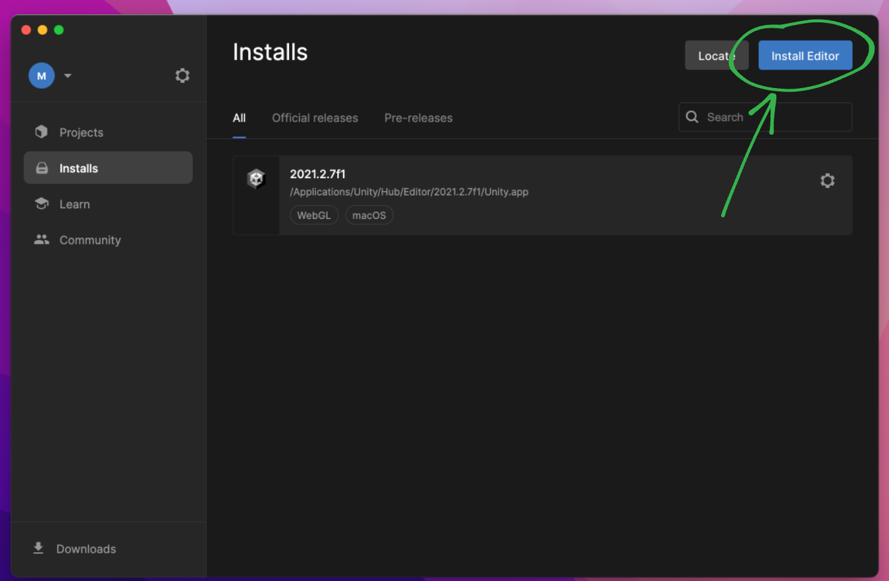
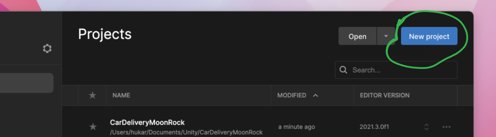
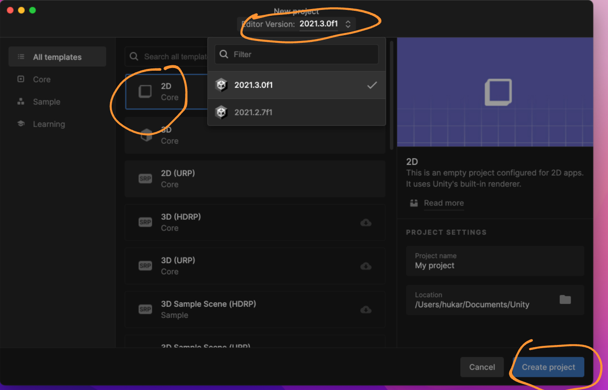

# 00 Installation

## Utiliser `Unity Hub`

Permet de gérer les projets et les installation (différentes versions) de `Unity` :

## Ajouter la dernière version de `Unity`

On clique sur `Installs` et sur `Install Editors` pour installer la dernière version :

On décoche `Visual Studio` car on va utiliser `VSCode`.

On décoche la `Documentation` et on coche `Web build support`:

## Créer un projet

On clique sur `New Project` :

Et on demnade un projet `2d` :

