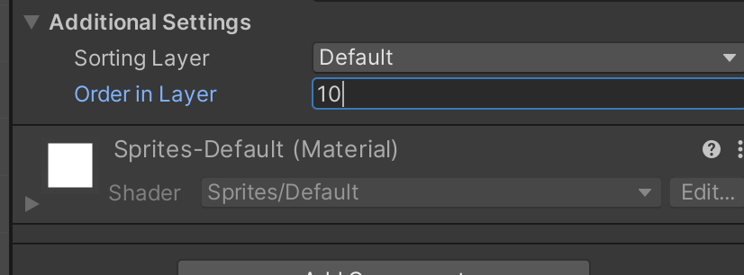
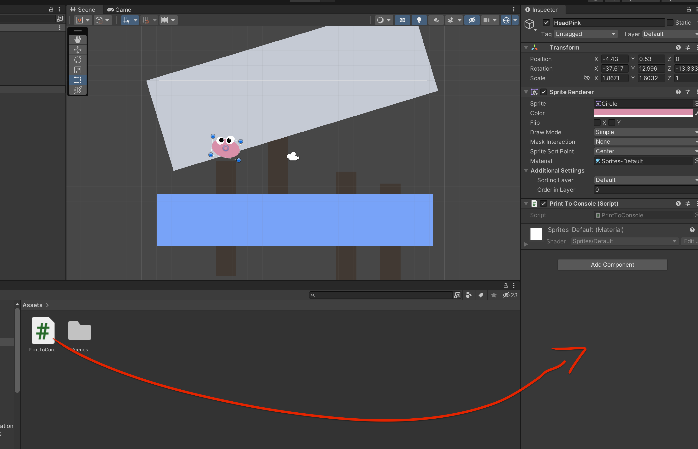
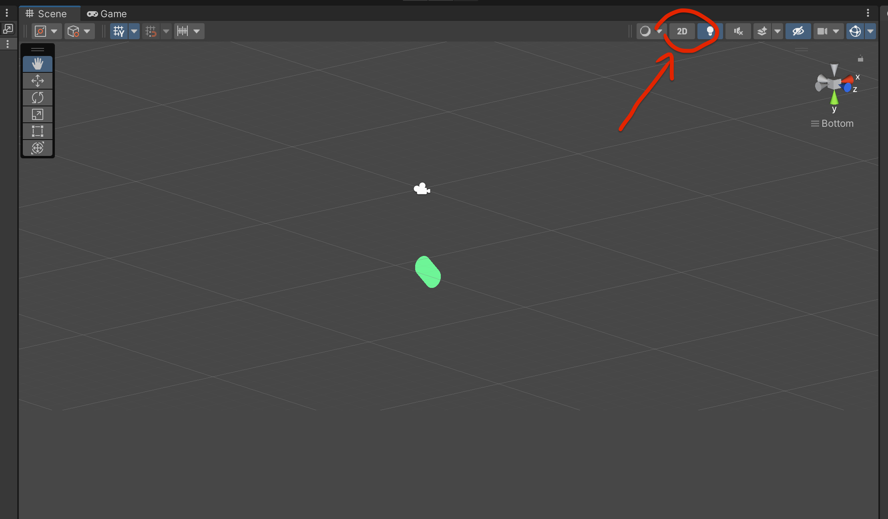

# 02 Concepts de base

## Order In Layer

Détermine l'ordre des objets par rapport à la camera (devant- derrière)

C'est bien l'ordre dans une même couche (un même calque).

## Créer un script `C#`

On double click sur le script pour l'éditer dans `VSCode` (on choisie l'éditeur dans les préférences).

On glisse le script sur un composant pour lui associer :

## `2d` et ` 3d`

On peut passer de la `3d` à la `2d` avec le bouton en haut.

La `2d` est en fait une `3d` où la camera  est parallèle à l'axe `Z`.