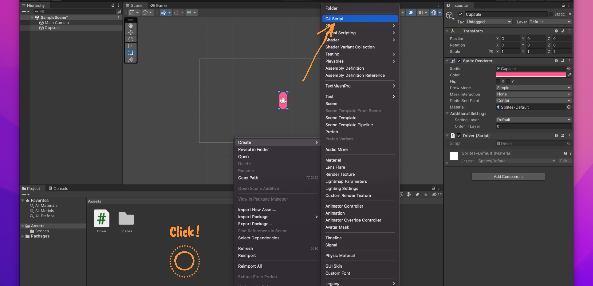
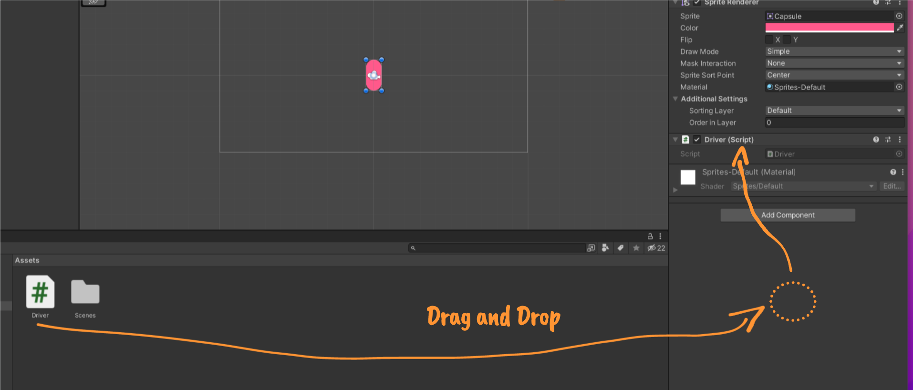
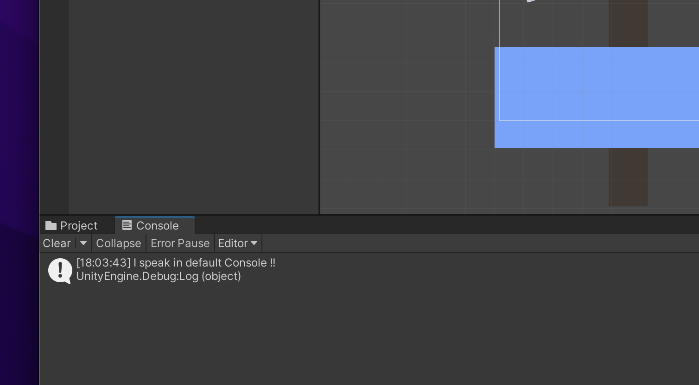
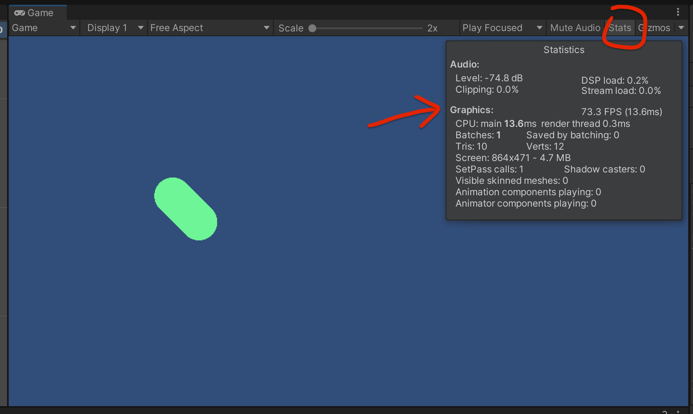

# 03 Scripting

## Créer un `Script`

Clique droit dans la fenêtre `Assets` puis glisser vers un élément :






## Utilisation de `Callback`

```cs
public class PrintToConsole : MonoBehaviour
{
    void Start()
    {
        Debug.Log("I speak in default Console !!");
    }

    void Update()
    {
        
    }
}
```

Le `Script` se compose de deux `Callback`.

`Start` est exécuté avec le premier rendu.

`Update` est exécuté à chaque rendu (chaque `Frame`).


## `Debug.Log`

Écris dans la `Console` de l'interface de `Unity` :

```cs
public class PrintToConsole : MonoBehaviour
{
    // Start is called before the first frame update
    void Start()
    {
        Debug.Log("I speak in default Console !!");
    }

    // Update is called once per frame
    void Update()
    {
        
    }
}
```




## `Update()`

S'exécute à chaque `frame`.

Pour connaitre le nombre de `fps` (`frame per second`), on peut afficher les `stats` dans la fenêtre de rendu :

