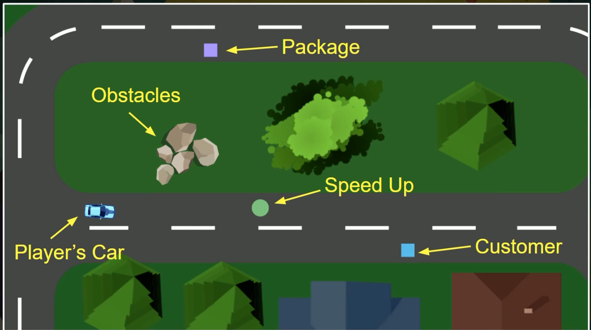
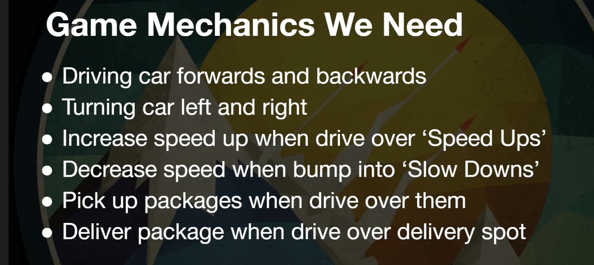

# 01 Game Design

## Un Croquis brut : `Rough Mockup`

On peut commencer par une représentation simplifiée (brut) du jeu :

On décrit les mécaniques du jeu le plus simplement possible.

## Énummerer les actions

Une liste des actions possible (parallèle avec les `use cases`).

et

## Fiche Minimal

### Expérience du joueur

Relaxante.

 (défis intelligence, super technique, exploration cool)

### Mécanique principal

Conduire un PickUp.

 (gérer un deck, parcourir un monde avec un héros, se déplacer en téléporteur)

### Déroulement du jeu

Trouver et remettre tous les colis pour gagner.

(Tuer le sorcier, parcourir les sept mondes, retrouver la princesse Fiona)

### Context

Une ville d'amateur de Donuts.

(Un royaume ensorcelle, une rivière pleine de grenouille, un plateau de jeu, une arène)