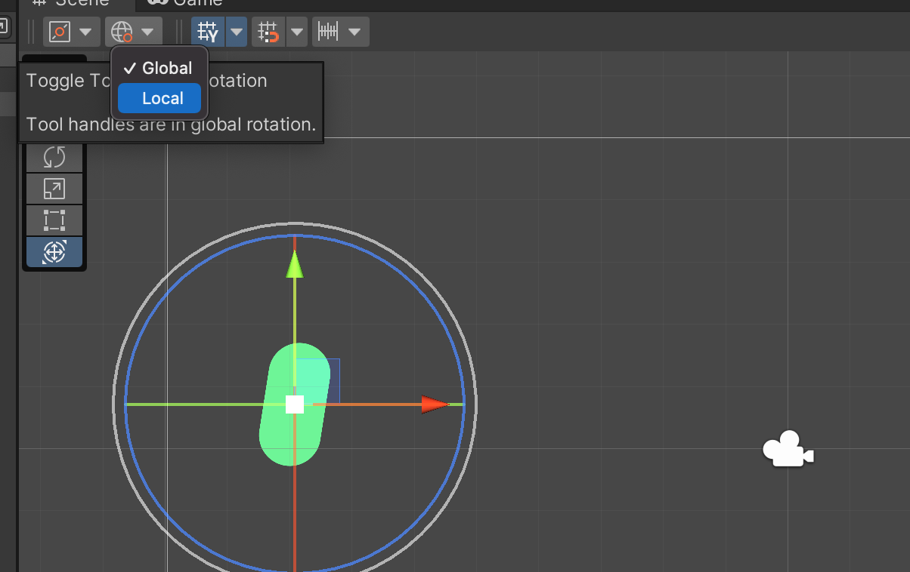
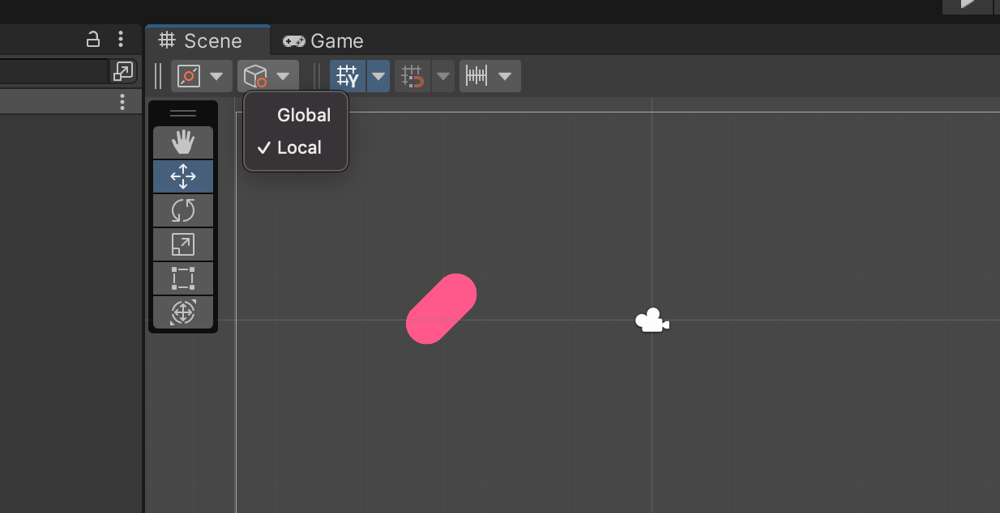

# 02 `Rotate`

## Rotation

### Axe de rotation



La rotation peut être `Global` (les axes `Y` et `X` reste fixe) ou `Local`


Les axes tournent aussi.

Dans la version actuelle c'est `Local` par défaut.




### Rotation dans le `Script` : `transform.Rotate`

```cs
transform.Rotate(x, y, z);
```

```cs
void Start()
{
  transform.Rotate(0, 0, 45);
}
```

On peut aussi jouer sur les trois paramètres :

```cs
void Update()
{
  // f for float type      
  transform.Rotate(1, 1.5f, 2);
}
```


