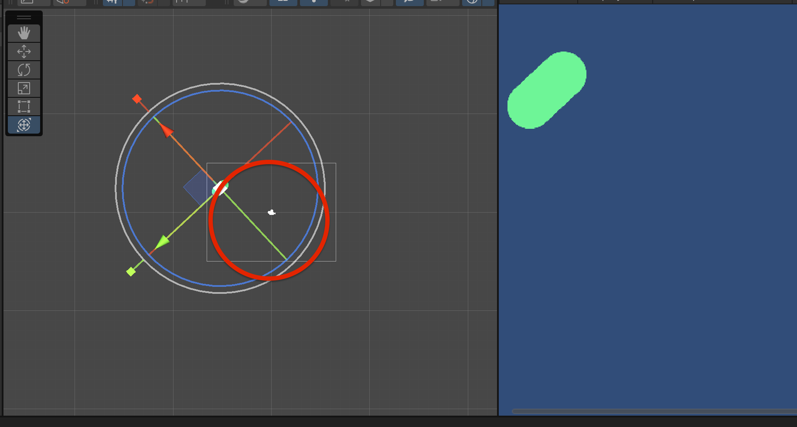

# `Translate`

## `transform.Translate()`

```cs
transform.Translate(0, 0.05f, 0);
```


### Tourner en rond : `rotation` + `translation`



```cs
void Update()
{
  transform.Rotate(0, 0, 0.5f);
  transform.Translate(0, 0.05f, 0);
}
```

