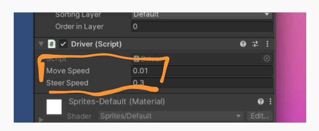
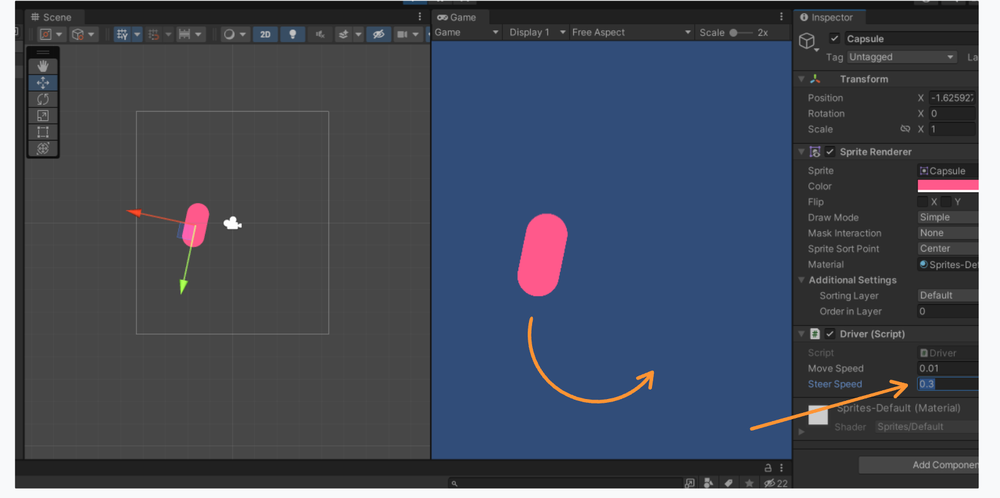

# 04 `Serialize Field`

On peut rendre accessible des valeurs directement dans l'interface de `Unity` grâce à l'`attribute` `SerializeField`.


## Exemple

```cs
public class Driver : MonoBehaviour
{
    [SerializeField] float moveSpeed = 0.01f;
    [SerializeField] float steerSpeed = 0.3f;
    
    // ...
```



On peut alors modifier les valeurs en temps réel pour tester le comportement lorsqu'on lance le jeu



On peut faire varier la valeur en se positionnant sur le nom de la variable et en déplaçant le curseur (souris, pad).


