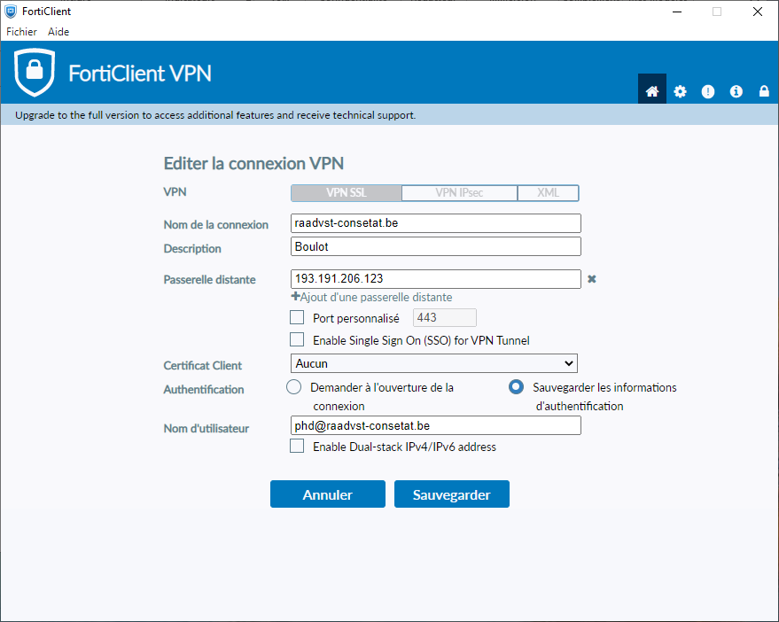
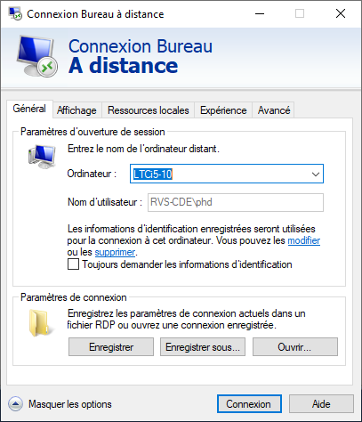
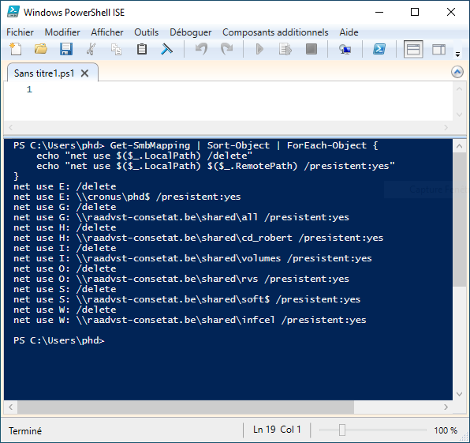

# Fiche de connection du `VPN`

## Mail de Pierre Henderickx

1/ Aller sur https://www.fortinet.com/support/product-downloads

2/ Choisir « Product downloads » \ « FortiClient VPN only » \ « for Windows »,

 3/ Faire l’install (ça prend un peu de temps),

 4/ Ajouter une nouvelle connexion, Sauvegarder, (l’adresse IP de Wim)




5/ Lancer la connexion


> Ici c'est bien l'adresse mail complète et pas le trigramme.

### Sur `PC Windows`

6/ Lancer une session Remote sur le desktop




 

7/ Pour obtenir les mêmes disques partagés que dans la session remote, y lancer une session powershell et y copier-coller ce code :

```powershell
Get-SmbMapping | Sort-Object | ForEach-Object {
	echo "net use $($_.LocalPath) /delete"
    echo "net use $($_.LocalPath) $($_.RemotePath) /presistent:yes"
}
```




8/ Recopier le code généré « net use » pour le coller dans une session cmd sur le laptop  


