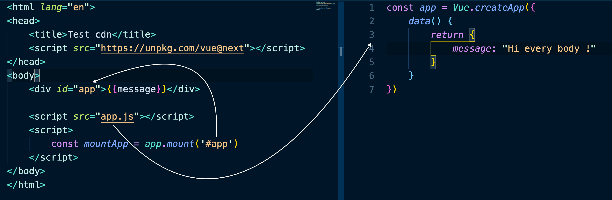
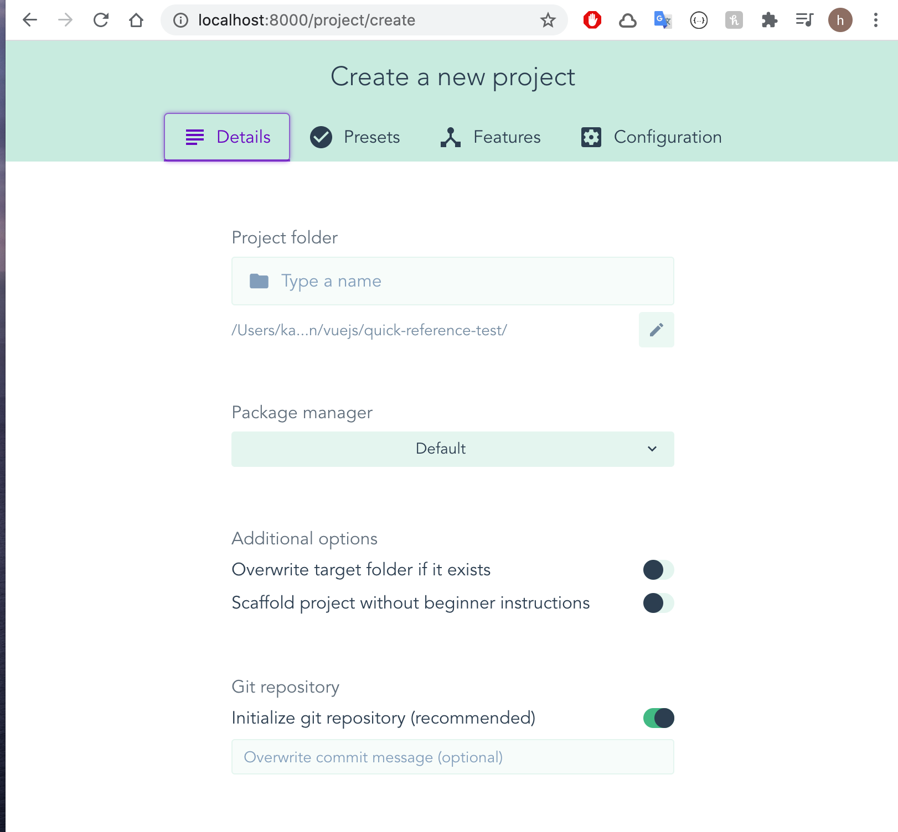
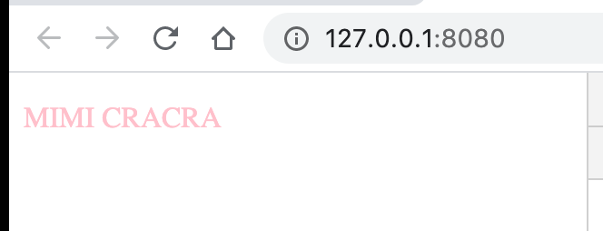
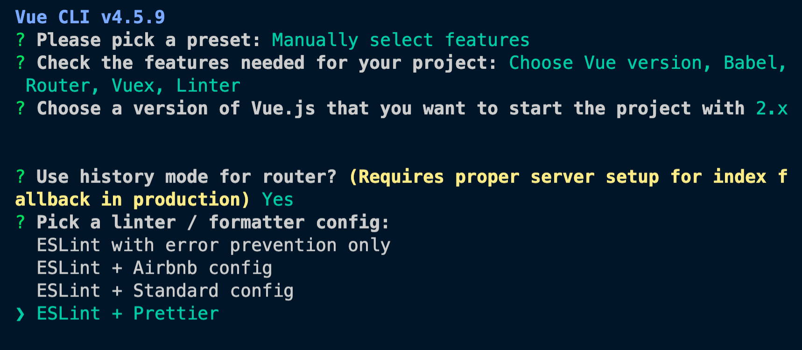

# 01 Bootstrap

## faire tourner un serveur

### live-server 3.4K ✩ github

```bash
npm i -g live-server

live-server
```

ou

### http-server 10.1K ✩ github

```bash
npx http-server
```


## Via un CDN

```html
<script src="https://unpkg.com/vue@next"></script>
```



## Extension VSCode

### `vetur`


## Interface Graphique

```bash
vue ui
```



## Vue CLI

### Zero Config Project

Intéressant pour tester des solutions.

`MyApp.vue`

```vue
<template>
    <div>
        <p>{{message.toUpperCase()}}</p>
    </div>
</template>

<script>
    export default {
        data() {
            return {
                message: 'mimi cracra'
            }
        },
    }
</script>

<style scoped>
    div {
        color: pink;
    }
</style>
```

```bash
vue serve MyApp.vue
```




### Créer une application

```bash
vue create my-app
```



### Options

- `-d` options par défaut
- `-b` bare = nue

### `build`

```bash
npm run build
```

Un dossier `dist` (`distribution`) est construit, c'est l'application à déployer.

## Configuration

