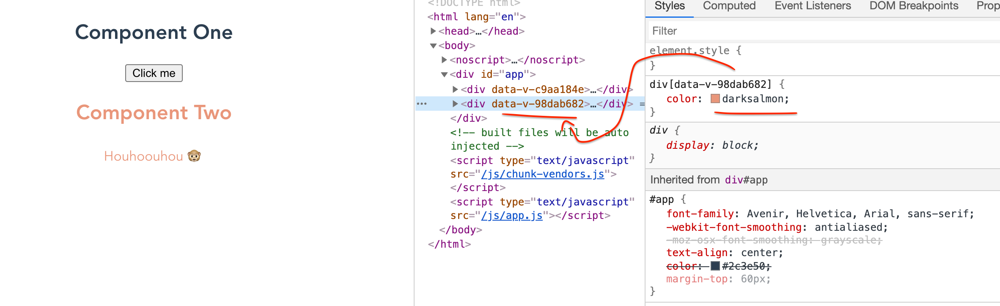
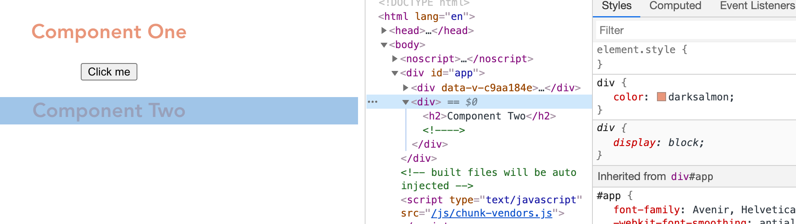

# 02 Les composants

## Anatomie d'un composant

### le template
```vue
<template>
    <div class="score">
        {{something}}
    </div>
</template>
```

### La logique
```vue
<script>
export default {
  	name: 'componentName'
    data: function () {
        return {
            something: "value"
        }
    },
}
</script>
```

### Le style
```vue
<!-- Add "scoped" attribute to limit CSS to this component only -->
<style scoped>
    div {
        color: darksalmon;
    }
</style>
```

Le style ne s'appliquera qu'aux `div` du composant.

`Vue js` crée un attribut `html` unique auquel sera associé le style `css`.



Si on ne met pas le mot clé `scoped`, l'attribut unique ne sera pas créé :



## Ajout d'un composant avec lien `CDN`

#### Composant `NameComponent.js`

```js
app.component("name-componant", {
  template: `<html>`,
  data() {
    return {
      myData: "value",
    };
  },
  methods: {
    myMethod() {},
  },
  computed: {
    dataComputed() {
      return something;
    },
  },
});
```

### Importer le composant dans le `html` 

```html
<div id="app">
    <my-title></my-title>
</div>

<!-- Import App -->
<script src="./main.js"></script>
<!-- Import Component -->
<script src="./components/ProductDisplay.js"></script>
```

