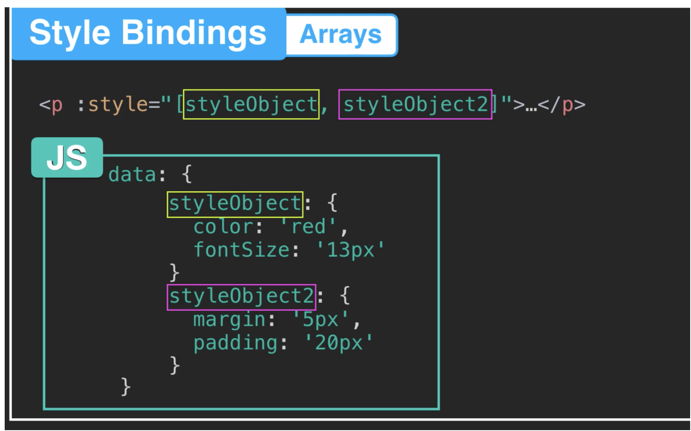

# 02.1 Binding, classes et style

## Le binding : `v-bind`

Lie un attribut à une expression javascript.

```html
<form v-bind:class="{ hide : player }" @submit.prevent="setPlayer">
<form :class="{ hide : player }" @submit.prevent="setPlayer">
```

```html
 0.5 ? image_blue : image_green" />
```

## `:disabled`

On peut assigner un booléen à l'attribut `disabled` :

```html
<button :disabled="!inStock" @click="addToCart">Click!</button>
```


## Les classes

### Classes dynamiques

```html
:class="{ hide : player }"
```

applique la classe `hide` si `player` est `true`.

### `:class="{className: boolean}"`

```html
<span class="round" :class="{ bonus : bonusActivated,bad : badColor }"></span>
```

Avec plusieurs classes.

### Utilisation des ternaires

```html
<h2 :class="h2Red ? 'red' : 'blue'">Component Two</h2>
```


### Utilisation d'un tableau

```html
<h2 :class="['red', 'bgDark', 'card']">Component Two</h2>
```

#### tableau + Ternaire

```html
<h2 :class="[h2Red ? 'red' : 'blue', 'bgDark', 'card']">Component Two</h2>
```

## Objet de style

### `:style="{backgroundColor:'red'}"`

```html
<p :style="{ backgroundColor: 'red'}">{{message}}</p>
```

On peut aussi mettre les propriété en `kebab-case` entre guillemets :

### `:style="{ 'background-color': variant.color }"`

On peut aussi passer à `:style` un objet :

```html
<span :style="roundStyle"></span>
```

```js
data: function () {
	return {
	  click: 0,
	  roundStyle: {
	    height: '50px',
	    width: '50px',
	    margin: '10% 20%'
	  }
	}
},
...
updated: function () {
  let size = Math.random() * (100 - 10) + 10
  let left = Math.random() * (60 - 5) + 5
  let top = Math.random() * (60 - 5) + 5

  this.roundStyle.width = this.roundStyle.height = `${size}px`
  this.roundStyle.margin = `${top}% ${left}%`
}
```

### Tableau d'objet `style`



