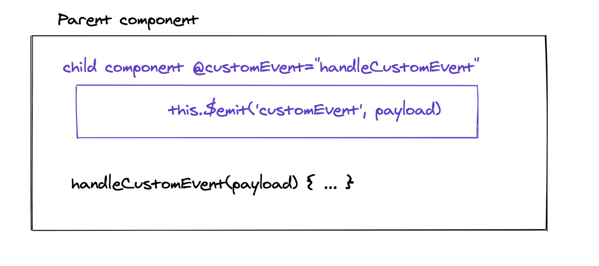

# 02.4 Les événements : `v-on`

```html
<span class="round" v-on:click="clickOnRound()"></span>
<span class="round" @click="clickOnRound()"></span>
```

```js
export default {
  name: 'MyComponent',
  methods: {
    clickOnRound: function () {
      console.log('click click')
    }
  }
}
```

## options de `v-on`

- stop
- once : invoque une seul fois
- capture
- self
- prevent : empêche le comportement `html` par défaut (lien, formulaire)
- enter : avec @keyup `<input @keyup.enter="send"`

```html
<form v-hide @submit.prevent="addPlayerName">
```

 

## syntaxe de l'appelle de la méthode

Le nom d'une méthode :

```html
<button @click="handleClick">Push me</button>
```

L'appelle d'une méthode avec argument :

```html
<button @click="handleClick('titi')">Push me</button>
```

L'appelle d'une fonction avec argument et l'objet `$event` (mapping par Vue de l'objet `DOM` event)

```html
<button @click="handleClick('toto', $event)">Push me</button>
```

Une expression javascript :

```html
<button @click="count += 6">Push me</button>
```


## la communication entre composants



## Émettre un événement `this.$emit('eventName', payload)`

Dans l'enfant

```js
this.$emit('score', this.click)
```


## Réceptionner un événement : `@eventName="handleEvent"`

Dans le parent

```html
<component-one  @say="handleSay"/>
```

```js
methods: {
    handleSay(payload) {
        console.log('App component listen say event')
        console.log(payload)
    }
}
```


## Communication inter-composant : `this.$root`

On peut communiquer entre composants en utilisant `this.$root` l'élément racine.

`ComponentA`

```js
methods: {
    handleClick() {
        this.$root.$emit('say', "Houhoouhou 🐵")
    }
}
```

`OtherComponent` de même niveau, enfant, parent, grand-parent, ...

```js
mounted() {
    this.$root.$on('say', payload => console.log(`in the app component payload : ${payload}`))
}
```

Utiliser le `hook` `mounted`.

`Pattern` à éviter à part pour des cas très simple.

Préférer `Vuex`.