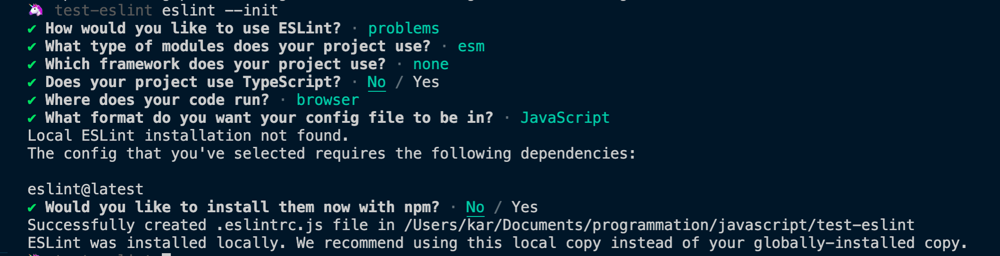
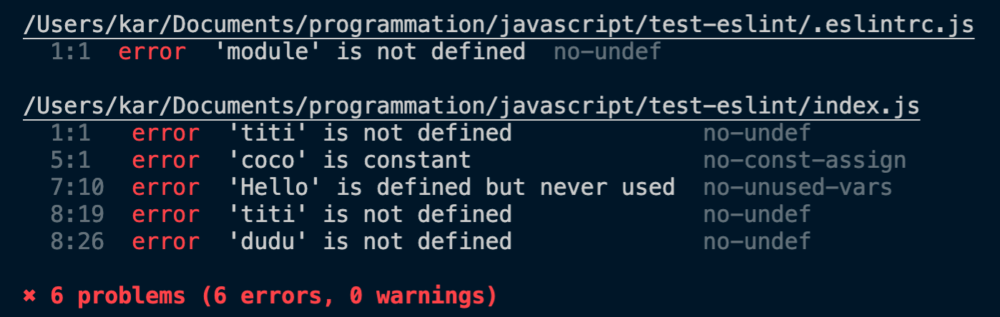
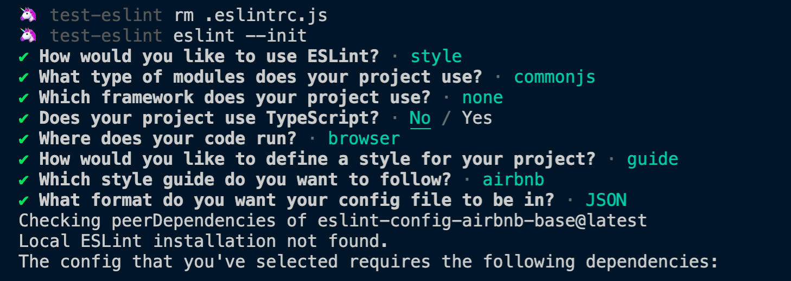
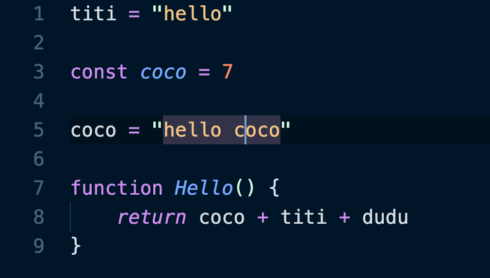
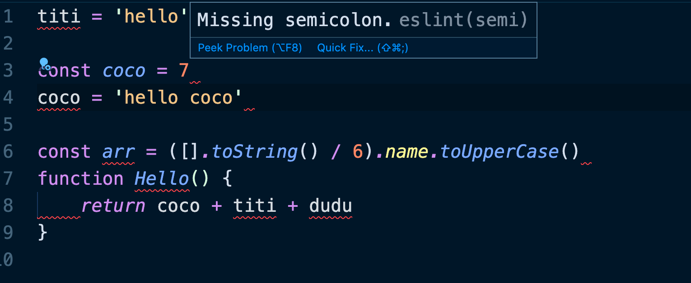
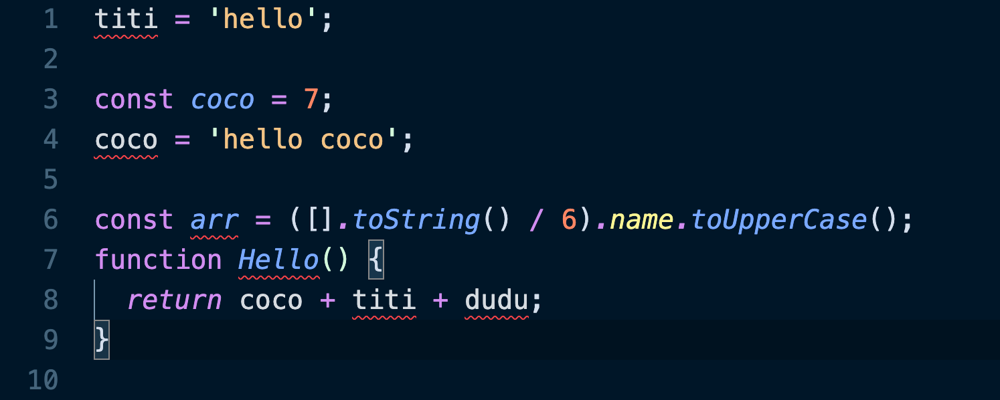
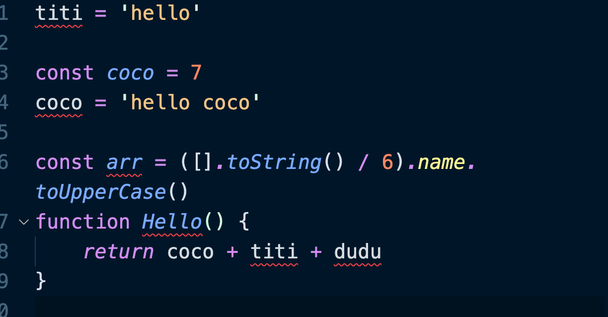
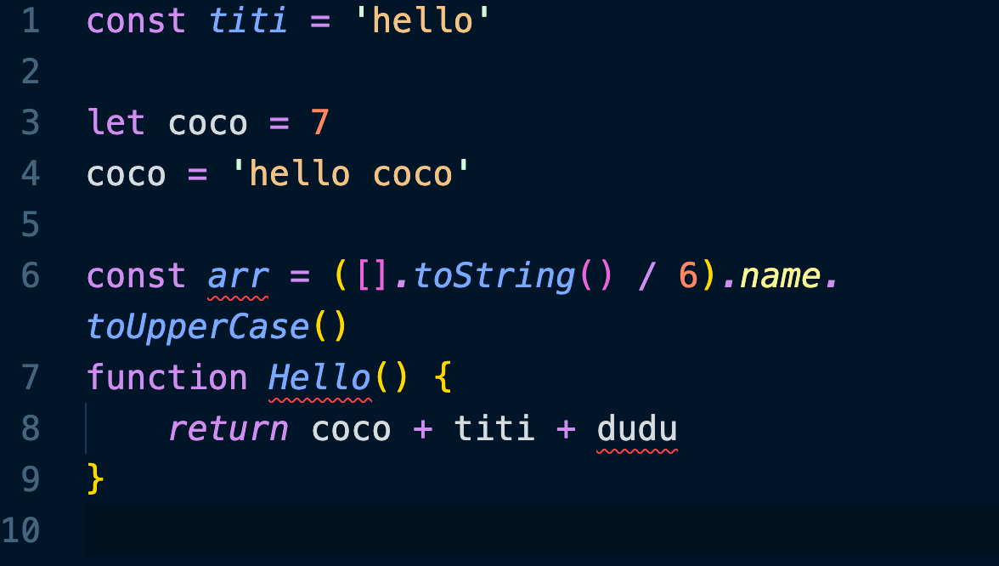

# BB `Prettier` et `Eslint`

# VS Code ESLint extension

On crée un fichier `.eslintrc` avec la commande :

```bash
eslint --init
```



`.eslintrc.js`

```js
module.exports = {
    "env": {
        "browser": true,
        "es2021": true
    },
    "extends": "eslint:recommended",
    "parserOptions": {
        "ecmaVersion": 12,
        "sourceType": "module"
    },
    "rules": {
    }
};
```

## Linter son dossier

```bash
🦄 test-eslint eslint .
```

`index.js`

```js
titi = "hello"

const coco = 7

coco = "hello coco"

function Hello() {
    return coco + titi + dudu
}
```




## Utiliser le standard Airbnb



`.eslintrc.json`

```json
{
    "env": {
        "browser": true,
        "commonjs": true,
        "es2021": true
    },
    "extends": [
        "airbnb-base"
    ],
    "parserOptions": {
        "ecmaVersion": 12
    },
    "rules": {
    }
}
```

tant que le l'extension `eslint vscode` n'est pas installée, le code n'est pas *linté* visuellement :



Avec l'extension :


## `.prettierrc`

On va configurer `Prettier` :

```json
{
    "semi": false,
    "tabWidth": 4,
    "singleQuote": true
}
```

Lorsqu'on formate le code on a un conflit entre `Prettier` et `eslint` :



`Prettier` corrige le point-virgule et `eslint` le voit comme une erreur !

Si on exécute maintenant `eslint` en ligne de commande :

```bash
eslint . --fix
```



On a de nouveau les point-virgules retirés par `Prettier` rajoutés par `eslint` !!

## La solution :

### `eslint-config-prettier` et  `eslint-plugin-prettier`

On va ajouter les deux outils :

```bash
npm i eslint-config-prettier eslint-plugin-prettier
```

`eslint-plugin-prettier` permet à `prettier` de mettre ses règles par dessus `eslint`.

`eslint-config-prettier` désactive les règles d' `eslint` pouvant être conflictuelles avec `prettier`.

Pour que cela fonctionne il faut aussi installer `prettier` et `typescript` (dépendance !?) dans le projet :

```bash
npm i prettier typescript
```

Voici maintenant notre `.eslintrc.json`

```json
{
    "env": {
        "browser": true,
        "commonjs": true,
        "es2021": true
    },
    "extends": [
        "airbnb-base"
        "plugin:prettier/recommended"
    ],
    "parserOptions": {
        "ecmaVersion": 12
    },
```

En fait `"plugin:prettier/recommended"` fonctionne lui comme ça :

```json
{
  "extends": ["prettier"],
  "plugins": ["prettier"],
  "rules": {
    "prettier/prettier": "error",
    "arrow-body-style": "off",
    "prefer-arrow-callback": "off"
  }
}
```




Maintenant avec `eslint-plugin-prettier` les point-virgules n'apparaissent plus comme des erreurs.

#### `settings.json` global

```json
{
    "editor.fontSize": 20,
    "debug.console.fontSize": 16,
    "terminal.integrated.fontSize": 16,
    "editor.wordWrap": "on",
    "vetur.validation.template": false,
    "editor.codeActionsOnSave": {
        "source.fixAll": true
    },
    "workbench.iconTheme": "material-icon-theme",
    "workbench.colorTheme": "Night Owl",
    "editor.detectIndentation": false,
    "git.enableSmartCommit": true,
    "emmet.includeLanguages": {
        "vue": "html"
    },
    "[vue]": {
        "editor.defaultFormatter": "esbenp.prettier-vscode"
    },
    "[javascript]": {
        "editor.defaultFormatter": "esbenp.prettier-vscode"
    },
    "prettier.tabWidth": 4
}
```

Mon formatage à la sauvegarde doit fonctionner grace à :

```json
"editor.codeActionsOnSave": {
    "source.fixAll": true
},
```

>  Veuillez également noter que si vous utilisez ESLint comme formatteur par défaut, vous devez désactiver `editor.formatOnSave` lorsque vous avez activé `editor.codeActionsOnSave`. Sinon, votre fichier sera corrigé deux fois, ce qui est inutile. 

### Fichier corrompu

---


### Fichier corrigé à la sauvegarde

---



On voit que les erreurs de syntaxe et de style sont corrigées.

## `eslint-config-prettier`

https://github.com/prettier/eslint-config-prettier

Désactive toutes les règles inutiles ou susceptibles d'entrer en conflit avec `Prettier` .

Notez que cette configuration *désactive* *uniquement les* règles *,* il est donc logique de l'utiliser avec une autre configuration.

Ensuite, ajoutez `eslint-config-prettier` au tableau `"extends"` de votre fichier `.eslintrc.*`. 

Assurez-vous de le mettre en **dernier,** afin qu'il ait la possibilité de remplacer d'autres configurations.

```json
{
  "extends": [
    "une-autre-configuration-que-vous-utilisez",
    "prettier"
  ]
}
```

Quelques plugins ESLint sont également pris en charge :

- [@typescript-eslint/eslint-plugin](https://github.com/typescript-eslint/typescript-eslint)
- [eslint-plugin-babel](https://github.com/babel/eslint-plugin-babel)
- [eslint-plugin-flowtype](https://github.com/gajus/eslint-plugin-flowtype)
- [eslint-plugin-prettier](https://github.com/prettier/eslint-plugin-prettier)
- [eslint-plugin-react](https://github.com/yannickcr/eslint-plugin-react)
- [eslint-plugin-standard](https://github.com/xjamundx/eslint-plugin-standard)
- [eslint-plugin-unicorn](https://github.com/sindresorhus/eslint-plugin-unicorn)
- [eslint-plugin-vue](https://github.com/vuejs/eslint-plugin-vue)

Ajoutez des exclusions supplémentaires pour les plugins que vous utilisez comme ceci :

```json
{
  "extends": [
    "some-other-config-you-use",
    "prettier",
    "prettier/@typescript-eslint",
    "prettier/babel",
    "prettier/flowtype",
    "prettier/prettier",
    "prettier/react",
    "prettier/standard",
    "prettier/unicorn",
    "prettier/vue"
  ]
}
```

Si vous étendez une configuration qui utilise un plugin, il est recommandé d'ajouter `"prettier/that-plugin"`(si disponible). 

Par exemple, [eslint-config-airbnb](https://www.npmjs.com/package/eslint-config-airbnb) active les[règles `eslint-plugin-react` ,  `"prettier/react"`est donc nécessaire:

```json
{
  "extends": [
    "airbnb",
    "prettier",
    "prettier/react"
  ]
}
```

## `eslint-plugin-prettier` 

Exécute `Prettier` en tant que règle [ESLint](http://eslint.org/) et signale les différences en tant que problèmes ESLint individuels.

## Installation

```bash
npm install --save-dev eslint-plugin-prettier
npm install --save-dev --save-exact prettier
```

Ensuite, dans votre `.eslintrc.json`:

```json
{
  "plugins": ["prettier"],
  "rules": {
    "prettier/prettier": "error"
  }
}
```

## Configuration recommandée

Ce plugin fonctionne mieux si vous désactivez toutes les autres règles `ESLint` relatives au formatage du code et activez uniquement les règles qui détectent les bogues potentiels. 

(Si une autre règle active `ESLint`  n'est pas d'accord avec la façon dont le code doit être formaté par `prettier`, il sera impossible d'éviter des erreurs de *lint*.) 

Vous pouvez utiliser [eslint-config-prettier](https://github.com/prettier/eslint-config-prettier) pour désactiver toutes les règles `ESLint` liées au formatage.

Ce plugin est livré avec une configuration `plugin:prettier/recommended` qui configure à la fois le plugin et `eslint-config-prettier`en une seule fois.

1. En plus des instructions d'installation ci-dessus, installez `eslint-config-prettier`:

	```bash
	npm install --save-dev eslint-config-prettier
	```

2. Ensuite, vous devez ajouter `plugin:prettier/recommended` comme **dernière** extension dans votre `.eslintrc.json`:

	```json
	{
	  // autre extensions
	    "extends": ["plugin:prettier/recommended"]
	}
	```

	Vous pouvez ensuite définir les propres options de Prettier dans un `.prettierrc`fichier.

3. Certains plugins ESLint (tels que [eslint-plugin-react](https://github.com/yannickcr/eslint-plugin-react) ) contiennent également des règles qui sont en conflit avec Prettier. Ajoutez des exclusions supplémentaires pour les plugins que vous utilisez comme ceci:

	```json
	{
	  "extends": [
	    "plugin:prettier/recommended",
	    "prettier/flowtype",
	    "prettier/react"
	  ]
	}
	```

	Pour obtenir la liste de tous les ensembles de règles d'exclusion disponibles, veuillez consulter le [readme de eslint-config-prettier](https://github.com/prettier/eslint-config-prettier/blob/master/README.md) .

Que fait exactement `plugin:prettier/recommended`? Eh bien, c'est ce à quoi il ressemble:

```json
{
  "extends": ["prettier"],
  "plugins": ["prettier"],
  "rules": {
    "prettier/prettier": "error",
    "arrow-body-style": "off",
    "prefer-arrow-callback": "off"
  }
}
```

- `"extends": ["prettier"]`active la configuration principale de `eslint-config-prettier`, qui désactive certaines règles de base ESLint qui sont en conflit avec Prettier.
- `"plugins": ["prettier"]` enregistre ce plugin.
- `"prettier/prettier": "error"` active la règle fournie par ce plugin, qui exécute Prettier depuis ESLint.
- `"arrow-body-style": "off"`et `"prefer-arrow-callback": "off"`désactive deux règles de base ESLint qui sont malheureusement problématiques avec ce plugin.

## Options

> Note: bien qu'il soit possible de transmettre des options à `Prettier` via votre fichier de configuration `ESLint`, cela n'est pas recommandé car les extensions de l'éditeur telles que `prettier-atom` et `prettier-vscode` liront `.prettierrc`, mais ne liront pas les paramètres d'`ESLint`, ce qui peut entraîner une expérience incohérente.

- La première option:

	- Un objet représentant des [options](https://prettier.io/docs/en/options.html) qui seront passées à `prettier`. Exemple:

		```json
		"prettier/prettier": ["error", {"singleQuote": true, "parser": "flow"}]
		```

		NB: Cette option fusionnera et remplacera toute configuration contenu dans un fichier `.prettierrc`

- La deuxième option:

	- Un objet avec les options suivantes

		- `usePrettierrc`: Active le chargement du fichier de configuration Prettier, (par défaut:) `true`. Cela peut être utile si vous utilisez plusieurs outils qui sont en conflit les uns avec les autres, ou si vous ne souhaitez pas mélanger vos paramètres ESLint avec votre configuration Prettier.

			```json
			"prettier/prettier": ["error", {}, {
			  "usePrettierrc": false
			}]
			```

		- `fileInfoOptions`: Options transmises à [prettier.getFileInfo](https://prettier.io/docs/en/api.html#prettiergetfileinfofilepath--options) pour décider si un fichier doit être formaté. Peut être utilisé par exemple pour refuser d'ignorer les fichiers situés dans des `node_modules`répertoires.

			```json
			"prettier/prettier": ["error", {}, {
			  "fileInfoOptions": {
			    "withNodeModules": true
			  }
			}]
			```

- La règle est `autofixable`  si vous exécutez `eslint` avec l'argument  `--fix`, votre code sera formaté en fonction du style `prettier`.

