# Différence entre `Vue 2` et `Vue 3`

## `vue.js devtools`

cocher `allow access to file URLs`

## Instancier l'`app`

```js
const app = new Vue({
  el: "#app",
  data: {
    product: "socks",
  },
});
```

`new Vue` à la place de `Vue.createApp`

`data` est un objet et non une fonction retournant un objet : `data() { return { ... }}`

`el:"#app` au lieu d'ajouter dans le `index.html` :

```html
<script>
  const mountedApp = app.mount("#app");
</script>
```

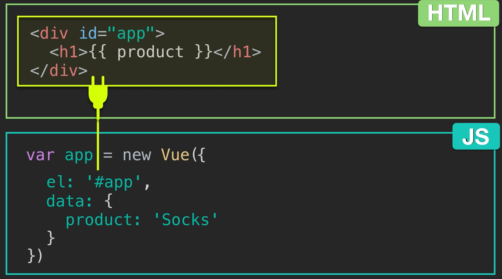

## Reactivity system

Lorsqu'une valeur dans `data` change, l'interface est mis à jour.

## `v-bind`

```jsx

```

est en théorie équivalent à :

```jsx

```

mais l'écriture ci-dessus n'est pas permise !

### exemple de `binding`

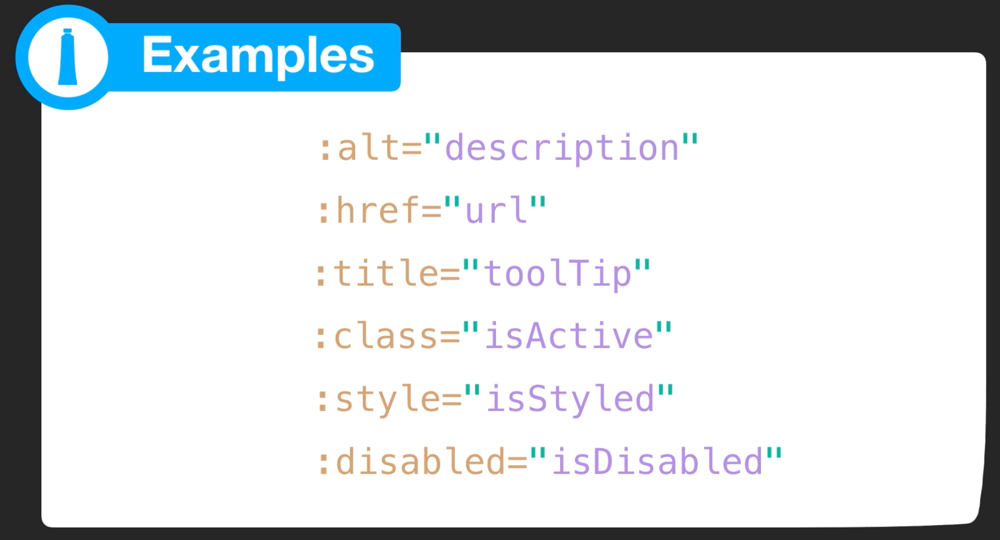

## `event`

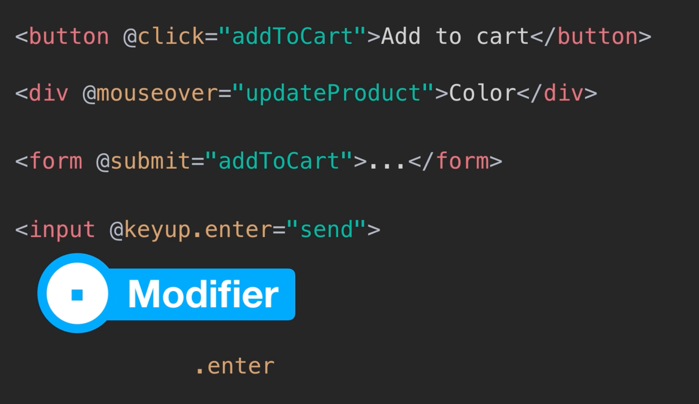

## Style binding

On peut utiliser la `kebab-case` entre guillemets si on préfère :

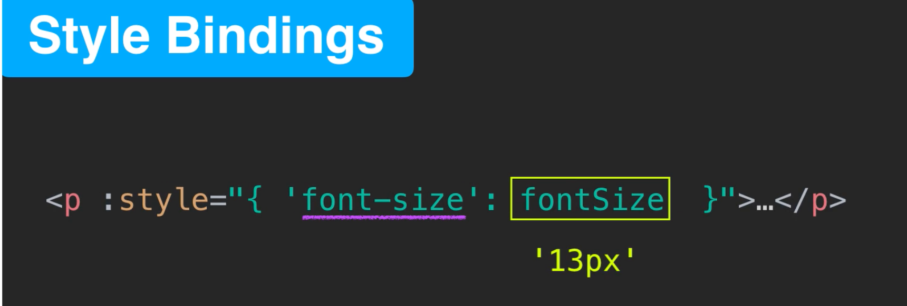

### Multi-binding

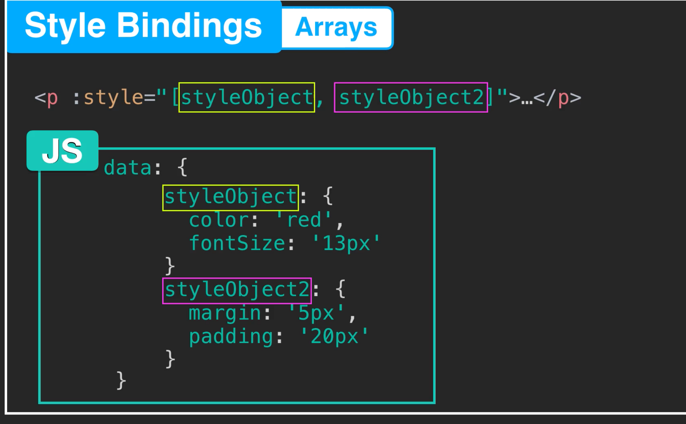

On peut lier plusieurs `styleObject` en utilisant un tableau `:style:"[styleObject1, styleObject2]"`.

## `class` binding

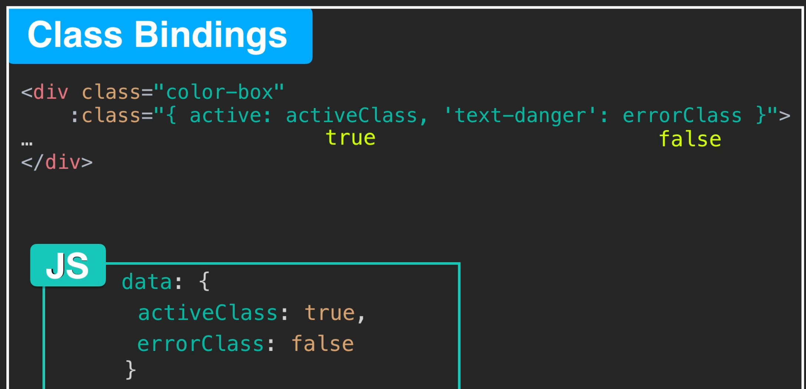

On peut aussi lier un tableau de classe :

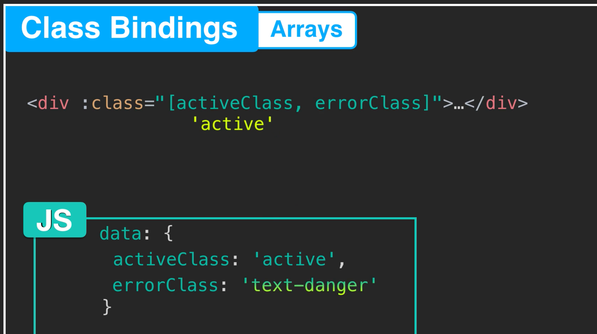

### Un mix :

```jsx
<button
    @click="addToCart"
    :disabled="!inStock"
    :class="[{disabledButton: !inStock}, {'border-active': borderActive}, bigFont, radiusMiddle]">
    Add To Cart</button>
```

### expression ternaire

```jsx
:class="[inStock ? '' : 'disabledButton']"
```

## Computed properties

Il y a une mise en cache des propriétés calculées.

Une propriété calculée va être réécrite lorsqu'un de ses éléments change.

## Component

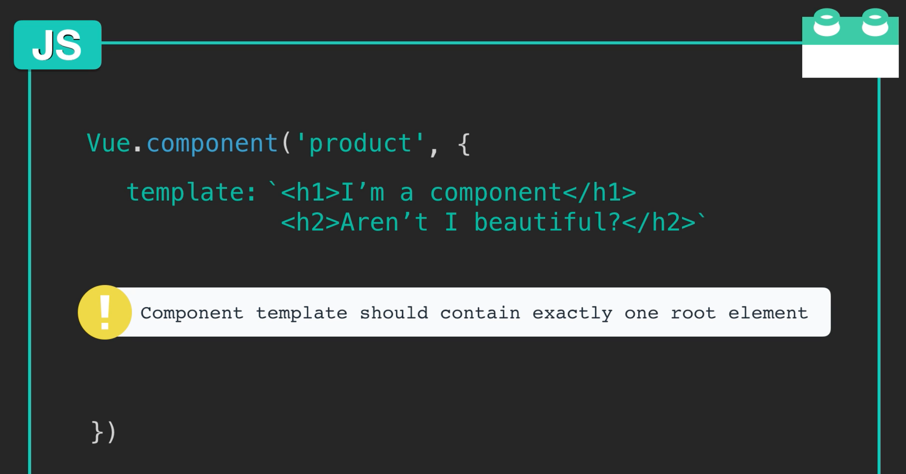

On a `Vue.component` au lieu de `app.component`.

On ne peut pas avoir de balise `html` cousine sans un parent englobant.

`data` est aussi une fonction : c'est pour que les données d'un composant aient leur propre `scope` lié à `data() { ... }`.

### props

Ce sont les données reçu du parent.

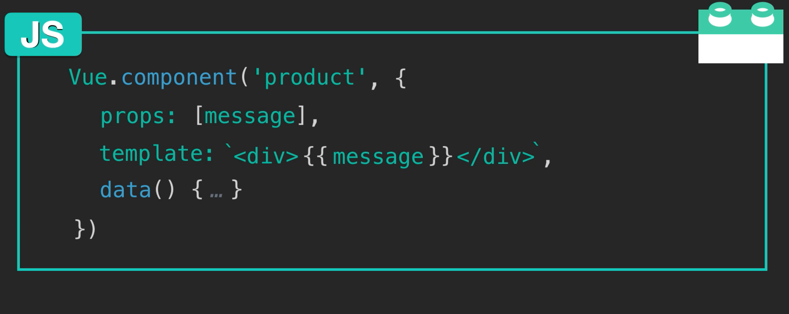

Plutôt qu'un tableau de `props` on recommande un objet de `props` avec ses propres validations définies :

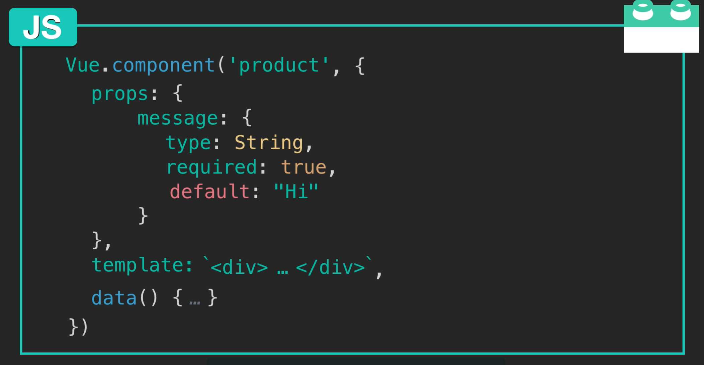

## Two way data binding

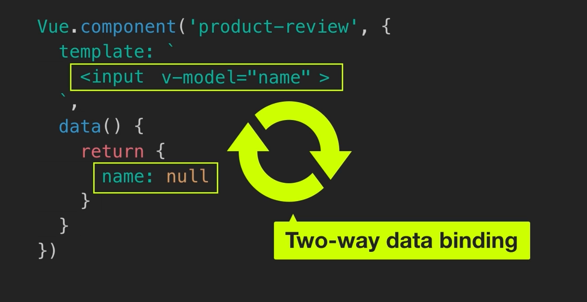
