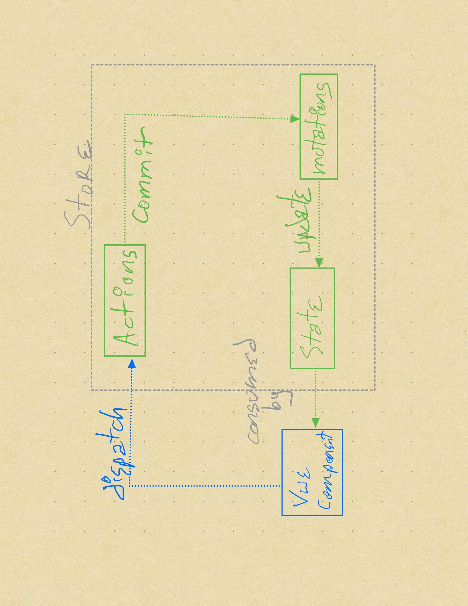
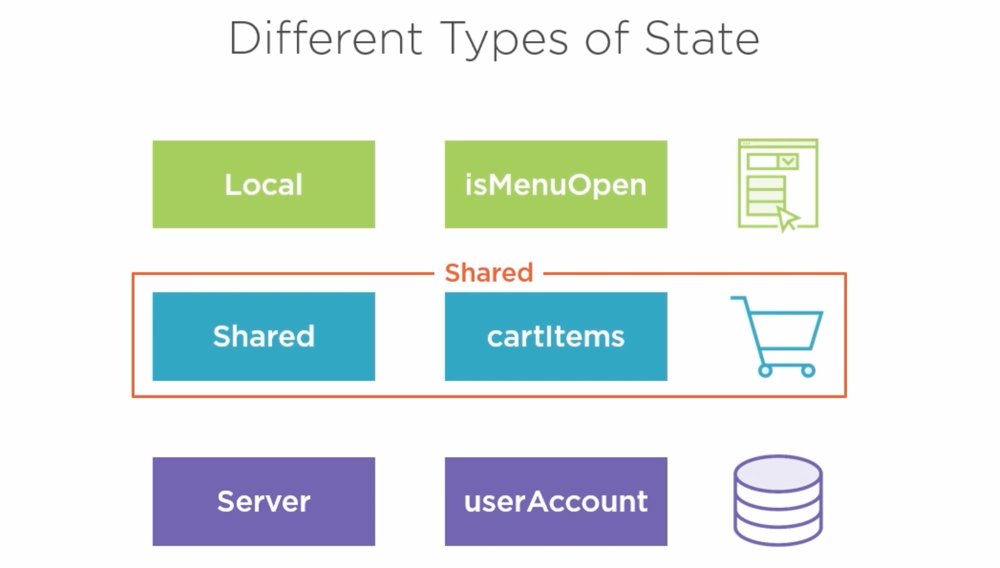
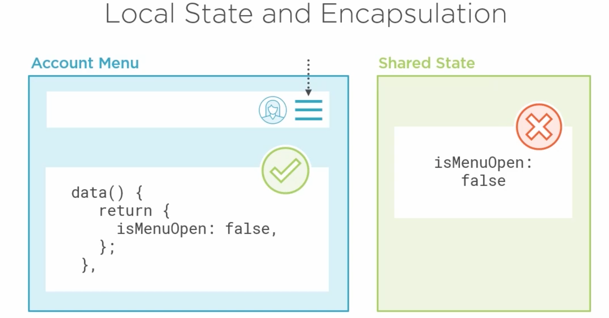
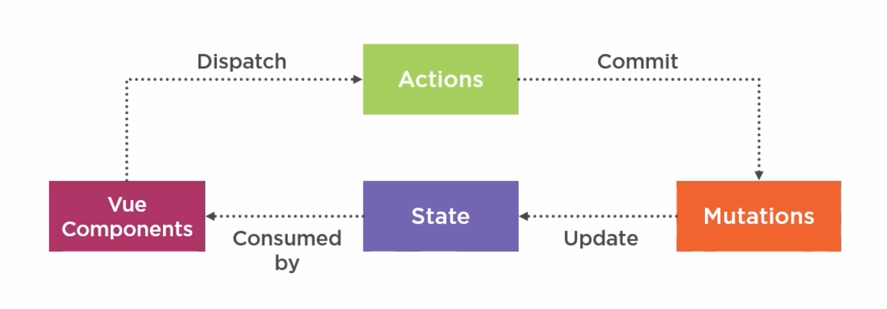
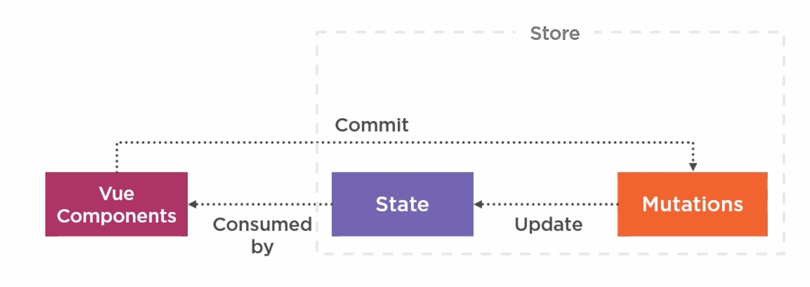
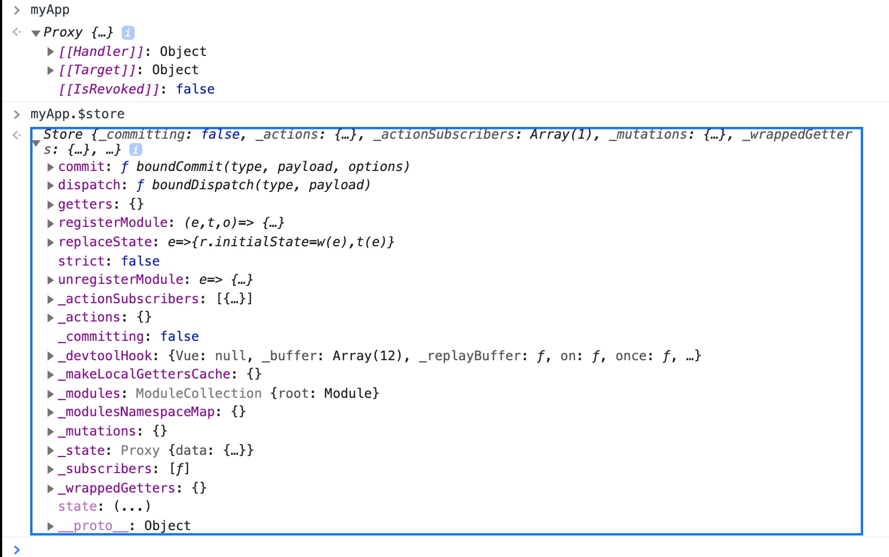
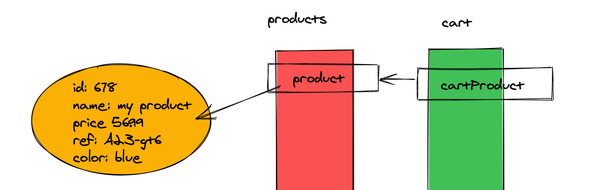
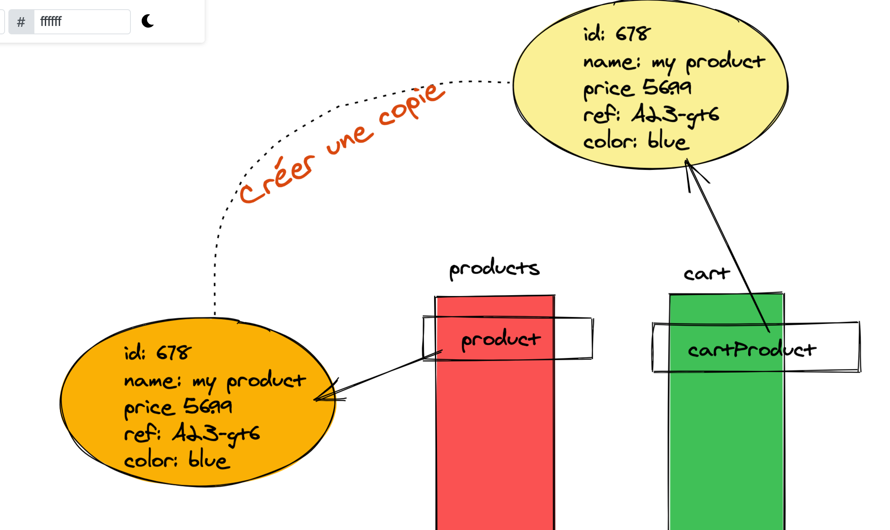

# 01 `state`




## Les différent type de `state`



`Vuex` est recommandé pour les `state` partagés entre différents composants.

Il n'est pas recommandé pour les `state` local (par exemple un booléen).

### Local state encapsulation



Pour l'ouverture d'un menu, il vaut mieux garder le `state` local, pour éviter qu'un autre composant puisse accidentellement ouvrir ou fermer le menu.

Pour une `snackbar` il vaut mieux mettre son `state` dans `Vuex`, car différents composants peuvent avoir besoin d'utiliser la `snackbar`.


## Qu'est-ce que `Vuex`

C'est un type de `flux` créer pour fonctionner avec `Vue`.



C'est un flow unidirectionnel pour gérer les données.

`component` `dispatch` une `action`.

`actions` permettent les opérations asynchrones, puis `commit` vers les `mutations`.

`mutations` est le seul endroit où on peut modifier les données du `state`.

`state` il est consommé par les `components` c'est la seul source de vérité des données.



Les `actions` ne sont pas obligatoires, s'il n'y a pas de traitement asynchrone, le composant peut directement utiliser les `mutations`.


## Accéder à une instance de `Vue 3` dans la console

```js
// main.js

window.myApp = Vue.createApp(App)
  .use(router)
  .use(store)
  .mount('#app');
```

### `window.myApp = Vue.createApp( ... )`




## Création d'un `store` `Vuex 4`

```js
//store/index.js

import { createStore } from 'vuex'

const store = createStore()

export default store
```


### Inscrire le `store`

Dans `main.js`

```js
import * as Vue from 'vue';
import * as VueRouter from 'vue-router';

import App from './App.vue';
import routes from './routes';
import store from './store'  // ici ...

const router = VueRouter.createRouter({
  history: VueRouter.createWebHistory(),
  routes,
});

Vue.createApp(App)
  .use(router)
  .use(store)  // ... et là
  .mount('#app');
```


### ajouter `user` au `store`

Dans `Vuex 4` `state` est une fonction.

```js
import { createStore } from 'vuex'

const store = createStore({
    state() {
        return {
            user: {
                firstName: 'Hukar',
                lastName: 'Skywalker',
                emial: 'hsky@gamil.com',
            }
        }
    }
})

export default store
```

### Dans le composant `AccountMenu.vue`

```js
export default {
  data() {
    return {
      user: this.$store.state.user,
      showMenu: false,
    };
  },
  methods: {
    signOut() {
      this.showMenu = false;
    },
  },
```


## `Mutations`

S'il n'y a pas d'`action` asynchrone, il est tout à fait possible de `commit` une `mutation` directement depuis le composant.

`Register.vue`

```js
export default {
  name: 'Register',
  components: { LoadingSpinner },
  data() {
    return {
      saving: false,
      registerError: false,
      firstName: null,
      lastName: null,
      email: null,
      password: null,
    };
  },
  methods: {
    registerUser() {
        this.saving = true;
        const user = { 
                firstName: this.firstName, 
                lastName: this.lastName, 
                email: this.email, 
                }
        this.$store.commit('ADD_USER', user)
            
    },
    cancel() {
      this.router.navigate(['/']);
    },
  },
```

On utilise `this.$store.commit` directement dans le composant.

```js
const store = createStore({
    state() {
        return {
            user: null,
            products
        }
    },
    mutations: {
        ADD_USER(state, newUser) {
            console.log('in mutation')
            state.user = newUser
        }
    }
})
```

Pour que cela fonctionne et que l'`AccountMenu` se mette à jour, il faut déplace l'appelle à `this.$store.state` de la propriété `data` à la propriété `computed`.

```js
// AccountMenu.js

export default {
  data() {
    return {
    //   user: this.$store.state.user, ici ce n'est pas reactif
      showMenu: false,
    };
  },
  methods: {
    signOut() {
      this.showMenu = false;
    },
  },
  computed: {
      user() {
          return this.$store.state.user // ici les changement du store mettent à jour l'affichage du composant
      }
  }
};
```

#### ! mettre les appelle à `this.$store.state` dans des propriété `computed` pour rendre l'affichage reactif.


## `getters` : syntaxe propriété

Ils permettent d'incorporer de la logique ou du calcule lorsqu'on récupère des données.

Les `getters` ne peuvent jamais être asynchrone ou avoir des effets de bord.

```js
//store
const store = createStore({
    state() {
        return {
            user: null,
            products,
            filter: ''
        }
    },
    mutations: {
        ADD_USER(state, newUser) {
            console.log('in mutation')
            state.user = newUser
        },
        CHANGE_FILTER(state, newFilter) {
            state.filter = newFilter
        }
    },
    getters: {
        getFilterProducts(state) {
            if(!state.filter) {
                return state.products
            }
            return state.products.filter(product => product.category === state.filter)
        }
    }
})
```

Utilisation dans un composant :

### `this.$store.getters.myGetter`

```js
computed: {
    visibleProducts() {
      return this.$store.getters.getFilterProducts
    },
  },
```


## Refactoring du `getters` syntaxe : méthode

### `this.$store.getters.myGetter(filter)`

`store`

```js
const store = createStore({
    state() {
        return {
            user: null,
            products,
        }
    },
    mutations: {
        ADD_USER(state, newUser) {
            console.log('in mutation')
            state.user = newUser
        }
    },
    getters: {
        getFilterProducts(state) {
            return function(filter) {
                if(!filter) {
                    return state.products
                }
                return state.products.filter(product => product.category === filter)
            } 
        }
    }
})
```

#### Arrow Function Style

```js
getters: {
    getFilterProducts: state =>  filter => {
        if(!filter) {
            return state.products
        }
        return state.products.filter(product => product.category === filter)
    }
}
```

`Products.vue`

```vue
<template>
  <div>
    <div class="categories">
      <button @click="setFilter('Hiking')">Hiking</button>
      <button @click="setFilter('Climbing')">Climbing</button>
      <button @click="setFilter('Kayaking')">Kayaking</button>
      <button @click="setFilter('')">All</button>
    </div>
    <div class="product-list">
      <!-- ... -->
    </div>
  </div>
</template>

<script>
export default {
  name: 'Products',
  data() {
      return {
          filter: ''
      }
  },
  methods: {
    setFilter(filter) {
      this.filter = filter
    },
  },
  computed: {
    visibleProducts() {
      return this.$store.getters.getFilterProducts(this.filter)
    },
  },
};
</script>
```

## Erreur courante

> ### éviter les références croisées
>
> Si on a deux tableaux dans le `state` par exemple `products` et `cart`
>
> Si on ajoute un `product` dans le `cart`, bien faire une copie du `product` pas un passage de référence

### Ce qu'il ne faut pas faire



Voilà ce qui ne faut pas faire `state.cart.push(product)` où `product ` est une référence vers un élément de `products`.

### Ce qu'il faut faire



```js
// Dans le composant

methods: {
    buyProduct(product) {
        this.$store.commit('ADD_PRODUCT_TO_CART', product)
    }
```

On passe une référence du produit

```js
// Dans le store

mutations: {
        ADD_PRODUCT_TO_CART(state, product) {
            // on regarde si on a un objet similaire dans le cart
            const productIndex = state.cart.findIndex(cartProduct => cartProduct.id == product.id)
            if(productIndex == -1) {
                
                // si non on crée une copie du produit
                const copyProduct = { ...product }
                // on crée et initialise à 1 la quantity
                copyProduct.quantity = 1
                // on ajoute la copie au cart
                state.cart.push(copyProduct)
            } else {
                
                // si le produit est déjà dans le cart, on augmente sa quantité
                state.cart[productIndex].quantity++
            }
        },
```

